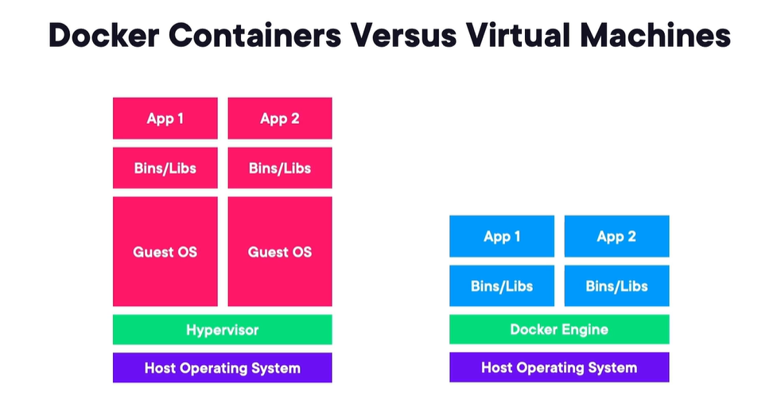
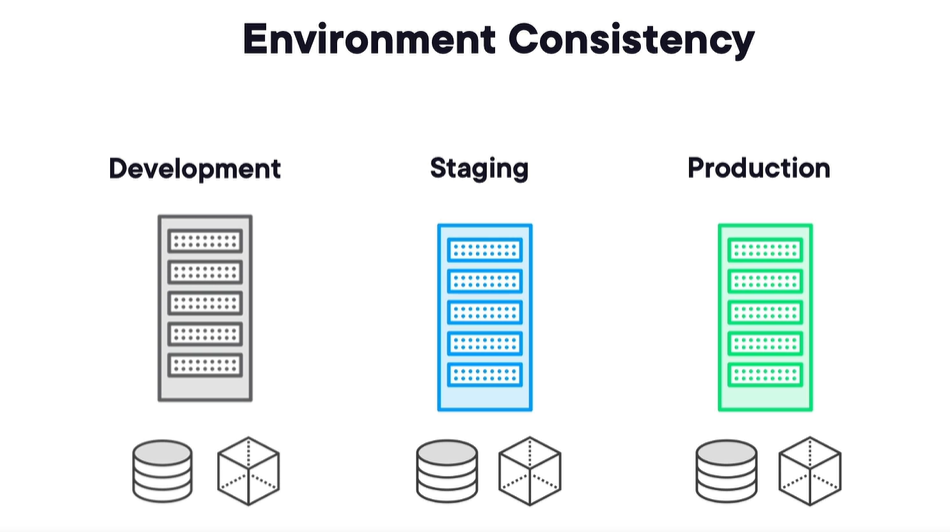

# 🔴 Docker for Web Developers

## Why to use Docker Containers as a Developer?

- Docker is a lightweight, open, secure platform which simplifies the building, shipping and running the apps.

- It relies on `images` and `containers`.

- A `image` is a read-only template composed of layered filesystems used to share common files and create Docker container instances. It contains each peace of your application, visualise it as cake layers. What we can do to these layers we can add frosting on top and get a running `container` which has all these layers inside.

- A `container` is an isolated and secured shipping container created from an image that can be run, started, stopped, moved and deleted.

- Docker Containers vs Virtual Machines




- A big advantage of usng docker is `Environment Consistency`. the container that runs in development is going to be the same container that runs in staging and the same container that runs in production. You'll just feed it different env variables, but the actual container itself in most cases is going to be the same.



## Hooking Your Source Code Into a Container
- The Layered File System -> Each image has multiple layers which can have env variables, your server, all those types of things you would need to successfully run your app. All these layers are read-only. Once you make an image, you cant change it.


- Containers and Volumes -> If you delete a container, anything that was in that container is now gone. But what if you have log files or database files or really any types of files that you want to hang around so that if the container comes back alive, you would want to point it back to those files. This is achieveble by storing them outside of the container and thats what containers and volumes can do. `Volumes` can be shared and reused among containers. Updates to an image wont affect a data volume.

Command: `docker run -p 8080:3000 -v /var/www node`

To be able to see this volume and where it is stored inside the docker hub or docker server you can run:
`docker inspect "my container"` and you can see the Source path and Destination.

This is an automatic approach where the volume is maintained by docker but you can also create and maintain it manually.
To do it you can run:

`docker run -p 8080:3000 -v $(pwd):/var/www node` pwd stands for print working directory and it specifies where is the current directory where I'm running this command from.

By using volumes you also connect what you change locally with what you have in the container.

There is a difference between `docker run`
and `docker start`, docker start doesnt create a new container it just runs the available one docker run creates a new one and starts it.

- Hooking a Container Volume to Node.js Source Code

- Removing Containers and Volumes

## Building Custom Imges with Dockerfile

- A `Dockerfile` is a text file that contains a series of instructions on how to build a Docker image. It defines the environment, dependencies, and commands needed to create a lightweight, portable, and isolated application environment inside a container.

Example of a Simple Dockerfile for a Node.js App:

```Dockerfile
# 1. Use an official Node.js base image
FROM node:14

# 2. Set the working directory in the container
WORKDIR /app

# 3. Copy package.json and package-lock.json to the working directory
COPY package*.json ./

# 4. Install dependencies
RUN npm install

# 5. Copy the rest of the app's source code
COPY . .

# 6. Expose the port your app runs on
EXPOSE 3000

# 7. Command to start your app
CMD ["node", "app.js"]

# You can also define VOLUME, ENV, ENTRYPOINT and more.

```

- To build the image run the following command:
docker build -t my-node-app .

You can also specify a version for the builded image:

docker build -t my-node-app:1.0 .

To see if image was created run:
docker images | grep my-node-app

docker run -d -p 3000:3000 my-node-app

⛔ A `Dockerfile` is a blueprint for creating Docker images, providing an automated, consistent, and portable way to build application environments. It ensures that everyone running your application (whether in development, testing, or production) is working with the same setup.

- Pushing an image to Docker Hub

👉 Docker Hub provides a centralized, cloud-based repository where you can store your Docker images. This allows you to access and distribute your images across different machines or teams.
Once an image is pushed to Docker Hub, anyone with access can pull it to any environment, making it easier to deploy and distribute applications.

1. Login to Docker Hub
docker login

2. Tag Your Docker Image
docker_hub_username/repository_name:tag

`docker_hub_username`: Your Docker Hub username.
`repository_name`: The name of the repository on Docker Hub. You can create one on Docker Hub or let it be created automatically when you push.
`tag (optional)`: The version of the image (e.g., latest, v1.0). If you omit this, it will default to latest.

docker tag my-node-app myusername/my-node-app:v1.0

3. Push the Image to Docker Hub

docker push myusername/my-node-app:v1.0

docker pull myusername/my-node-app:v1.0


## Communicating Between Containers

- You might have the scenario of microservices or a frontend container trying to communicate with a database container, how can you make it work?

- You can do it by using Containers Networks.

Steps using Docker CLI:

1. Create a Custom Bridge Network

`docker network create --driver bridge isolated_network`

`docker network ls`

2. Run/Add Containers in the Network

`docker run -d --network=isolated_network --name mongodb mongo`

## Managing Containers with Docker Compose

- Docker Compose or docker-compose.yml file can define multiple services, it can work with volumes, define environment variables, howt o build the images. 

- Remember Docker Compsoe its not designed for production its for development so you have to learn Kubernetes or other Cloud services for that.

- Docker Compose Workflow:
 1. Build Services
 2. Start Up Services
 3. Tear Down Services

- First lets learn the docker-compose.yml file.

```yaml
version: '3.8' # Specifies the Docker Compose file format version

services: # Defines all services (containers)
  web: # The web service (e.g., NGINX)
    image: nginx:latest # Use the latest official NGINX image
    ports: 
      - "8080:80" # Maps port 8080 on the host to port 80 inside the container
    volumes:
      - ./web:/usr/share/nginx/html:ro # Mounts the local 'web' directory to the NGINX document root (read-only)
    depends_on:
      - app # Ensures the 'app' service starts before 'web'
    networks:
      - frontend # Connects to the 'frontend' network
    environment:
      - NGINX_HOST=localhost # Set an environment variable for NGINX (can be accessed in config)

  app: # The app service (e.g., Node.js application)
    build:
      context: ./app # Use the Dockerfile in the 'app' directory to build the image
      dockerfile: Dockerfile # Explicitly specifies the Dockerfile name (optional)
    volumes:
      - ./app:/usr/src/app # Mount the app source code into the container
    environment:
      - NODE_ENV=production # Set the environment for Node.js to 'production'
      - DB_HOST=db # Environment variable for database host
      - DB_PORT=3306 # Environment variable for database port
    command: npm start # Overrides the default container command with 'npm start'
    depends_on:
      - db # Ensure the database service starts before the app
    healthcheck: # Define a health check to monitor the container
      test: ["CMD-SHELL", "curl -f http://localhost:3000 || exit 1"] # Use curl to check if app is responding
      interval: 30s # Check every 30 seconds
      timeout: 10s # Fail if it takes longer than 10 seconds
      retries: 5 # Retry 5 times before marking it as unhealthy
    networks:
      - frontend # Connects to 'frontend' network
      - backend # Connects to 'backend' network (communication with db)

  db: # The database service (e.g., MySQL)
    image: mysql:5.7 # Use MySQL version 5.7
    volumes:
      - db-data:/var/lib/mysql # Mount a persistent volume for MySQL data
    environment: 
      MYSQL_ROOT_PASSWORD: rootpassword # Root password for MySQL
      MYSQL_DATABASE: appdb # Database name to create
      MYSQL_USER: appuser # Database user
      MYSQL_PASSWORD: password # Password for the user
    networks:
      - backend # Only connect to the 'backend' network

networks: # Define the networks
  frontend: # The frontend network where web and app can communicate
  backend: # The backend network where app and db can communicate

volumes: # Define named volumes for persistent data
  db-data: # Persistent volume for the database
```

- Key Docker Compose Commands

-> docker compose build (building the images for all the services in the compose file)
-> docker compose up (once you have the images and you want to bring those containers up)
-> docker compose down
-> docker compose logs
-> docker compose ps (list the containers that are running)
-> docker compose start
-> docker compose stop (doesnt remove them just stops them and you can start again)
-> docker compose rm (if you run docker compose stop and want to remove them totally like compose down)
-> docker-compose down --rmi all --volumes (remove all images and volumes)
-> docker compose push (push created images into a registry, docker hub for example)


- Docker Compose in Action


# 🔴 Building and Orchetrating Containers with Docker Compose
