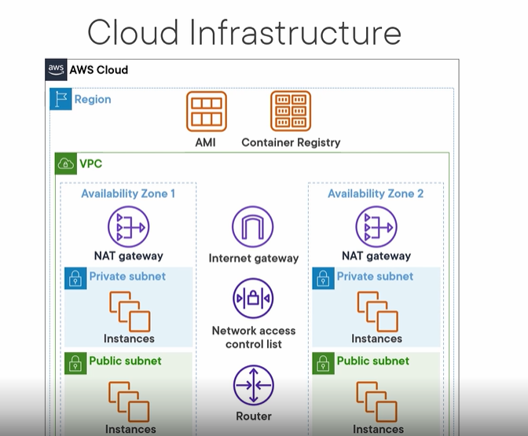
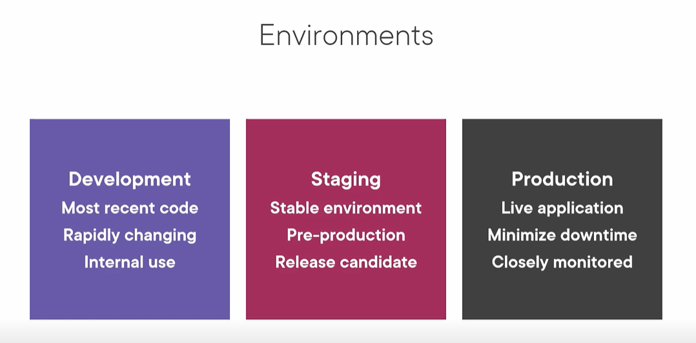
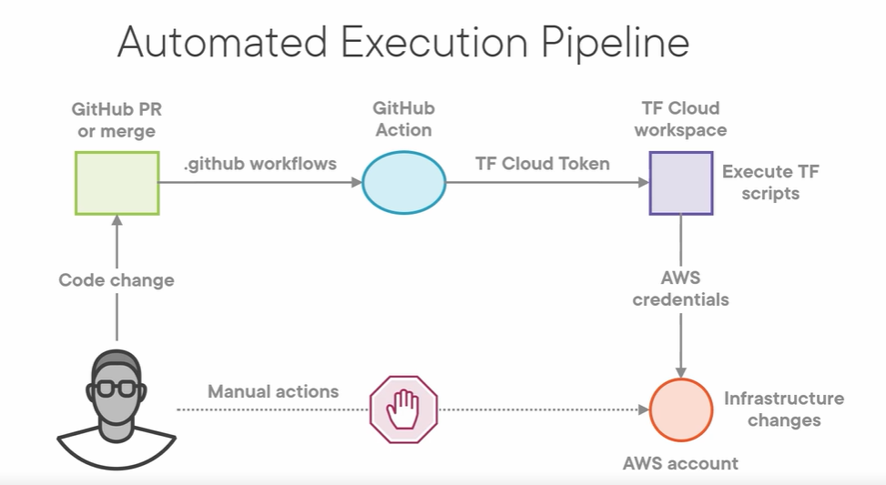

# Running your Application on EKS

## Cloud Infrastructure

🟢 This image depicts the AWS Cloud infrastructure, which consists of various components within a Region. The key elements shown are:

1. Region: This represents a geographical location where the AWS services are hosted.

2. AMI (Amazon Machine Image): This is a template used to create EC2 instances, which are virtual servers running in the cloud.

3. Container Registry: This is a service for storing and managing Docker container images.

4. VPC (Virtual Private Cloud): This is a virtual network within the AWS Cloud, which provides an isolated and secure environment for deploying resources.

5. Availability Zones: These are distinct data centers within a Region, designed to provide high availability and fault tolerance.

6. NAT Gateway: This is a service that enables instances in a private subnet to connect to the internet or other AWS services, while preventing the internet from initiating a connection with those instances.

7. Internet Gateway: This connects the VPC to the internet, allowing resources within the VPC to communicate with the public internet.

8. Network access control list (ACL): This is a firewall-like feature that controls inbound and outbound traffic at the subnet level.

9. Router: This enables communication between the subnets and the internet gateway within the VPC.

10. Instances: These are the virtual servers (EC2 instances) running within the VPC, which can be placed in either private or public subnets.

The overall schema illustrates the key components of the AWS Cloud infrastructure, including the logical network structure, security features, and the deployment of computing resources within a Region and Availability Zones.

## Environments

- After you have your Infrastructure figured out then you have to think about your environment. There are three of them `development, staging and production`.

## Tools you'll use during this course:

- Terraform -> It allows to define , provision and manage cloud infrastructure using a simple declarative language. Instead of manually creating resources in a cloud provider's console (like AWS, Azure, or Google Cloud), you write code to describe the desired state of your infrastructure.
It is used to handle:
1. Infrastructure Automation
2. Consistency
3. Version Control
4. Dependency Management and more...

🟠 Dont confuse Terraform with CI/CD, gitlab ci/cd is used to deploy, test and deploy your app for example Deploy a Docker container to Kubernetes after running tests. You can run your ci/cd once the infrastructure is ready.

🟢 Example Workflow:
Provision Infrastructure:

Write a Terraform configuration to set up a Kubernetes cluster on AWS (via EKS).
Deploy Application:

Use a GitLab CI/CD pipeline to build a Docker image, test it, and deploy it to the Kubernetes cluster provisioned by Terraform.

- GitOps
- Helm -> it is the package manager of `kubernetes` and allows to find a wide variety of applications that  are already configured in your Kubernetes cluster.
We will also use something called `ManagedKube` which provides an easy-to-use patten for combining Terraform modules, Helm charts and GitHub Actions in your EKS implementation.
Helm automates application deployment, updates, and rollbacks efficiently. It helps scale microservices while maintaining Kubernetes manifests effectively. Helm integrates seamlessly with CI/CD pipelines to enhance automation in Kubernetes environments.

Key things to know about Helm:

1. Packages - Helm works with "charts", which are packages that contain all the necessary Kubernetes resources (deployments, services, etc.) to run an application.
2. Templating - Helm uses a templating engine to allow customizing chart values, making them reusable across different environments.
3. Versioning - Helm tracks chart versions, allowing you to install, upgrade, and rollback applications.
4. Release Management - Helm keeps track of installed applications as "releases", allowing you to view the history and status of each deployment.
5. Automation - Helm integrates with CI/CD pipelines to automate the process of packaging, testing, and deploying applications to Kubernetes.

- kubectl -> Command line interface used to control Kubernetes clusters. Many of the actions running with kubectl with be run by Terraform.

- eksctl -> Specificaly designed to manage EKS clusters.

`⚠️kubectl` is the general Kubernetes tool, while `eksctl` is AWS-specific for EKS.

- CloudFormation -> AWS specific IaC (Infrastructure as Code) tool.

# Creating a Staging Envionment for EKS

🟡 Quick Notes:

EKS clusters run within an AWS VPC. The VPC provides the virtual network infrastructure for the Kubernetes cluster. Key points:

- EKS clusters are fully managed by AWS, but run within a customer's VPC.
- The VPC allows you to define the IP address range, subnets, routing tables, and other network configuration for the EKS cluster.
- This integration with the VPC provides network isolation and security controls for the Kubernetes resources.
- eksctl simplifies the process of creating an EKS cluster and connecting it to a VPC.
- kubectl can then be used to manage the EKS cluster and the applications running on it, just like any other Kubernetes cluster.

## Triggering Infrastructure Creation with Code

We will follow this structure:

