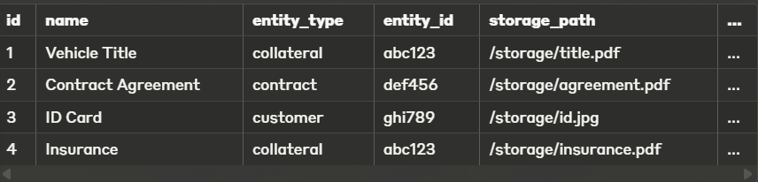

Required dependencies:

- npm install --save @nestjs/common@11 @nestjs/core@11 @nestjs/platform-express@11 @nestjs/swagger@11 @nestjs/config@4 @nestjs/typeorm@11 @nestjs/passport@11 @nestjs/testing@11 @nestjs/mapped-types@11 @nestjs/bullmq

- npm install --save typeorm pg class-validator class-transformer passport passport-jwt passport-local bcrypt uuid bullmq

- npm install --save-dev dotenv-cli

- npm install

- npm run start:dev

- Not needed by the others: Into the fleet-credit-system run `chmod +x setup-nestjs.sh` and `./setup-nestjs.sh`

- Create a container for redis in order to connect it with bullmq, into Exec write:
  Or you could use redis insight which is like mongodb compass
  Get the connection key from there

```cli
redis-cli
ping
keys *
```

Into the `setup-nestjs.sh` we have

```script

# Install NestJS CLI if not already installed
npm i -g @nestjs/cli

# Create new NestJS project
nest new vehicle-management-system
cd vehicle-management-system

# Create base directory structure
mkdir -p src/domains/vehicles/{controllers,services,dtos,entities,repositories,interfaces}
mkdir -p src/domains/customers/{controllers,services,dtos,entities,repositories,interfaces}
mkdir -p src/domains/contracts/{controllers,services,dtos,entities,repositories,interfaces}
mkdir -p src/domains/documents/{controllers,services,dtos,entities,repositories,interfaces}
mkdir -p src/domains/audit/{controllers,services,dtos,entities,repositories,interfaces}
mkdir -p src/shared/{interfaces,utils,constants,filters,guards,interceptors,dto}
mkdir -p src/infrastructure/{config,database,auth,logging,messaging,storage}

# Generate modules using NestJS CLI (without creating files first)
nest g module domains/vehicles/vehicles --flat
nest g module domains/customers/customers --flat
nest g module domains/contracts/contracts --flat
nest g module domains/documents/documents --flat
nest g module domains/audit/audit --flat

# Create index files
touch src/domains/vehicles/index.ts
touch src/domains/customers/index.ts
touch src/domains/contracts/index.ts
touch src/domains/documents/index.ts
touch src/domains/audit/index.ts

# Generate controllers
nest g controller domains/vehicles/controllers/vehicles --flat
nest g controller domains/customers/controllers/customers --flat
nest g controller domains/contracts/controllers/contracts --flat
nest g controller domains/documents/controllers/documents --flat
nest g controller domains/audit/controllers/audit --flat

# Generate services
nest g service domains/vehicles/services/vehicles --flat
nest g service domains/customers/services/customers --flat
nest g service domains/contracts/services/contracts --flat
nest g service domains/documents/services/documents --flat
nest g service domains/audit/services/audit --flat

# Infrastructure modules
nest g module infrastructure/database
nest g module infrastructure/auth
nest g module infrastructure/logging
nest g module infrastructure/messaging
nest g module infrastructure/storage
nest g module infrastructure/config

# Create basic domain entities
touch src/domains/vehicles/entities/vehicle.entity.ts
touch src/domains/customers/entities/customer.entity.ts
touch src/domains/contracts/entities/contract.entity.ts
touch src/domains/documents/entities/document.entity.ts
touch src/domains/audit/entities/audit-log.entity.ts

# Create basic domain DTOs
touch src/domains/vehicles/dtos/create-vehicle.dto.ts
touch src/domains/vehicles/dtos/update-vehicle.dto.ts
touch src/domains/customers/dtos/create-customer.dto.ts
touch src/domains/customers/dtos/update-customer.dto.ts
touch src/domains/contracts/dtos/create-contract.dto.ts
touch src/domains/contracts/dtos/update-contract.dto.ts

# Create basic repositories
touch src/domains/vehicles/repositories/vehicle.repository.ts
touch src/domains/customers/repositories/customer.repository.ts
touch src/domains/contracts/repositories/contract.repository.ts
touch src/domains/documents/repositories/document.repository.ts
touch src/domains/audit/repositories/audit-log.repository.ts

# Create shared utilities
touch src/shared/utils/date-helper.ts
touch src/shared/constants/app-constants.ts
touch src/shared/filters/http-exception.filter.ts
touch src/shared/guards/auth.guard.ts
touch src/shared/interceptors/logging.interceptor.ts

# Create infrastructure base files
touch src/infrastructure/config/configuration.ts
touch src/infrastructure/database/database.providers.ts
touch src/infrastructure/auth/auth.service.ts
touch src/infrastructure/logging/logger.service.ts

# Update main app module to import domain modules
cat > src/app.module.ts << 'EOL'
import { Module } from '@nestjs/common';
import { VehiclesModule } from './domains/vehicles/vehicles.module';
import { CustomersModule } from './domains/customers/customers.module';
import { ContractsModule } from './domains/contracts/contracts.module';
import { DocumentsModule } from './domains/documents/documents.module';
import { AuditModule } from './domains/audit/audit.module';
import { DatabaseModule } from './infrastructure/database/database.module';
import { AuthModule } from './infrastructure/auth/auth.module';
import { ConfigModule } from '@nestjs/config';

@Module({
  imports: [
    ConfigModule.forRoot({
      isGlobal: true,
    }),
    DatabaseModule,
    AuthModule,
    VehiclesModule,
    CustomersModule,
    ContractsModule,
    DocumentsModule,
    AuditModule,
  ],
})
export class AppModule {}
EOL

# Update main.ts with basic setup
cat > src/main.ts << 'EOL'
import { NestFactory } from '@nestjs/core';
import { AppModule } from './app.module';
import { ValidationPipe } from '@nestjs/common';

async function bootstrap() {
  const app = await NestFactory.create(AppModule);

  // Apply global pipes
  app.useGlobalPipes(new ValidationPipe({ transform: true }));

  // Enable CORS
  app.enableCors();

  // Set global prefix
  app.setGlobalPrefix('api');

  await app.listen(3000);
  console.log('Application is running on: http://localhost:3000');
}

bootstrap();
EOL

# Create example HTTP exception filter
cat > src/shared/filters/http-exception.filter.ts << 'EOL'
import { ExceptionFilter, Catch, ArgumentsHost, HttpException } from '@nestjs/common';
import { Request, Response } from 'express';

@Catch(HttpException)
export class HttpExceptionFilter implements ExceptionFilter {
  catch(exception: HttpException, host: ArgumentsHost) {
    const ctx = host.switchToHttp();
    const response = ctx.getResponse<Response>();
    const request = ctx.getRequest<Request>();
    const status = exception.getStatus();
    const exceptionResponse = exception.getResponse();

    response.status(status).json({
      statusCode: status,
      timestamp: new Date().toISOString(),
      path: request.url,
      message: exceptionResponse,
    });
  }
}
EOL

# Create example logging interceptor
cat > src/shared/interceptors/logging.interceptor.ts << 'EOL'
import { Injectable, NestInterceptor, ExecutionContext, CallHandler } from '@nestjs/common';
import { Observable } from 'rxjs';
import { tap } from 'rxjs/operators';

@Injectable()
export class LoggingInterceptor implements NestInterceptor {
  intercept(context: ExecutionContext, next: CallHandler): Observable<any> {
    const request = context.switchToHttp().getRequest();
    const method = request.method;
    const url = request.url;
    const now = Date.now();

    return next
      .handle()
      .pipe(
        tap(() => {
          console.log(`${method} ${url} ${Date.now() - now}ms`);
        }),
      );
  }
}
EOL

# Create example vehicle entity
cat > src/domains/vehicles/entities/vehicle.entity.ts << 'EOL'
import { Entity, Column, PrimaryGeneratedColumn, CreateDateColumn, UpdateDateColumn } from 'typeorm';

@Entity('vehicles')
export class Vehicle {
  @PrimaryGeneratedColumn('uuid')
  id: string;

  @Column()
  make: string;

  @Column()
  model: string;

  @Column()
  year: number;

  @Column()
  vin: string;

  @Column({ default: true })
  isActive: boolean;

  @CreateDateColumn()
  createdAt: Date;

  @UpdateDateColumn()
  updatedAt: Date;
}
EOL

# Create example customer entity
cat > src/domains/customers/entities/customer.entity.ts << 'EOL'
import { Entity, Column, PrimaryGeneratedColumn, CreateDateColumn, UpdateDateColumn } from 'typeorm';

@Entity('customers')
export class Customer {
  @PrimaryGeneratedColumn('uuid')
  id: string;

  @Column()
  firstName: string;

  @Column()
  lastName: string;

  @Column({ unique: true })
  email: string;

  @Column({ nullable: true })
  phone: string;

  @Column({ default: true })
  isActive: boolean;

  @CreateDateColumn()
  createdAt: Date;

  @UpdateDateColumn()
  updatedAt: Date;
}
EOL

# Update vehicles repository with basic implementation
cat > src/domains/vehicles/repositories/vehicle.repository.ts << 'EOL'
import { Injectable } from '@nestjs/common';
import { InjectRepository } from '@nestjs/typeorm';
import { Repository } from 'typeorm';
import { Vehicle } from '../entities/vehicle.entity';

@Injectable()
export class VehicleRepository {
  constructor(
    @InjectRepository(Vehicle)
    private vehicleRepository: Repository<Vehicle>,
  ) {}

  async findAll(): Promise<Vehicle[]> {
    return this.vehicleRepository.find();
  }

  async findOne(id: string): Promise<Vehicle> {
    return this.vehicleRepository.findOne({ where: { id } });
  }

  async create(vehicleData: Partial<Vehicle>): Promise<Vehicle> {
    const vehicle = this.vehicleRepository.create(vehicleData);
    return this.vehicleRepository.save(vehicle);
  }

  async update(id: string, vehicleData: Partial<Vehicle>): Promise<Vehicle> {
    await this.vehicleRepository.update(id, vehicleData);
    return this.vehicleRepository.findOne({ where: { id } });
  }

  async remove(id: string): Promise<void> {
    await this.vehicleRepository.delete(id);
  }
}
EOL

# Install additional helpful dependencies
npm install --save @nestjs/typeorm typeorm pg class-validator class-transformer @nestjs/config @nestjs/jwt passport-jwt passport @nestjs/passport

# Print final message
echo "NestJS project structure has been created successfully!"


```

# PostgreSQL Database Setup for Fleet & Credit Management System

## Step 1: Start the PostgreSQL Container

1. Make sure Docker and Docker Compose are installed on your system
2. Save the `docker-compose.yml` file to your project root directory
3. Open a terminal and run:

```bash
docker-compose up -d
```

This will start both PostgreSQL and pgAdmin in detached mode.

## Step 2: Verify the Database Connection

1. Access pgAdmin through your browser at http://localhost:5050
2. Login with:
   - Email: admin@admin.com
   - Password: admin
3. Register a new server in pgAdmin:
   - Name: FleetDB (or any name you prefer)
   - Connection tab:
     - Host: postgres (this is the service name in docker-compose)
     - Port: 5432
     - Maintenance database: fleet_db
     - Username: postgres
     - Password: postgres

## Step 3: Configure Your NestJS Application

1. Copy the `.env.development` file to your project root
2. Ensure the following files are set up:

   - `src/infrastructure/config/configuration.ts`
   - `src/infrastructure/database/database.module.ts`
   - `src/infrastructure/database/base.entity.ts`
   - `src/domains/vehicles/entities/vehicle.entity.ts` (sample entity)
   - `src/domains/vehicles/vehicles.module.ts`
   - `src/app.module.ts`

3. Update your `main.ts` to import the AppModule correctly

## Step 4: Start Your NestJS Application

Run your NestJS application:

```bash
npm run start:dev
```

With `synchronize: true` in your TypeORM configuration, the tables will be automatically created based on your entity definitions.

## Step 5: Verify Table Creation

1. Refresh pgAdmin
2. Navigate to:
   - Servers > FleetDB > Databases > fleet_db > Schemas > public > Tables
3. You should see the `vehicles` table created from your entity definition

## Note on Production Use

For production environments:

- Set `synchronize: false` to prevent automatic schema changes
- Use migrations for database schema changes
- Set stronger passwords
- Consider using connection pooling
- Implement proper backup strategies

## Troubleshooting

If you can't connect to the database:

- Ensure Docker containers are running: `docker ps`
- Check container logs: `docker logs fleet_db`
- Verify environment variables match your Docker setup
- Try connecting with a direct PostgreSQL client like `psql`

# Documents Module

⚠️ For the implementation of the Documents since it is dependent on the other modules like Vehicle, Collateral, Contract, Payment and more in future we are going to use a pattern called "Polymorphic Association Pattern", lets call it shortly PAP. PAP is a database design pattern that allows an entity to belong to more than one type of parent entity throught a simple association.

## The Basic Problem:

In traditional relational database design, when you want to create a relationship between tables, you typically use foreign keys that reference the primary key of another specific table. For example:

- A `Comment` might belong to a `Post`, so the comments table would have a `post_id` column.
- An `Image` might belong to a `User`, so the `images` table would have a user_id column.

But what if you want more flexibility? What if:

- A `Comment` could belong to either a `Post` OR a `Product`?
  A `Document` could be attached to a `Customer`, a `Contract`, or a `Collateral`?

## How Polymorphic Association Work:

Instead of having a single foreign key column that references one specific table, a polymorphic association uses two columns:

1. `A type column`: Identifies which type of entity is being referenced (e.g., "post", "product", "customer")
2. `An ID column`: Contains the ID of the specific entity being referenced

In our case with documents, these columns would be:

`entity_type`: Stores values like "collateral", "contract", "customer"...
`entity_id`: Stores the UUID of the specific collateral, contract, or customer

## Visual Example



## Trade-offs and Considerations

⚠️ Consider to add validation in backend or frontend if this document has an entity type which it has been asigned and entity_id

- Database Integrity: Traditional foreign keys can't enforce these relationships, so you need application-level validation

⚠️ Consider this in future

- Indexing: You need to index both columns together for efficient lookups

## In Our Application

In your TypeORM code, this pattern is implemented by:

Having `entityType` and `entityId` columns in your `Document` entity
Creating services that know how to find documents for specific entity types
Using these for querying:

```javascript
documentRepository.find({
  where: { entityType: "collateral", entityId: someId },
});
```

## Testing endpoints:

### Contracts

1. Create Contract

curl -X POST "http://localhost:3000/contracts" \
-H "Content-Type: application/json" \
-d '{
"type": "loan",
"contractNumber": "LN-0011",
"customerId": "01636467-e158-44f7-9e0b-cc090eeeddb7",
"startDate": "2023-01-01",
"endDate": "2024-01-01",
"totalAmount": 10000,
"interestRate": 5.5,
"loanDetails": {
"type": "loan",
"contractNumber": "LN-0011",
"customerId": "01636467-e158-44f7-9e0b-cc090eeeddb7",
"startDate": "2023-01-01",
"endDate": "2024-01-01",
"totalAmount": 10000,
"interestRate": 5.5,
"loanTermMonths": 12,
"monthlyPayment": 860,
"processingFee": 200
},
"terms": {
"maintenanceIncluded": true,
"insuranceType": "Full coverage",
"kilometrageLimitAnnual": 20000,
"excessKilometrageFee": 0.1,
"additionalTerms": "Vehicle must be serviced"
}
}'

- Update Contract

curl -X PUT "http://localhost:3000/contracts/184fed24-48b9-422f-bbd0-497b4d25e4db" \
-H "Content-Type: application/json" \
-d '{
"id": "184fed24-48b9-422f-bbd0-497b4d25e4db",
"interestRate": 6.0
}'

- Delete Contract

curl -X DELETE "http://localhost:3000/contracts/184fed24-48b9-422f-bbd0-497b4d25e4db" \
-H "Content-Type: application/json"

- Activate Contract

curl -X PATCH "http://localhost:3000/contracts/2accae14-fee6-4c0f-8261-a1038785c679/activate" \
-H "Content-Type: application/json"

- Complete Contract

Note: To complete a contract the remainingAmount to pay should be 0

curl -X PATCH "http://localhost:3000/contracts/2accae14-fee6-4c0f-8261-a1038785c679/complete" \
-H "Content-Type: application/json"

- Cancel Contract

Note: Remember only draft or active contracts can be cancelled

curl -X PATCH "http://localhost:3000/contracts/302dca06-3f4b-4edd-a906-6a3f9dbf6a28/cancel" \
-H "Content-Type: application/json" \
-d '{
"reason": "Customer requested cancellation"
}'

- Get payments for a contract

Method: GET
URL: {{baseUrl}}/customers/{{customerId}}/contracts
Optional Query Parameters:

active: true/false
limit: number
offset: number

curl -X GET "http://localhost:3000/contracts/d86b5de6-860e-4529-810c-6fd93264286e/payments" \
-H "Content-Type: application/json"

### Payments

- Get All Payments

curl -X GET "http://localhost:3000/payments?status=pending&type=scheduled&limit=10&offset=0" \
-H "Content-Type: application/json"

d86b5de6-860e-4529-810c-6fd93264286e

curl -X GET "http://localhost:3000/payments" \
-H "Content-Type: application/json"

curl -X GET "http://localhost:3000/payments?contractId=d86b5de6-860e-4529-810c-6fd93264286e&status=pending&type=scheduled&limit=10&offset=0" \
-H "Content-Type: application/json"

- Get Payment By Id

curl -X GET "http://localhost:3000/payments/9eafbcb8-16d4-462a-99a8-a9d296efde6a" \
-H "Content-Type: application/json"

- Create New Payment

Note: Remember payments can only be added to active contracts

curl -X POST "http://localhost:3000/payments" \
-H "Content-Type: application/json" \
-d '{
"contractId": "02d8123d-8d3a-4fd4-8966-a085667fb5ab",
"amount": 60000,
"dueDate": "2023-06-01",
"paymentDate": "2023-06-01",
"status": "paid",
"type": "scheduled",
"notes": "Monthly payment",
"paymentMethod": "bank_transfer",
"transactionReference": "tx-789"
}'

- Update a Payment

curl -X PUT "http://localhost:3000/payments/57326815-9b8b-4454-abae-c09fc106c748" \
-H "Content-Type: application/json" \
-d '{
"amount": "5000",
"id": "57326815-9b8b-4454-abae-c09fc106c748",
"status": "pending",
"paymentDate": "2023-06-02",
"paymentMethod": "credit_card"
}'

- Delete a Payment

Note: Cannot delete a paid payment

curl -X DELETE "http://localhost:3000/payments/57326815-9b8b-4454-abae-c09fc106c748" \
-H "Content-Type: application/json"

- Get Payments For a Contract

curl -X GET "http://localhost:3000/payments/contract/63fc8751-c36e-4181-b40c-0b0a11eae808?status=pending&limit=10&offset=0" \
-H "Content-Type: application/json"

## Collaterals

- Get all collaterals

Method: GET
URL: http://localhost:3000/collateral
Optional Query Parameters:

type: "vehicle", "property", "personal_guarantee", "other"
contractId: Filter by contract
customerId: Filter by customer
active: true/false
limit: Maximum number of results
offset: Skip first N results

curl -X GET "http://localhost:3000/collateral?type=vehicle&active=true&limit=10&offset=0" \
-H "Content-Type: application/json"

curl -X GET "http://localhost:3000/collateral?type=vehicle&contractId=02d8123d-8d3a-4fd4-8966-a085667fb5ab&active=true&limit=10&offset=0" \
-H "Content-Type: application/json"

curl -X GET "http://localhost:3000/collateral?type=vehicle&contractId=02d8123d-8d3a-4fd4-8966-a085667fb5ab&customerId=2a7d17a3-eea1-4e95-9b2f-c8c44dcb9f78&active=true&limit=10&offset=0" \
-H "Content-Type: application/json"

curl -X GET "http://localhost:3000/collateral?type=vehicle&customerId=2a7d17a3-eea1-4e95-9b2f-c8c44dcb9f78&active=true&limit=10&offset=0" \
-H "Content-Type: application/json"

- Get Collateral By Id

curl -X GET "http://localhost:3000/collateral/05e84632-6735-471e-b934-c82be0d341d1" \
-H "Content-Type: application/json"

- Get Vehicle Collateral by id

curl -X GET "http://localhost:3000/collateral/vehicle/05e84632-6735-471e-b934-c82be0d341d1" \
-H "Content-Type: application/json"

- Create new vehicle collateral

curl -X POST "http://localhost:3000/collateral" \
-H "Content-Type: application/json" \
-d '{
"vehicleDetails": {
"type": "vehicle",
"description": "Range Rover",
"value": 25000,
"contractId": "02d8123d-8d3a-4fd4-8966-a085667fb5ab",
"customerId": "b84918c4-2247-44d1-9146-67c09be68167",
"active": true,
"make": "Toyota",
"model": "Camry",
"year": 2021,
"licensePlate": "ABC123",
"vinNumber": "3HGCM82633A123456",
"color": "Silver",
"engineNumber": "EN123456",
"registrationCertificate": "RC789012",
"insurancePolicy": "INS456789"
}
}'

- Update a Vehicle Collateral

curl -X PUT "http://localhost:3000/collateral/05e84632-6735-471e-b934-c82be0d341d1" \
-H "Content-Type: application/json" \
-d '{
"id": "05e84632-6735-471e-b934-c82be0d341d1",
"vehicleDetails": {
"id": "05e84632-6735-471e-b934-c82be0d341d1",
"vinNumber": "1HGCM82633A123999",
"licensePlate": "XYZ789",
"color": "Red"
}
}'

- Delete a Collateral

curl -X DELETE "http://localhost:3000/collateral/05e84632-6735-471e-b934-c82be0d341d1" \
-H "Content-Type: application/json"
