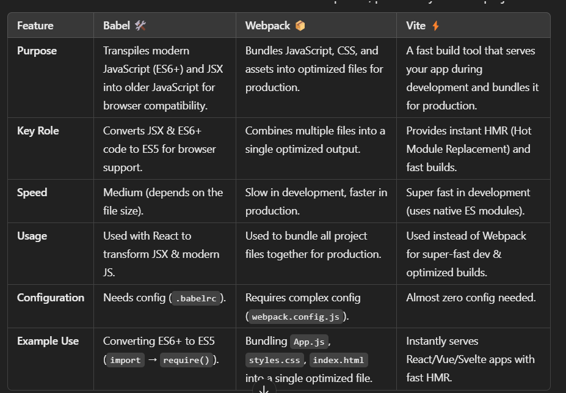

# 1 SCSS
SCSS (Sassy CSS) is a preprocessor for CSS that extends its capabilities by adding features like variables, nesting, mixins, functions, inheritance, and better modularity.

```scss
// styles.scss
$primary-color: #3498db;
.button {
  background-color: $primary-color;
  padding: 10px;
}

```


```javascript
import "./styles.scss";
const Button = () => <button className="button">Click Me</button>;
```

⛔ To avoid global conflicts use `.module.scss`
```scss
// Button.module.scss
.button {
  background-color: blue;
  padding: 10px;
}

```

```javascript
import styles from "./Button.module.scss";
const Button = () => <button className={styles.button}>Click Me</button>;

```

## Nesting

```scss
.card {
  padding: 16px;
  
  .title {
    font-size: 20px;
  }
  
  &:hover {  // & refers to parent selector
    background: #f0f0f0;
  }
}

// Button.scss
.button {
  background-color: #3498db;
  color: white;
  padding: 12px 20px;
  border: none;
  border-radius: 5px;
  cursor: pointer;
  font-size: 16px;
  transition: background-color 0.3s ease;

  &:hover {
    background-color: #217dbb;
  }

  &:active {
    background-color: #1b6aa3;
  }

  // Nested class for icon inside button
  .icon {
    margin-right: 8px;
  }
}
```

```javascript
import React from "react";
import "./Button.scss";

const Button = ({ text, icon }) => {
  return (
    <button className="button">
      {icon && <span className="icon">{icon}</span>}
      {text}
    </button>
  );
};

export default Button;

```

What Are SCSS Partials?
Partials are SCSS files that cannot be compiled into a standalone CSS file.
They are meant to be imported into other SCSS files instead of being used directly.
This helps organize and modularize styles in large projects.

For example naming: _Buttons.scss

## Lets see a real example:

```javascript
import React, { useState } from "react";
import { GiHamburgerMenu } from "react-icons/gi";
import { MdClose } from "react-icons/md";
import { ImSun } from "react-icons/im";
import { BsFillMoonFill } from "react-icons/bs";
import logo from "../assets/logo.png";
export default function Navbar({ changeTheme, currentTheme }) {
  const [navState, setNavState] = useState(false);
  return (
    <nav>
      <div className="brand-container">
        <div className="brand">
          
        </div>
        <div className="toggle-container">
          <div className="toggle">
            {navState ? (
              <MdClose onClick={() => setNavState(false)} />
            ) : (
              <GiHamburgerMenu onClick={() => setNavState(true)} />
            )}
          </div>
          <div className="mode" onClick={changeTheme}>
            {currentTheme === "dark" ? (
              <ImSun className="light" />
            ) : (
              <BsFillMoonFill className="dark" />
            )}
          </div>
        </div>
      </div>
      <div className={`links-container ${navState ? "nav-visible" : ""}`}>
        <ul className="links">
          <li>
            <a href="#features">Features</a>
          </li>
          <li>
            <a href="#about">About</a>
          </li>
          <li>
            <a href="#launch">Launch</a>
          </li>
          <li>
            <a href="#signup">Sign Up</a>
          </li>
          <li onClick={changeTheme}>
            {currentTheme === "dark" ? (
              <ImSun className="light" />
            ) : (
              <BsFillMoonFill className="dark" />
            )}
          </li>
        </ul>
      </div>
    </nav>
  );
}
```

```css
nav {
  display: flex;
  justify-content: space-between;
  align-items: center;
  .brand-container {
    .brand {
      img {
        height: 100%;
      }
    }
    .toggle-container {
      display: none;
      .toggle {
      }
      .mode {
      }
    }
  }
  .links-container {
    .links {
      list-style-type: none;
      display: flex;
      gap: 4rem;
      li {
        .dark {
          color: black;
        }
        .light {
          color: yellow;
        }
        a {
          color: var(--accent-color3);
          text-decoration: none;
        }
        &:last-of-type {
          a {
            color: var(--pink);
          }
        }
      }
    }
  }
}

[data-theme="light"] {
  nav {
    .brand-container {
      .brand {
        img {
          filter: brightness(0);
        }
      }
    }
  }
}

@media screen and (min-width: 280px) and (max-width: 1080px) {
  nav {
    position: relative;
    padding: 1rem 2rem;
    .brand-container {
      display: flex;
      justify-content: space-between;
      align-items: center;
      width: 100%;
      .brand {
        img {
          height: 1.5rem;
        }
      }
      .toggle-container {
        display: block;
        color: var(--accent-color1);
        display: flex;
        flex-direction: row-reverse;
        gap: 1rem;
        z-index: 40;
        .toggle {
          z-index: 40;
          display: block;
        }
      }
    }
    .links-container {
      z-index: 30;
      background-image: linear-gradient(101deg, var(--pink), var(--orange));
      height: 100vh;
      position: absolute;
      top: 0;
      right: 0;
      opacity: 0;
      width: 0;
      visibility: hidden;
      display: flex;
      justify-content: center;
      align-items: center;
      transition: 0.5s ease-in-out;
      .links {
        flex-direction: column;
        li {
          a {
            color: var(--background);
          }
          &:last-of-type {
            display: none;
          }
        }
      }
    }
    .nav-visible {
      width: 60vw;
      visibility: visible;
      opacity: 1;
    }
  }
}

```


## Another component example:

```JavaScript

import React from "react";
import home from "../assets/home.png";
export default function Home() {
  return (
    <div className="home">
      <div className="container">
        <div className="content">
          <p className="sub-title">Launching Soon</p>
          <h1 className="title">An NFT like no other</h1>
          <p className="description">
            Don't miss out on the release of our new NFT. Sign up below to
            recieve updates when we go live.
          </p>
          <button>Sign Up</button>
        </div>
        <div className="image-container">
          <div className="image">
            
          </div>
          <div className="ellipse-container">
            <div className="ellipse pink"></div>
            <div className="ellipse orange"></div>
          </div>
        </div>
      </div>
    </div>
  );
}

```


```scss
.home {
  margin-top: 6rem;
  .container {
    display: grid;
    grid-template-columns: 1fr 1fr;
    font-size: 32px;
    .content {
      margin-top: 3rem;
      display: flex;
      flex-direction: column;
      gap: 2rem;
      align-items: flex-start;
      .sub-title {
        color: var(--pink);
        text-transform: uppercase;
        letter-spacing: 0.1rem;
      }
      .title {
        color: var(--accent-color1);
      }
      .description {
        color: var(--accent-color3);
      }
      button {
        color: var(--accent-color1);
        background-color: var(--background);
        font-weight: bold;
        padding: 1rem 3rem;
        border-radius: 2rem;
        box-shadow: 0 0 6px 0 rgba(157, 96, 212, 0.5);
        border: solid 3px transparent;
        background-image: linear-gradient(
            rgba(255, 255, 255, 0),
            rgba(255, 255, 255, 0)
          ),
          linear-gradient(101deg, var(--pink), var(--orange));
        background-origin: border-box;
        background-clip: content-box, border-box;
        box-shadow: 2px 1000px 1px var(--background) inset;
        transition: 0.5s ease-in-out;
        cursor: pointer;
        &:hover {
          box-shadow: none;
        }
      }
    }
    .image-container {
      text-align: center;
      position: relative;
      z-index: 10;
      .image {
        img {
        }
      }
      .ellipse-container {
        .ellipse {
          z-index: -1;
          position: absolute;
          height: 15rem;
          width: 15rem;
          filter: blur(100px);
        }
        .pink {
          top: 40%;
          right: 40%;
          background-color: var(--pink);
        }
        .orange {
          bottom: 40%;
          left: 40%;
          background-color: var(--orange);
        }
      }
    }
  }
}

```

## 3-RD example

```css
.releases {
  margin: 5rem 0;
  display: flex;
  flex-direction: column;
  gap: 5rem;
  .release {
    display: grid;
    grid-template-columns: 1fr 1fr;
    border-radius: 0.5rem;
    .content {
      padding: 5rem 8rem;

      display: flex;
      flex-direction: column;
      gap: 2rem;
      .title {
        font-size: 2rem;
      }
      .description {
        font-size: 1.3rem;
        a {
          color: black;
          font-weight: bold;
        }
      }
      .link {
        color: black;
        font-weight: bold;
        text-decoration: none;
        display: flex;
        gap: 1rem;
        svg {
          font-size: 1.2rem;
        }
      }
    }
    .image {
      position: relative;
      overflow: hidden;
      text-align: center;
      z-index: 1;
      display: flex;
      justify-content: center;
      align-items: flex-end;
      img {
        height: 24rem;
      }
      .ellipse {
        z-index: -1;
        position: absolute;
        bottom: -40%;
        right: 0;
        height: 20rem;
        width: 20rem;
        filter: blur(100px);
      }
      .pink {
        background-color: var(--pink);
      }
    }
    .card-container {
      display: flex;
      justify-content: center;
      align-items: center;
      position: relative;
      z-index: 1;
      overflow: hidden;
      .card-image {
        img {
          height: 14rem;
        }
      }
      .ellipse {
        z-index: -1;
        position: absolute;
        bottom: -45%;
        left: 0;
        height: 20rem;
        width: 20rem;
        filter: blur(100px);
      }
      .orange {
        background-color: var(--orange);
      }
    }
  }
  .orange {
    background-color: var(--orange);
  }
  .green {
    background-color: var(--green);
  }
}

@media screen and (min-width: 280px) and (max-width: 1080px) {
  .releases {
    margin: 0;
    gap: 0;
    .release {
      border-radius: 0;
      grid-template-columns: 1fr;
      padding: 1rem 2rem;
      gap: 2rem;
      &:nth-of-type(1) {
        .image {
          grid-row: 1;
        }
      }
      .content {
        padding: 0;
      }
      .image {
        zoom: 0.5;
      }
      .card-container {
        zoom: 0.5;
      }
      .ellipse {
        display: none !important;
      }
    }
  }
}
```


```javascript

import React from "react";
import { BsArrowRight } from "react-icons/bs";
import release1 from "../assets/release1.png";
import release2 from "../assets/release2.png";
import Card from "./Card";

export default function Release() {
  return (
    <div className="releases">
      <div className="release orange">
        <div className="content">
          <h2 className="title">Initial Release 4/11</h2>
          <p className="description">
            We have released four limited edition NFTs early which can be bid on
            via <a href="#">OpenSea</a>
          </p>
          <p className="description">
            There will be the only four of these NFTs we ever make, so be sure
            not to miss out!
          </p>
          <p className="description">50% of proceeds go to charity.</p>
          <a href="#" className="link">
            Check them out <BsArrowRight />
          </a>
        </div>
        <div className="image">
          
          <div className="ellipse pink"></div>
        </div>
      </div>
      <div className="release green">
        <div className="card-container">
          <Card
            image={release2}
            series="Gloop Series"
            title="Purple Man"
            price={3.95}
            tag="1094"
            time={2}
          />
          <div className="ellipse orange"></div>
        </div>
        <div className="content">
          <h2 className="title">Initial Release 4/11</h2>
          <p className="description">
            We have released four limited edition NFTs early which can be bid on
            via <a href="#">OpenSea</a>
          </p>
          <p className="description">
            There will be the only four of these NFTs we ever make, so be sure
            not to miss out!
          </p>
          <p className="description">50% of proceeds go to charity.</p>
          <a href="#" className="link">
            Check them out <BsArrowRight />
          </a>
        </div>
      </div>
    </div>
  );
}


```


## Theme, how does it work and example using SASS

1. You have created a base scss file which will be used for all the components:
```css
@import url("https://fonts.googleapis.com/css2?family=Inter:wght@100;200;300;400;500;600;700;800;900&display=swap");
:root {
  --orange: #ff8139;
  --pink: #ff3998;
  --green: #39ffa0;
  --red: #ff3939;
  --light-green: #edfff6;
  --light-orange: #fff0e8;
  --accent-color1: #ffffff;
  --accent-color2: #555555;
  --accent-color3: #cccccc;
  --card-color: #000000;
  --background: #111111;
  --font-family: "Inter", sans-serif;
}

[data-theme="light"] {
  --background: #ffffff;
  --accent-color1: #000000;
  --accent-color2: #eeeeee;
  --accent-color3: #777777;
  --card-color: #eeeeee;
}

* {
  padding: 0;
  margin: 0;
  box-sizing: border-box;
}

html {
  scroll-behavior: smooth;
}

.app-container {
  background-color: var(--background);
  font-family: var(--font-family);
  overflow-x: hidden;
  transition: 0.5s ease-in-out;
  padding: 2rem 4rem;
  @media screen and (min-width: 280px) and (max-width: 1080px) {
    padding: 0;
  }
}

@media only screen and (min-device-width: 280px) and (max-device-width: 1080px) {
  .app-container::-webkit-scrollbar {
    display: none;
  }
}

::-webkit-scrollbar {
  background-color: #111111;
  width: 0.2rem;
}

::-webkit-scrollbar-thumb {
  background-color: var(--orange);
}
```

2. As you can see I have defined this class [data-theme="light"] that in cases where data theme is light it will overide
the styles for the `root` class since the root is the base theme.
Now in the main scss file where you import all the scss files you also import the base.scss like below:

```css
@import "base/base";

@import "components/scrollToTop";
@import "components/navbar";
@import "components/footer";
@import "components/card";

@import "sections/home";
@import "sections/free";
@import "sections/clients";
@import "sections/superRare";
@import "sections/release";
@import "sections/signup";
@import "sections/like";
```

3. Now in your main component like `App.jsx` you handle it like this:

```javascript
import React, { useState, useEffect } from "react";
import Clients from "./components/Clients";
import Footer from "./components/Footer";
import Free from "./components/Free";
import Home from "./components/Home";
import Like from "./components/Like";
import Navbar from "./components/Navbar";
import Release from "./components/Release";
import ScrollToTop from "./components/ScrollToTop";
import Signup from "./components/Signup";
import SuperRare from "./components/SuperRare";
import scrollreveal from "scrollreveal";
import "./sass/index.scss";
function App() {
  const [theme, setTheme] = useState("dark");
  const changeTheme = () => {
    theme === "dark" ? setTheme("light") : setTheme("dark");
  };
  useEffect(() => {
    const registerAnimations = () => {
      const sr = scrollreveal({
        origin: "bottom",
        distance: "80px",
        duration: 2000,
        reset: false,
      });
      sr.reveal(
        `
        nav,
        .home,
        .free,
        .clients,
        .super-rare,
        .releases,
        .like,
        .signup,
        footer
    `,
        {
          interval: 500,
        }
      );
    };
    registerAnimations();
  }, []);
  window.setTimeout(() => {
    const home = document.getElementsByClassName("home");
    home[0].style.transform = "none";
    const nav = document.getElementsByTagName("nav");
    nav[0].style.transform = "none";
  }, 1500);
  return (
    // You see we pass the data-theme and thats it, every component will be dark or light mode automatically.
    <div data-theme={theme} className="app-container">
      <ScrollToTop />
      <Navbar changeTheme={changeTheme} currentTheme={theme} />
      <Home />
      <Free />
      <Clients />
      <SuperRare />
      <Release />
      <Like />
      <Signup />
      <Footer />
    </div>
  );
}

export default App;
```


# 2 Babel vs WebPack vs Vite


# 3 Diffing and Reconciliation


⚠️ Diffing is done in Javascript not in DOM, Javascript operations are faster then DOM manipulation.

# 4 React Best Practices and Design Patterns

# 5 useMemo, useCallback, memo

# 6 Static Site Generation (SSG)
Server-Side Rendering (SSR)
Incremental Static Regeneration (ISR) in Nextjs

# 7 Media Queries and Breakpoints

# 8 FP and OOP

1️⃣ FP
✅ What are pure functions? Why are they important in functional programming?
A pure function always produces the same output for the same given input.
It has no side effects (does not modify external state or have observable interactions with the outside world).
Pure functions can be easily memoized (cached) to improve performance.

✅ How does JavaScript support functional programming? Provide examples.
1. First-class functions
`const add = (a, b) => a + b;`

2. Higher-order functions
`const multiplyBy = (multiplier) => (number) => number * multiplier;`

3. Closures
`const createCounter = () => { let count = 0; return () => ++count; };`

```JavaScript
function createExpensiveOperationCache() {
    // This cache is preserved in the closure
    const cache = new Map();
    
    return function expensiveOperation(input) {
        if (cache.has(input)) {
            // Return cached result without recalculating
            return cache.get(input);
        }
        
        // Simulate expensive calculation
        const result = /* complex calculation */;
        cache.set(input, result);
        return result;
    };
}


const calculateWithCache = createExpensiveOperationCache();

const 1call = calculateWithCache();
const 2call = calculateWithCache();
```

4. Recursion
`function factorial(n) { return n === 0 ? 1 : n * factorial(n - 1); }`

The beauty of this pattern is that the cache remains private and can only be modified through the provided methods. This encapsulation prevents other parts of your code from accidentally modifying these values and potentially causing bugs.


✅ What is a `higher-order function`? Can you give an example?

`Higher-order function`: A function that accepts other functions as arguments or returns a function as its result.

```JavaScript
function map(array, callback) {
  const result = [];
  for (let i = 0; i < array.length; i++) {
    result.push(callback(array[i]));
  }
  return result;
}

const numbers = [1, 2, 3];
const doubled = map(numbers, (number) => number * 2); // [2, 4, 6]
```

✅ Explain function composition. How can you use it to improve code maintainability?

Combining two or more functions to create a new function.

```JavaScript
const add5 = (x) => x + 5;
const multiplyBy2 = (x) => x * 2;

const compose = (f, g) => (x) => f(g(x)); 

const add5ThenMultiplyBy2 = compose(multiplyBy2, add5); 
add5ThenMultiplyBy2(3); // 16
```

✅ What are first-class functions in JavaScript? How do they support functional programming?
✅ What is currying? How does it help in functional programming?

```JavaScript
const add = (a) => (b) => a + b; 
const add5 = add(5); // Curried function: add5(b) => 5 + b
add5(3); // 8
```

Benefits:
Partial application: Create new functions with some arguments pre-filled.
Flexibility: Allows you to compose functions in more flexible ways.
Readability: Can improve code readability in some cases.


✅ How does React enforce functional programming principles through hooks?

- Focus on pure functions: Many hooks encourage writing pure functions (e.g., useMemo, useCallback).
- State management: Hooks like useState and useReducer provide a functional way to manage state within components.
- Side effect management: useEffect allows you to handle side effects (e.g., data fetching, subscriptions) in a controlled and declarative way.

✅ What are side effects in functional programming? How do you handle them in React?

- useEffect hook: The primary mechanism for handling side effects in React functional components.
    - Allows you to perform actions after render (e.g., data fetching).
    - Provides a way to clean up side effects (e.g., unsubscribe from events).
- Minimize side effects: Strive to write as many components as possible with pure functions.
- Isolate side effects: Use useEffect to isolate side effects from the main component logic.


2️⃣ OOP

✅ What are the four pillars of OOP? (Encapsulation, Abstraction, Inheritance, Polymorphism)
✅ How does JavaScript implement OOP? Explain prototypes vs. classes.
✅ What is prototypal inheritance? How is it different from classical inheritance?
✅ How do you implement encapsulation in JavaScript?
✅ What are getters and setters in JavaScript? How do they improve OOP design?
✅ What is the difference between a class and an object in JavaScript?
✅ Explain the difference between constructor functions and ES6 classes.


3️⃣ OOP and FP in React

✅ How does React's component-based architecture align with functional programming principles?

✅ How does Redux follow functional programming principles?

✅ Can OOP and FP coexist in the same codebase? Provide an example.

# Technicues for performant and optimised code in React and Javascript

1. Virtualization for Large Lists
When dealing with large list
2. Intelligent Data Caching
Implementing a smart caching strategy can significantly reduce unnecessary API calls
3. useMemo, useCallback
4. Design patterns
5. custom hooks
6. cleanup side effects for preventing memory leaks and unexpected behaviors
```javascript
useEffect(() => {
  const handleResize = () => {
    setWindowWidth(window.innerWidth);
  };
  
  window.addEventListener('resize', handleResize);
  
  return () => {
    window.removeEventListener('resize', handleResize);
  };
}, []);
```
⚠️ ⚠️ ⚠️
 Why is the cleanup needed?
- When the component mounts, it adds an event listener to listen for window resizes.
- If the component unmounts but the event listener is not removed, it will continue listening even though the component is gone.
- This can cause:
1. Memory leaks
2. Unexpected errors

✅ Cleanup ensures that when the component unmounts, it removes the event listener to avoid memory leaks and improve performance.

Another example:
```Javascript
useEffect(() => {
  const timer = setInterval(() => {
    fetchData().then(setData);
  }, interval);
  
  return () => {
    clearInterval(timer);
  };
}, [interval]);
```

❓ But how can the addEventListener run in the background if the component unmounts?
Even if a React component unmounts (i.e., is removed from the UI),
JavaScript event listeners are not automatically cleaned up by React.

`window.addEventListener` for example attaches a global event listener that exists outside of React.

# new Set vs new Map vs Objects vs Arrays


