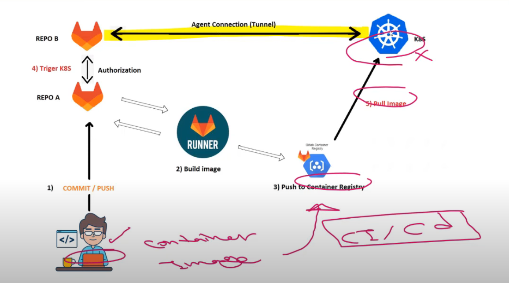
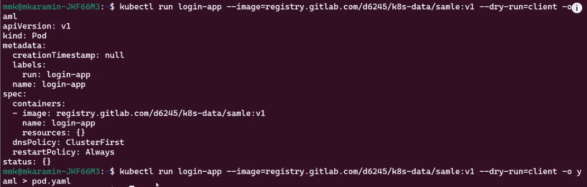
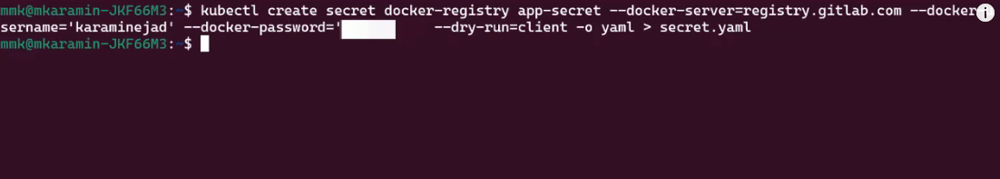
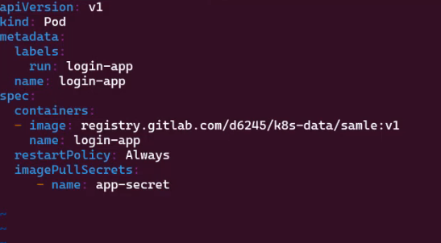
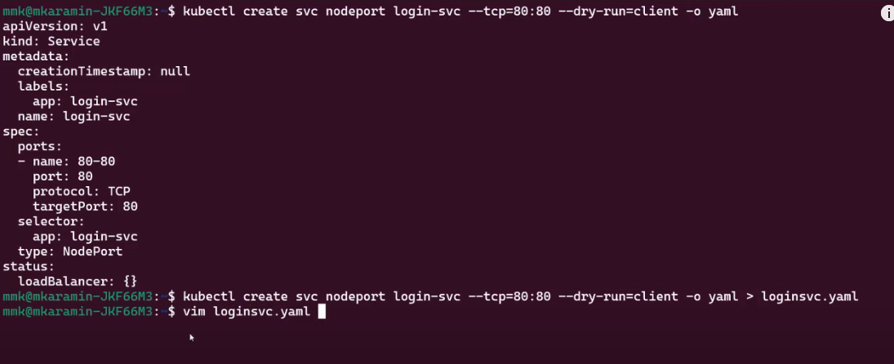
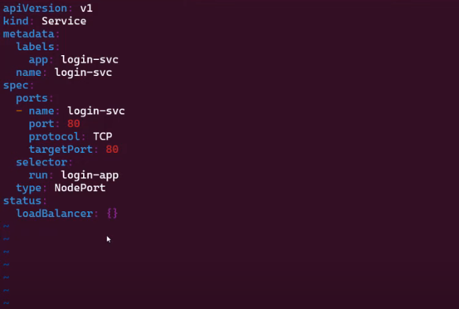
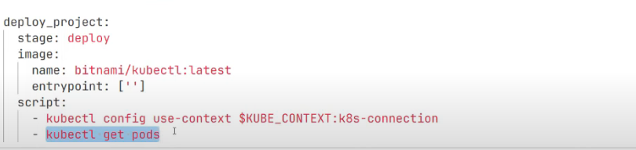

Video Link: https://www.youtube.com/watch?v=fwtxi_BRmt0

📗 Deploy a microservices container using GitLab CI/CD into AWS

# What we want to achieve



1. Developer commits/pushes code to GitLab Repo A
2. GitLab Runner:
   - Triggered by commit
   - Builds Docker image from code
3. Container Registry
   - Recieves and stores built image into ECR which is needed because EKS is going to pull these images in future to publish the services.
4. GitLab Agent (K8s)
   - Connects GitLab to Kubernetes cluster via secure tunnel
   - Handles authentication between GitLab and K8s
   - Deploys new image to K8s cluster


Part 1 - Create a `K8S-connection repo` to handle the connection between gitlab and AWS.

- Follow this link https://docs.gitlab.com/ee/user/clusters/agent/ to make the connection

- Installing an agent for your cluster
⛔ Note:: Before you can install the agent in your cluster, you need:
1. An existing Kubernetes cluster like EKS.
2. On self-managed GitLab instance.

- Create an `agent configuration file`

- In the `K8S-connection repo` create a new agent in : .gitlab/agents/k8s-connection/config.yaml

- Register the agent with gitlab -> Go to `Operate` -> `Kubernetes clusters` -> `Connect a Cluster` -> `select the K8S-connection` -> `Register`. Copy the access token and Install using `Helm`. Put the comamnds in terminal one by one locally.

🟣 These commands are necessary because:

They establish a secure connection between your Kubernetes cluster and GitLab
Enable GitLab to deploy to and monitor your cluster
Allow for GitLab CI/CD pipelines to interact with your Kubernetes environment
Provide a secure way to manage Kubernetes resources from GitLab
  

Step 2 - Create a repo in which you are going to store your code, gitlab ci/cd, dockerfile and manifest files.

- Push the image into container registry

🟠 But this entire process we want to make using gitlab ci/cd we dont want to make it manually.
For example we can push our images into GitLab constainer registry manually following these commands:

First build the DockerFile to create the image

`docker login registry.gitlab.com`
`docker build -t registry.gitlab.com/d6245/k8s-data/sample:v1`
k8s-data - name or repo in github
sample:v1 - name of local image we want to push...

`docker push registry.gitlab.com/d6245/k8s-data/sample:v1`

🟢 Walaaa you pushed the image to the `GitLab container registry` but it is not what we want. We want to do this automatically not manually... In order to do it we have to introduce `.gitlab-ci.yml`. You can follow this documentation if needed https://docs.gitlab.com/ee/user/packages/container_registry/build_and_push_images.html.

It will look like this:
```yml
stages:
    - build

build_image:
  image: docker
  stage: build
  services:
    - docker:dind
  script:
    - docker login -u $CI_REGISTRY_USER -p $CI_REGISTRY_PASSWORD $CI_REGISTRY
    - docker build -t $CI_REGISTRY/d6245/k8s-data/sample:v1 .
    - docker push $CI_REGISTRY/d6245/k8s-data/sample:v1
    - echo "Image built"
```

🟣 You may ask why `GitLab container registry` and not `EKS`:

1. You can use both of them but If you have invested in AWS use ECR, if you want simplier setup and dont need optimal performance use `GitLab Registry`. 
2. When talking about accessing these images into EKS there are some differences:
 For GitLab repositories:
 - Create a `Kubernetes secret` for GitLab registry authentication
 - Reference the secret in deployment

 Using ECR is simpler: 
 - EKS has built-in authentication with ECR
 - No need for separate secrets
 - Faster image pulls within AWS network
 - Better integration with AWS security

While both work, ECR is recommended for EKS deployments due to better integration and performance.

## Next Steps...

Our next steps are:
1. Create the Pod for our application in the kubernetes cluster
2. Create the secret to store the secrets to communicate with GitLab container registry...
3. Create the Service manifest to make the Pod accessible externaly using NodePort
⚠️ Service is not enough to make the Pod accessible externaly, it is simply to make the Pod accessible between other pods in the cluster so for that we need eather NodePort or LoadBalander


🟠 First lets implement these steps doing it manually then we should do it using CI/CD pipelines.

➡️ Until now I have learned to create manifest files manually but they can also be done using commands:


Simply access it running `vim pod.yaml`

Note: `registry.gitlab.com/.....` is taken from git lab container registry.

➡️ Create the secret


Run `kubectl apply -f secret.yaml`

➡️ Add this secret into the pod configuration


Run `kubectl apply -f pod.yaml`

➡️ Create the service with the nodeport



Apply the Service `kubectl apply -f loginsvc.yaml`

Run `kubectl get pod -o wide` -> Copy the IP of your app pod for example `10.42.0.190`
Run `kubectl get node -o wide` -> Copy the Internal Api of node for example `172.20.123.18` and paste it into brawser

🟢 Greatt job! You managed to create them but now we should create them using CI/CD.

Lets do it:

1. First make sure that all the pods that you created , secret and server push them into gitlab to the repo you are working on.

2. Have a look at this documentation: https://docs.gitlab.com/ee/user/clusters/agent/ci_cd_workflow.html

3. Make sure the connection is okay between the gitlab agent and the kubernetes:



