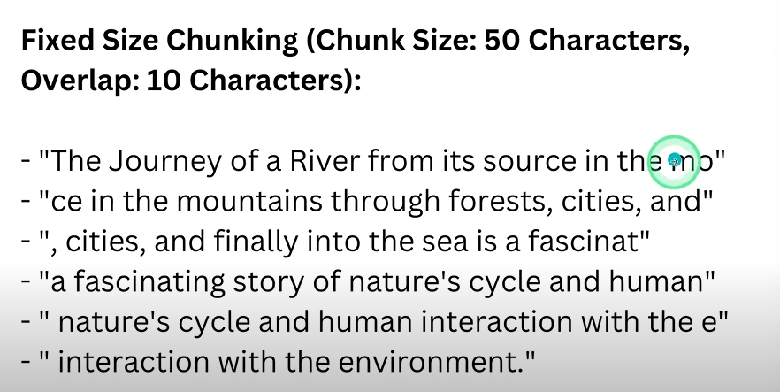
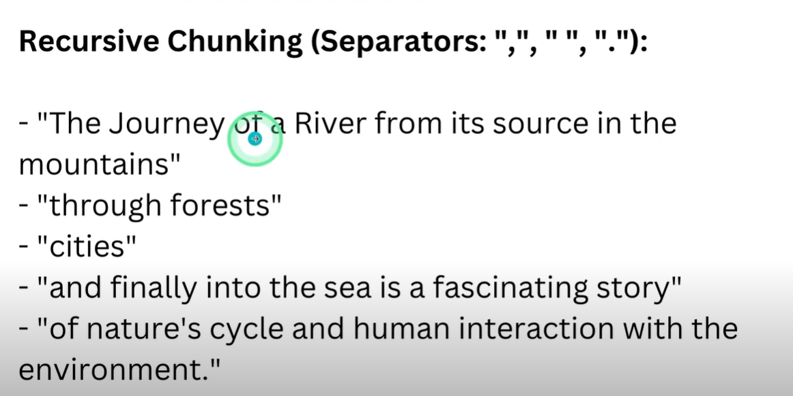

🟢 High quality chunks produce high quality answerss!!!

- Propositions Chunking (Part of Agentic Chunking)
https://arxiv.org/pdf/2312.06648
- Fixed Size Chunking

Even though it is easy to implement it is not very performant because:
1. Breaks semantic coherence by cutting text arbitrarily
2. Creates retrieval problems

- Recursive chucking

- Semantic Chunking
