🔴 Building Your First scikit-learn Soultion 🔴

# Exploring scikit-learn for Machine Learning

- Scikit-learn is an integral part of the Python data science stack, and it has a close relationship with NumPy, SciPy, Pandas and Matplotlib. Have a look at them .

- There are two kind of learning technicues:
1. Supervised learning- requires labeled data
2. Unsupervised learning- learns from patterns within the data.

## Traditional Models/Problems. There are 4 types of models: Regression, Classification, Clustering and Dimensionality reduction.

- ⚠️ These are also called problems that you are trying to solve, not only models.

- ⚠️ Regression and classification model.

Key Differences:
Output type: Regression produces continuous values; classification produces discrete categories.
Problem type: Regression solves "how much" or "how many" problems; classification solves "which category" problems.
Evaluation metrics: Regression uses metrics like Mean Squared Error (MSE); classification uses metrics like accuracy, precision, recall.

In real-world scenarios:
Regression might be used to predict a student's exact test score based on study hours.
Classification might be used to predict whether a student will pass or fail based on study hours.

Also for the other Traditional models there are more `submodels` like in this image:

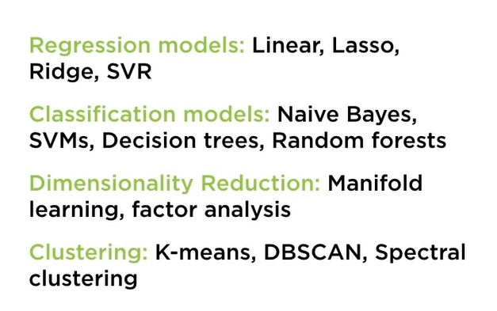

Remember Classification algorithm for example includes a variety of classifiers, decision trees, support vector machines, Naive Bayes classifiers (there are also more this are some of them) and all of these learn from data in different ways. Here You have a visualisation of them:

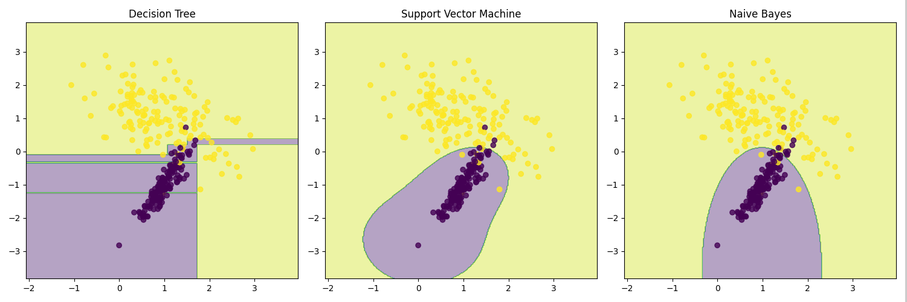

Different models have different algorithmic structures.

- ⚠️ Clustering and Dimensionality reduction.
Clustering might be used to segment customers into groups based on purchasing behavior.
Dimensionality reduction might be used to compress image data or to visualize high-dimensional data.
These techniques are often used as preprocessing steps before applying regression or classification models.

## Representational ML Models

- ⚠️ Beside Traditional Models there are also `Representational ML Models`: As your input data gets larger and you want to build models for more complex use cases you might turn to representational-based machine learning models. These models are used to solve the same kind of problems like the `Traditional ML Models` using classification, regression, clustering and dimensionality reduction. The difference is that they dont need experts to tell them what features to pay attention to. They are capable of learning significant features form the underlying data. And an example of representation-based ML models are `deep learning` models such as 💣 neural network.
If you want to work with Representational machine learning models you can use frameworks like TensorFlow, Keras, PyTorch beacause scikit-learn only works for `Traditional ML Models`.

- These `Representation ML Models` are also called Deep Learning ML Models.

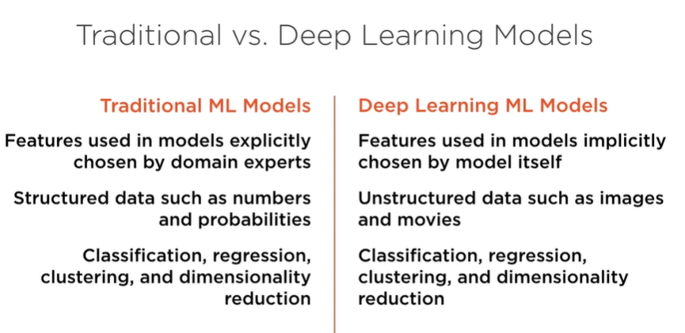

- To not get confused with these two kind of ML Models you can think of them like this:
Traditional Models stands for Machine Learning Solutions
Representation Models stand for Deep Learning Solution

- Scikit-learn primarily supports traditional ML Models

- Machine Learning is used to find patterns on your data to make decisions.

## How ML works on Supervised Learning  

- The input that you feed into your machine learning are referred to as `X` variables. These `X` variables are the attributes that the ML algorithm focuses and they are called `features`. Every data point is a list or `vector` of such features. So basically every record that you feed in for training or prediction is a vector of features. And this is the reason why the inut into an ML algo is a `feature vector`. If you are building an ML algo to predict the price of the car all the attributes of a car make up a `feature vector` or the `X variables`.

- Beside `X varibales` there are also `Y variables`, these are attributes that the ML algo tries to predict after it has been trained. This can be the predicted price of the car. These `Y variables` are called `Labels` and there are different types of them:
1. Categorical (classification)
2. Continuous (regression)

- So knowing this we can say : `Most machine learning algos seek to "learn" the function f that links the features (attributes of a car) and the labels (predicted price of the car)`

- The Linear regression model is known as the easiest model to work with. It gives you a graph with x and y axis where x stands for the features and y for labels. So given the features it predicts the labels. Now what `Linear reggresion` does is finding the `best fit` line via a training process. Once we ave found this best fit line, we can use it to predict the values of y, given an x. This uses the formula: `y = f(x)`.

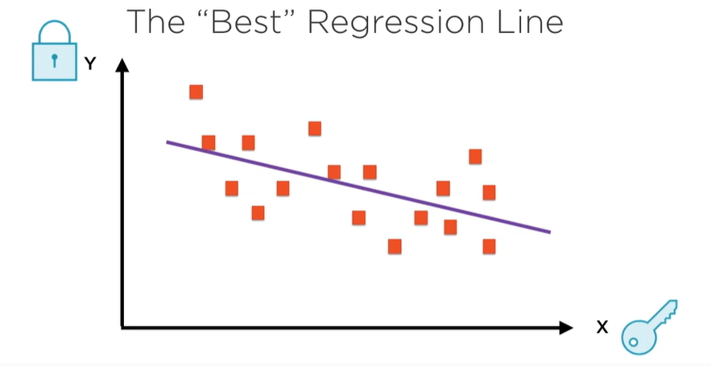

## How ML works on Unsupervised Learning

- Unsupervised learning foes not have `y variables` or the right predicted values to train your regression model. And this is because in unsupervised learning algorithms `self-discover` the patterns and structure in the data. 

- Some Unsupervised ML Algorithms are:
1. Clustering (K-means)
2. Dimensionality Reduction (PCA)

🛑 As much as I understand they donst use traditional regression or classification since they dont have labels outputs to make predictions.

## Installing Python and other packages

1. Jupyter - it allows you to run code and see result within your browser. It is an Browser-based interactive shell for executing Python code.

- source venv/bin/activate

You can use venv if you want but It will take a lot of memory since in every project you have to install packages.
If you want to use venv you can also take the packages from your machine using:

- python3 -m venv --system-site-packages my_project_env

If not continue without venv...

- sudo apt install python3-pip

- pip install notebook jupyterlab ipykernel ipywidgets

- jupyter --version

- pip --version

- pip install -U scikit-learn

- pip install -U numpy (for array computation and metrix operations)

- pip install -U scipy

- jupyter notebook

# Understanding the Machine Learning Workflow with scikit-learn

## Basic Machine Learning Workflow

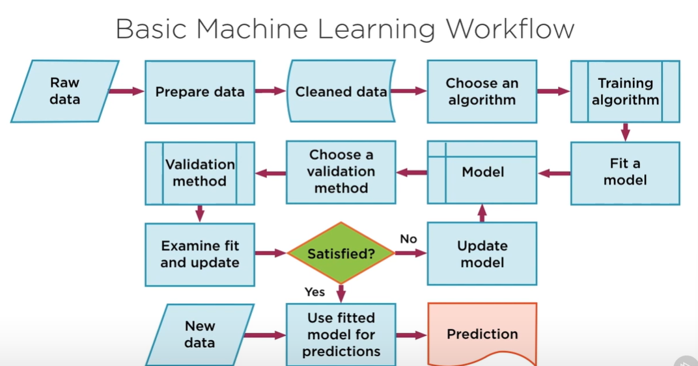 

- Lets explain each step:

1. First you have your raw data lets assume you are predicting the stock price, you might want to use stock prices form the last 10 years.

2. Once you've identified the raw data the next step is to prepare your data for machine learning.

3. Once the data is ready for your program you jave to format that they can be used by the model. You have to perform a bunch of data preprocessing to clean your data and get it in the right format. Machine Learning can only work with numeric data which means that strings or categories in your data have to be converted to the numeric format.

4. Next you need to choose an algorithm that you want to fit on your underlying data. Your algorithm could involve decision trees, support vector machines...

5. After deciding which one to use you will then use this ML algo to learn from your data. This is also called `to fit a model on your data `. At the end of the train what you'll have is a fully trained machine learning model that is ready for prediction. 

But still you dont know if your model performs well...

6. This is where validation comes in and there are different technicues that you can choose to evaluate your model.

7. You will then see if you are satisfied with the result of your model. If you are not satisfied you might need to update your model by choosing a different algo for example which works better on your data. You might include more data in your training phase or you might run training for a longer period of time and to go through the chain again until you are satisfied. This process is also called `pipelining`.

8. You will deploy this model to production and you'll feed in new data for prediction in the real world. And it is possible for your model to learn form this new data as well like chess.com.

 

## Choosing your Estimator (object that learns from data and can make predictions or transform data)

### Classification Problem Estimators

- You can use this chart as a quick cheat sheet or reference to figure out what is the right estimator for your use case.

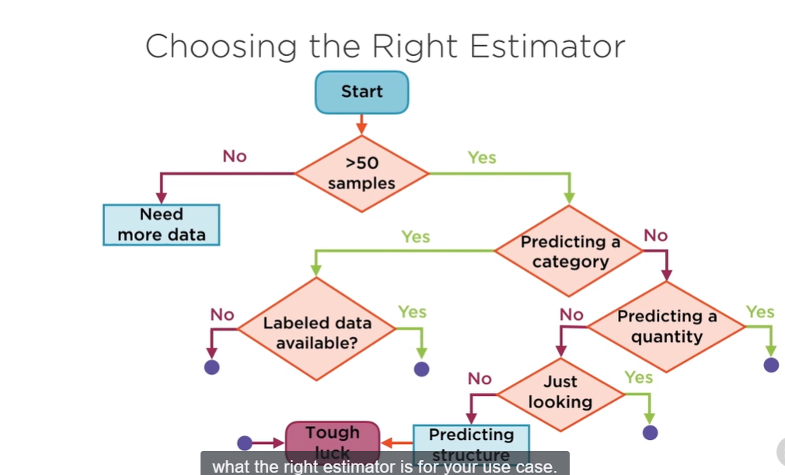

- 🟥 Rememberrrrrr......!!!!
You first have to figure out your problem that you are trying to solve after that you decide for the algorithm estimator..... 🟥.
The problem you are trying to solve can be a `classification, regression, clustering, dimensionality reduction`. Now these problems all have their algos/estimators which you can use. As a cheat sheet what algo to use based on the problem you have you can use the diagrams belowwww...

- ⚠️ Now you can see the step of Predicting a category. If you are trying to predict a classification(is spam or ham?) it is classification problem and scikit-learn has several algorithms that work for classification. Now after it has been figured out your problem you can chooes the algorithm using this helping diagram.

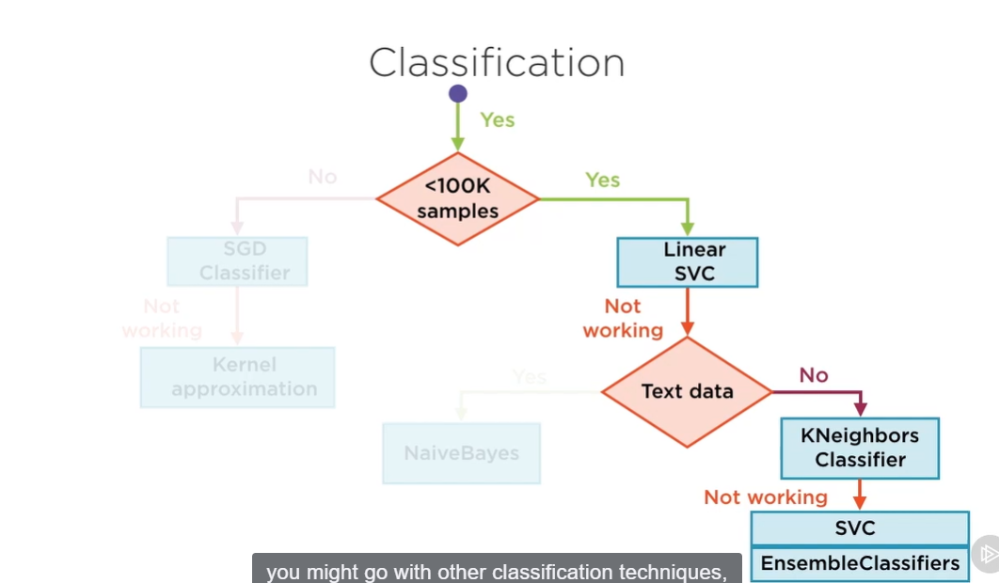

- In the given diagram if you have less than 100k samples you might use Linear SVC  Estimator which is a classification algorithm and so on... If you have more that 100k data records you can go with SGD Estimator.

### Clustering Problem Estimators

- So the first question is what you want your model to do?
If you want the model to predict a category or label you are dealing with Clustering problem.

- This is where you need to apply clusting techniques in order to find patterns on your data.
Here we present the other cheat sheet deiagram which found help us to choose the right estimator or technique for this Clustering problem.

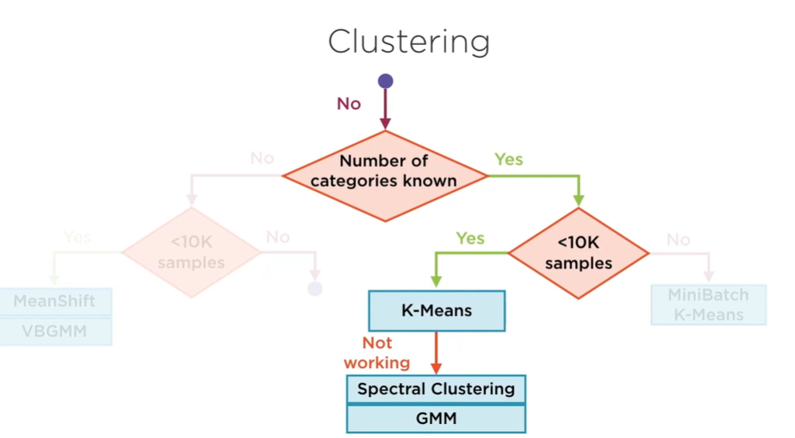

### Regression and Dimensionality Reduction Problem Estimators

- Regression Models
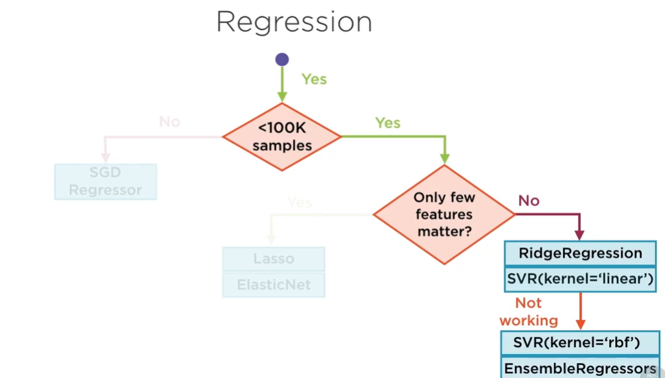

- Dimensionality Reduction Models

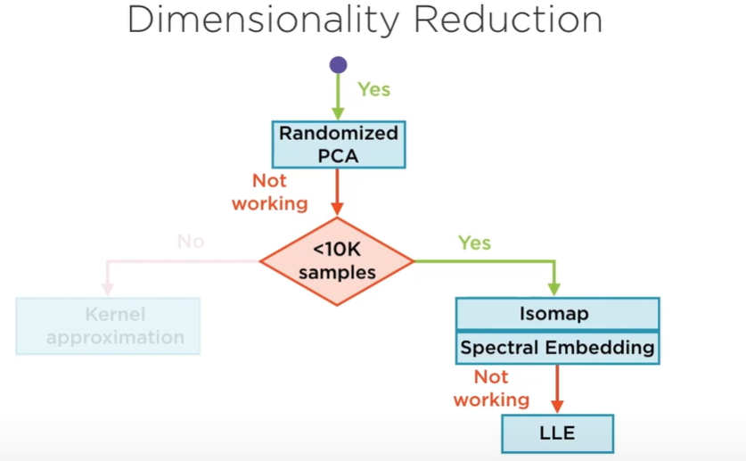

## Exploring Build-in Datasets

- As we learned `features` are the data that we pass into our model but they are seperated in two parts based on this code I learned:

`df_features = pd.DataFrame(breast_cancer_dataset.data, columns=breast_cancer_dataset.feature_names)`

Both breast_cancer_dataset.data and breast_cancer_dataset.feature_names relate to features:

breast_cancer_dataset.data: This contains all the feature values. Each column represents a different feature, and each row represents a different sample.
breast_cancer_dataset.feature_names: This provides the names or labels for each feature.

Key points to understand:

Features are the inputs to our model:

In this case, features include measurements like "mean radius", "mean texture", etc.
These are the characteristics we use to make predictions.

Feature values are the actual data:

The numbers in the DataFrame are the feature values.
Each row represents a different sample (patient in this case).
Each column represents a different feature.

Feature names provide context:

They tell us what each feature represents.
They're not used in calculations but are crucial for interpretation.

# Building A Simple Machine Learning Model with scikit-learn

⚠️ To find the code and more datails for this go into Scikit-learn-code.md

- Training using Linear Regression which specifically is under the category of Regression models/problems.

- Training and Prediction Using Logistic Regression Classifier, which specifically is under the category of Classification models/problems.

How Logistic Regression Works
Logistic Regression is a statistical model that, despite its name, is primarily used for classification tasks, especially binary classification (i.e., where the output variable has two possible outcomes, like "yes/no", "0/1", or "spam/not spam"). The model works by estimating the probability that a given input point belongs to a particular class.

1. The Problem of Linear Regression for Classification
Linear Regression predicts a continuous value, but in classification, we need to predict discrete classes.
If we use linear regression for classification, it could predict any number, including values greater than 1 or less than 0, which doesn’t make sense for probabilities. For example, you can’t have a probability of 1.5 or -0.2.
To solve this problem, Logistic Regression uses a sigmoid (logistic) function to map the continuous output of a linear equation to a probability value between 0 and 1.

⚠️ In few words `Logistic Regression` helps find how probabilities are changed by actions.

Lets have a visual interpretation how it works:

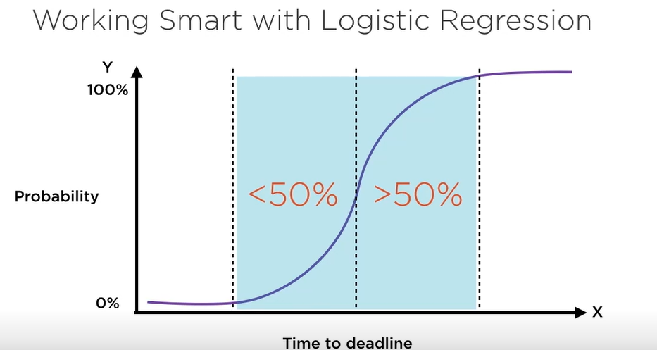

Lets assume that you have the time to deadline to finish a project and the propability of finishing it based on the time. You can choose to start it one year before the deadline and the propability will be close to 100% of finishng it in time but you can also start it 2 weeks before the deadline and the propability of finishng it will me 0%. These percentages in Logical Regression are represented wih numbers between 0 and 1, 0 for low propablility and 1 for high. But you can see also the `smart area` because you can still start 1 month before the deadline and still have a high chance of finishing the project before the deadline. It is called `samrt area` because you can spend the other 11 months working in other projects. The `Logical Regression` is represented in a S curve.
The dotted line in the middle can be thought of as a `threshold`.

# 🔴 Building Classification Models with Scikit-learn 🔴

- In this Course Model you will learn to implement various classification techniques and what classification seeks to achieve. You will learn more advanced forms of classification like `support vector machines, decision trees and Stochastic Gradient Descent` and the hyperparameters that these various classification models possess and how these can be optimized. 

## Understanding Classification as a Machine Learning Problem

- Classification is what you'll use to classify your data into categories, true or false, male or female, up or down...

- The first we will use and the basic one is `Logistic regression` classifier.

- When you train your model you have an `objective or loss function` hat you try to minimize. What does it meann... So when you get the output from your model there is also some feedback that you feed back to your model to improve its parameters. This feedback is the `loss function or cost function` also known as the `objective function`. Remember!!! The idea behind training your model is to minimize the loss function and this minimizaton improves the model parameters and makes it a more rebust model for prediction.

- To figure out if the train model is efficient you have to measure Accuracy,Precision and Recall.
1. Accuracy - Compare predicted and actual labels.
 High accuracy is good but it still can be a poor or useless prediction .
For example if you are trying to examine a very rare kind of cancer
 in medical reports and that cancer appears 1 in 100000 reports still 
 you can have accuracy for rare cancer at 99.9999% but this doesnt mean
that the ML model its doing its job well. Remember... there are some labels which may be much more common/rare than other and such a dataset is said to be `skewed`. And when you are working with skewed data accuracy tends to be a poor evaluation metric. In this sceanrio you need to consider using other metrics, and for that you'll set up a `confusion matrix`. Have a look at the image below to understand how `confusion matrix` works:

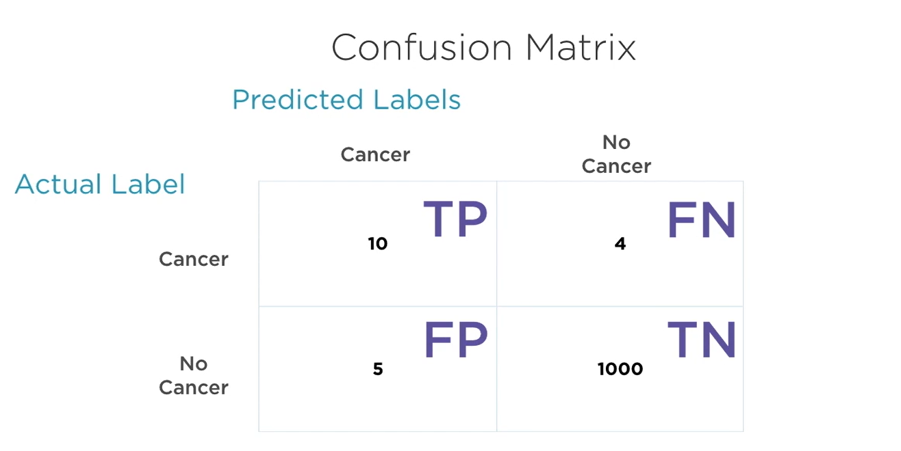

In the `confusion matrix ` you have the columns which show the predicted
labels and rows which show the actual labels.Now, beacuse the are
two outputs for this particular classification `cancer, no cancer` this is called 
a `binary classifier`. In other scenarios you can have as many
rows and columns as there are categories in your underlying data.
Lets explain each box:
- Top left box: it gives you the number of instances where our model correctly 
predicted the existence of cancer `actual label = [redicted label]`. These are called 
TP - true positives in our prediction.
- Bootom Left: represents the number of instances where our model predicted cancer, but cancer did not actually exist.
FP - False Positives.
- Bootom Right: number of instances where our model predicted no cancer and there was actually no cancer.
TN - True Negatives
- Top Right: number of instances where our model said no cancer was present but the patient was actually diagnosed with cancer.
FN - False Negatives

The purpose of this is to calculate accuracy, precision as well as recall.
How to calculate them:

1. Accuracy = TP + TN/Num instances = 1010/1019 = 99.12%
2. Precision = TP/TP + FP = 10/15 = 66.67%
⚠️ This precision value tells us that 1 out of every 3 cancer diagnosses in incorrect.
So dont be fooledddd...... ⚠️ Accuracy is not the same as precision and it is not enough.
3. Recall = TP/TP + FN = 10/14 = 71.42%
Also this measure is not looking that good. A recall value
of 70% means that 2 out of every 7 cancer cases missed. So it identified
people with cancer as they dont have cancer. Which is badddd...

- Threshold -> In linear regression you can specify the `Threshold` 
and it is used to categorize your input. So in the cancer exmaple If
you have a threshold of 0 that means that all people have cancer.
Lets see how the 0 threshold can affect our model based on
`Confusion Matrix`:
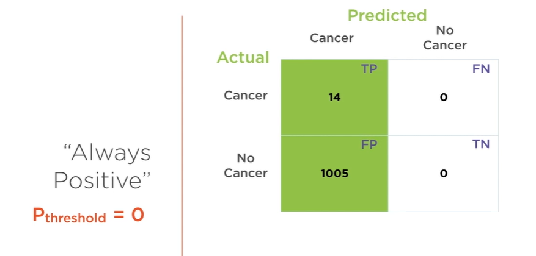

This would also affect the Recall, Precision:

Recall = 100% since it is based on FN and TP and FN now is 0.
Precision - 14/1019 = 13.7% . Pretty badly...

What we can say is that `this classifier is not conservative enough`

📓 Note::: The less the threshold of you classifier the lower the precision...

Now lets consider the other extreme with the threshold = 1. 
This is an always negative classifier and have a look how it can affect our model:

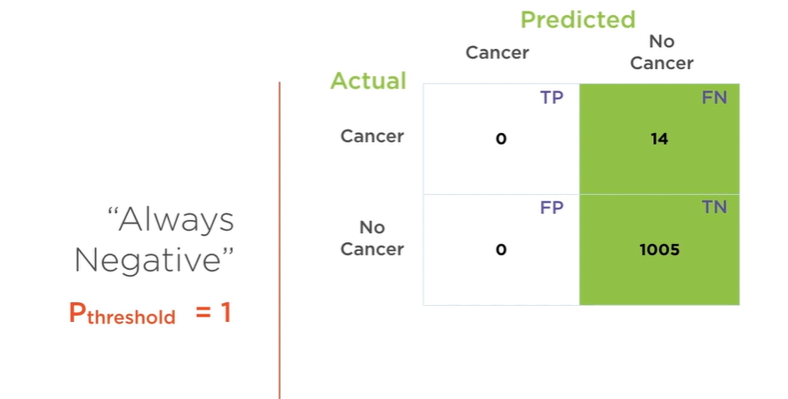

This would also affect the Recall, Precision:

Recall = 0% since 0/0 + 14 is 0. So, it would not find any cancer patients.
Precision = Infinite 

What we can say is that `this classifier is too conservative`.

Based on what we have we can see that the higher the `precision` the less the recall.
And the higher the recall the less the precision.
We can visualise it in this graph.

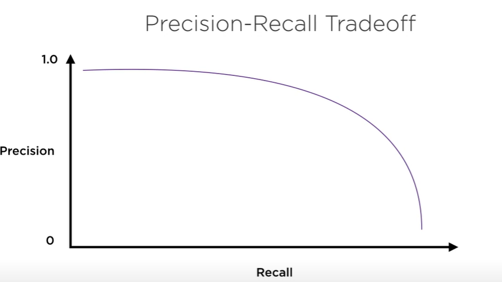

⚠️ Well, if that is the canse, how do we find a model thats good for uss...
And how do we find the best Pthreshold???? Very important.
Now we can use the `ROC curve` Receiver Operating Characteristic.
⚠️⚠️⚠️⚠️⚠️⚠️⚠️⚠️⚠️
For a good classification model we need a TP Rate ass high as possible.
We also need the FP rate to be as low as possible.
The curve that we have in this image is the ROC(TP vs FP Rates) curve which would help us
to find the best Pthreshold. Soooo basically we will give our model
different values of threshold from 0 to 1 and based on its output for TP and FP we will put it in a graph.
In the created graph we will take point which has the highest TP Rate and lowest FP Rate.

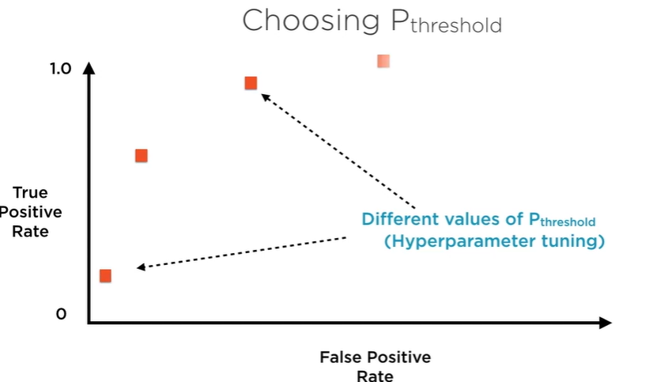

Here you would pick the second point from the left...

- Types Of Classification Problems:
1. Binary -> "Yes/No, True/False , Up/Down, Male/Female ..."
2. Multiclass -> Digit Classification,"Dog, Cat, bird, mouse ..."
3. Multilabel -> ("True", "Female"), ("False", "Male"). Output is tuple of multiple binary variables.
4. Multioutput -> Multiclass + Multilabel. ("Sunday", "January").

## Building a Simple Classification Model

- For the code go into Scikit-learn-code.md

