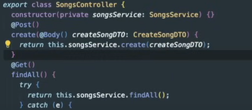
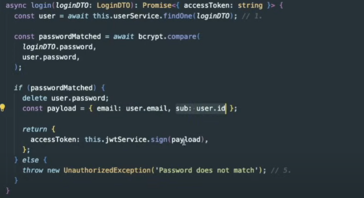

# What is NestJS
It combines elements of OOP (Object Oriented Programming), FP (Functional Programming), and FRP (Functional Reactive Programming).

Nest provides an out-of-the-box application architecture which allows developers and teams to create highly testable, scalable, loosely coupled, and easily maintainable applications. The architecture is heavily inspired by Angular.

# OVERVIEW

## Modules
- A module serves as the foundational building block of Nest.js app.
Each `Module` encapsulates Providers, Controllers, Imports and Exports acting as a cohesive unit of related functionality.

## Providers
- Providers are classes that act as services, factories or repositories. They encapsulate business logic and can be `injected` into controllers or other services.

- To inject a service or a provider into controller you should do it in the `constructor` of that controller like this:
  

- When you create a service you have to provide the decorator `@Injectable()`. The service can be a logic which interacts with database and we want to make it reusable...

## Controllers
- Controllers serve the function of handling incoming HTTP requests and sending responses back to the client.

- For the `Spotify` app we would have a SongController which exposes findAll() and create() services.

- `@Get()`, `@Post()` are called `decorators`.

- How to create a Controller?


## Imports 
- Imports is an array that pecifies the external modules needed for the current module, enabling code reusability and separation of concerns.

## Exports
- Exports are utilized to make services available to other modules.


🟠 In Nest.js, this architecture follows the `Module Isolation` principle, ensuring that the application is organised into distinct functional or feature-based modules.

Lets say we want to build a `Spotify` service we want to make the structure like this:


To create a module use this shortcut: `nest g module songs`

## Validate Request Body using MIDDLEWARE
- First install these packages:
`npm install class-validator classtransformer`

- Create a dto file to specify the validation for the body of a specific request:


- Go in the Controller where you have defined all the requests and use the dto for the body:


- Try the request:


- Things you can do using middleware:
1. Execute any code before the route handler
2. Changes to req and res
3. End the req-res cycle
4. Call the next middleware

While both Express and NestJS middlewares are tied to the request-response cycle, NestJS offers additional request handling mechanisms that provide more flexibility in controlling request flow.

- Middlewares are best for:

Logging
Request parsing
Header modification
CORS
Basic authentication
Request timing

- Guards are best for:

Authentication
Authorization
Role-based access control
Permission checking
Route protection
Complex request validation

⚠️ Guards run after the middlewares and before pipes/interceptors.

- Pipes are use to validate the input request params or to transform their types.

🟠 Example using Guards.

```javascript
@Injectable()
export class AuthGuard implements CanActivate {
  canActivate(context: ExecutionContext): boolean | Promise<boolean> | Observable<boolean> {
    const request = context.switchToHttp().getRequest();
    // Can redirect or throw exceptions
    if (!request.user) {
      throw new UnauthorizedException('Please login first');
      // Or redirect
      // context.switchToHttp().getResponse().redirect('/login');
    }
    return true;
  }
}

```

🟠 Another example of both

```JavaScript
// Middleware for request logging
@Injectable()
export class LoggerMiddleware implements NestMiddleware {
  use(req: Request, res: Response, next: NextFunction) {
    console.log(`${req.method} ${req.url}`);
    const start = Date.now();
    
    res.on('finish', () => {
      const duration = Date.now() - start;
      console.log(`Request completed in ${duration}ms`);
    });
    
    next();
  }
}

// Guard for authentication
@Injectable()
export class AuthGuard implements CanActivate {
  constructor(private authService: AuthService) {}

  async canActivate(context: ExecutionContext): Promise<boolean> {
    const request = context.switchToHttp().getRequest();
    const token = request.headers.authorization;
    
    if (!token) {
      throw new UnauthorizedException('No token provided');
    }

    const user = await this.authService.validateToken(token);
    if (!user) {
      throw new UnauthorizedException('Invalid token');
    }

    // Attach user to request for use in controllers
    request.user = user;
    return true;
  }
}

// Using both in your application
@Module({
  imports: [AuthModule],
  controllers: [UserController],
  providers: [AuthGuard]
})
export class AppModule implements NestModule {
  configure(consumer: MiddlewareConsumer) {
    consumer
      .apply(LoggerMiddleware)
      .forRoutes('*');
  }
}

@Controller('users')
@UseGuards(AuthGuard)
export class UserController {
  @Get()
  getUsers(@Request() req) {
    // Access authenticated user from request
    console.log(req.user);
    return [];
  }
}
```


## Custom Providers

- Custom providers

What happens when your requirements go beyond those offered by Standard providers? Here are a few examples:

- You want to create a custom instance instead of having Nest instantiate (or return a cached instance of) a class
- You want to re-use an existing class in a second dependency
- You want to override a class with a mock version for testing

Nest allows you to define Custom providers to handle these cases. It provides several ways to define custom providers. Let's walk through them.

There are many techniques to use providers:
1. Standard Providers
2. Value Providers
3. Non Class based Provider tokens
4. ClassProviders: useClass
5. Factory Providers: useFactory
6. Non-service providers
7. Alias providers: useExisting

⚠️ When you create a new Service like below,
the `@Injectable()` decorator makes the class a provider:
```javascript

import { Injectable } from '@nestjs/common';
import { Cat } from './interfaces/cat.interface';

@Injectable()
export class CatsService {
  private readonly cats: Cat[] = [];

  findAll(): Cat[] {
    return this.cats;
  }
}

```

## Injection Scopes

When you use the Provider/Service into a Module they are cached by Nest so the `singleton` principle is applied.
By default, NestJS providers are singletons - meaning `they share a single instance across your entire application when imported into different modules`.
Have a look at this example:

```javascript
@Injectable()
class CounterService {
  private count = 0;

  increment() {
    this.count++;
    console.log(`Count is now: ${this.count}`);
    return this.count;
  }
}

@Controller('counter1')
class Counter1Controller {
  constructor(private counterService: CounterService) {}

  @Get()
  increment() {
    return this.counterService.increment();
  }
}

@Controller('counter2')
class Counter2Controller {
  constructor(private counterService: CounterService) {}

  @Get()
  increment() {
    return this.counterService.increment();
  }
}

@Module({
  controllers: [Counter1Controller, Counter2Controller],
  providers: [CounterService]
})
class AppModule {}

```

GET /counter1 -> Returns 1
GET /counter2 -> Returns 2
GET /counter1 -> Returns 3

🔴 This is important to remember providers are singletons in Nestjs.

🟠 However, you can override this behavior in two ways:

1. Using custom providers with factory:

```javaScript
@Module({
  providers: [{
    provide: CounterService,
    useFactory: () => new CounterService()  // New instance each time
  }]
})
```

2. Using scope options:
```javaScript
@Injectable({ scope: Scope.REQUEST })  // New instance per request
class CounterService {
  // ...
}

```

Available scopes are:

- DEFAULT: Singleton (default). A single instance of the provider is shared across the entire application. Nest cache the instance.
- REQUEST: New instance per request.
- TRANSIENT: New instance per injection.

🔴 But be careful with non-singleton scopes as they can impact performance and memory usage. 🙂

## REPOSITORY PATTERN

- TypeORM supports the repository pattern, so each entity has its own repository. These repositories can be obtained from the database data source.

- Learn more for this

## Pagination

- For pagination you can use this library https://github.com/nestjsx/nestjs-typeorm-paginate.

👍 Steps:

1. Install the library.
2. Create this function isnide the provider/service 

Code Explanation:
- async: Makes the function asynchronous, returns a Promise
- paginate<Song>: Uses a generic pagination utility with Song type
- this.songsRepository: Database repository for songs
- options: Contains pagination settings (page number, items per page)
- Returns: Paginated list of songs with metadata (total count, pages, etc.)

This appears to use `nestjs-typeorm-paginate` library to handle pagination automatically with TypeORM repositories.

3. Create this enpoint into the Controller: 


🟠 Now if you want to test it you can call only the get endpoint:

`GET http://localhost:3000/songs/`

Or you can specify the page and the limit you want to fetch by specifying them as query params:
`GET http://localhost:3000/songs/?page=1&limit=2`

By calling this endpoint it will return the list of items also it will return a `meta` object which has these information:

```JavaScript
"meta": {
"totalItems": 4,
"itemCount": 2,
"itemsPerPage": 2,
"totalPages": 2,
"currentPage": 1

}
```

## ONE TO ONE Relationships || Many To Many Relation
Leraning about the relationsishps TypeORM comes into help: https://docs.nestjs.com/techniques/database


## User Signup

## User Login and Authenticate User with Passport JWT

Steps:

1. Install the dependencies:


2. Into auth.module.ts use the JwtModule:
```JavaScript
import {JwtModule} from '@nestjs/jwt';

imports: [
  ...,
  JwtModule.register({secret: 'YOUR_SECRET', signOptions: {expiresIn: '1d'}});
]
```
🔴 Make sure to store this secret in a safe place. Like in .env

3. Inside auth.service.ts:

- Use the JwtService into the constructor:


- Create this login function to generate the jwt token:


4. Create jwt-strategy.ts:


Register it as a provider in auth.module.ts.

5. Create the `guard` which is going to be called as decorator in the routes.


6. Call the login endpoint to generate the `accessToken` and copy it.

7. Apply the guard to the public route:
- 
- Pass the `accessToken` into the request:


🟠 How does this entire process work:

This is where NestJS's dependency injection and Passport's authentication system work together behind the scenes. Let me break it down:


🟢The connection happens through Passport's strategy registry, not through direct code references. This is why you don't see any explicit calls between JwtGuard and JwtStrategy - they're connected through Passport's internal mechanism.


Think of it like a pub/sub system:

- JwtStrategy "publishes" itself as a 'jwt' strategy
- JwtGuard "subscribes" to the 'jwt' strategy
- Passport connects them together.


## Role Based Authentication

🟠 We are going to implement this scenario:
- Only an artist can upload/create a song.

We have to restrict the access of create songs endpoint. Only artists can access this endpoint and create or update a song.

Steps to achieve this:

1. Create an Artists Module:


# FUNDAMENTALS

## Custom providers
