# Why is Deploying Code to Production So Hard?

## There are some common deployment issues
1. Manual Deployments
2. Dependency Management 
3. Multiple Environments
4. Rollback Procedures - When an error accours in production you have to rollback to a working state. So you should have a plan for failure and this is a bit hard when deploying manually. The failure plan has to bee tested.
5. Database Migrations
6. Realese Planning

## Containerization Makes it Easier
- What common issues does containers solve for us?
1. Automated Deployments (Using Pipelines or just deployment scripts)
2. Dependency Management (prepacked dependencies)
3. Consistent Environments (because your container is going to be your environment, whether it is development, testing or production)
4. Rollback and Versioning (by using Container orchestration tools)

- ⚠️ Deployments should be consistend and predictable.

# Microservices for the Modern Age

## Making your Microservice Cloud Native

- 12 factors for a cloud native service
1. Codebase (For example keeping all your code in git, there is a one to one relationship between dhe codebase and your repo,
if it lives in multiple repos that means that it is a distributed system like microservices, code sharing should be from libraries)
2. Dependencies (explicitly declare and isolate dependencies, using also a manifest file like package.json)
3. Config (store config in the environment, config is everything that varies between environments)
4. Backing services (treat backing services as `attached resources`, backing service is any service consumed over the network like database, memcached, redis, rabbitMQ and more...)
5. Build, release, run (Strictly seperate the build and run stages)
6. Port bindings (expose port services via port binding)
7. Concurrency
8. Disposability (maximise robustness with fast startup and graceful shutdowns)
9. Dev/prod parity (keep development, staging, production as similar as possible)


# Docker and Kubernetes Basics

## Understanding Images

- It is a blueprint of the libraries and dependencies that you're gonna need to run your
application in a container.
- When we build our docker image it is going to go and contain instructions on how to go and build a container.
These instructions include things like what the base image is going to be , the steps, how the app is going to be executed when that container goes and starts up.
- An image consists of multiple layers. each of these layers are gonna be `immutable` which means once the image is built, they're never going to change.
Each layer is going to be an instruction from copying your code over to go and installing packages.
- Changes are made to the container layer and this layer is gonna stand at the top of every other layers.
- To build a docker image you have to create a `Dockerfile`


## Understanding Containers

- A container is a virtualized runtime environment 
for your application.
- Containers are `ephemeral` which means that they essentially are temporary.
So when a container crashes you need to go and spin up a new one. But, 
this means that any information in the container is lost when a new one is created.
Containers dont have a `persisted storage`.

## Kubernetes Pods
- Pods are the smallest deployable unit of computing
- They are a group of one or more containers, most of the time
there is going to be a single container but there can be scenarios
where there are helper containers.
- Pods have `ephemeral lifespan`, once they die they do not come back
unless you recreate them.
- Containers in a pod share:
Network namespace (they can talk to each other via localhost)
Storage volumes
Same lifecycle (start/stop together)

## Kubernetes Services

- Pods operate in isolation which means that its not really publicly accessible.
For this reason we use services to make these pods available on the network. By using the name of the service we can access the pod.

## Kubernetes ReplicaSets

- Replica Sets are a guarantee that we have availability on our pods, lets assume our pod 
went down and we want it back again we can ensure this by replicaSets. 
- We can define a number of pods that we want running and that replicaSet will go and enforce that number of pods.
- Scale up to meet demand.
- The replicasets can access the pod directly and create new ones, after creating multiple pods with the help of replica sets you can create the service for the pod.

## Kubernetes Deployment

- Why use a deployment over a ReplicaSet? When we use a ReplicaSet and delpoy it out, its going to overwrite the previous ReplicaSet.
When we use Deployment its going to perform a rolling update which means its not going to replace the previous ReplicaSet until all the pods of the new ReplicaSet have been deployed out and are online.
So to minimize any kind of downtime for our deployment we should use `Kubernetes Deployment`.
- By default, a deployment will keep a history of 10 ReplicaSets.

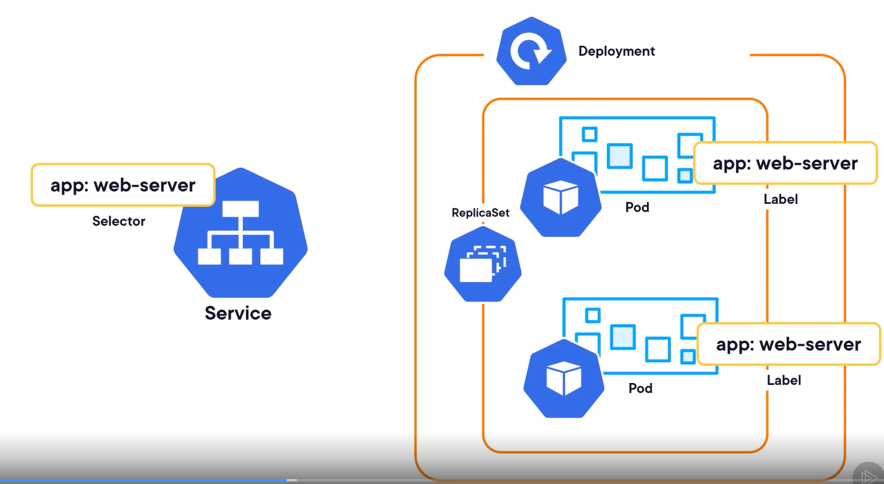


# Creating a Kubernetes Environment in AWS

## Setup Account 
⚠️ We are gona use `eksctl`:
`eksctl` is a command-line tool for creating and managing clusters on Amazon Elastic Kubernetes Service (EKS). EKS is a managed Kubernetes service by Amazon Web Services (AWS), and `eksctl` simplifies many of the steps involved in setting up, configuring, and operating Kubernetes clusters on EKS.

- Crete User Group and EKS policies, in AWS it is called IAM where you create user groups. For policies when creating a new group go to `Attach permissions policies` and you want to add:
1. amazonec2full
2. iamfull
3. awscloudformationfullaccess
After adding them create the group.
Open the created gorup again go to permissions and add a new permission `create inline policy`. Inside the JSON paste this code
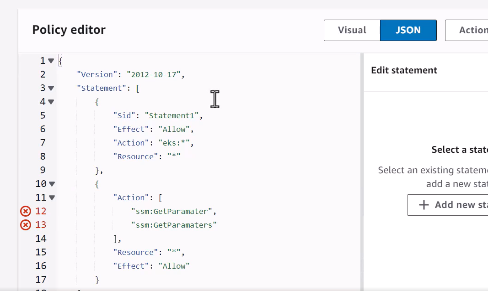

This policy would typically be used when you need to:

Have full access to Amazon EKS (Elastic Kubernetes Service) operations
Read parameters from AWS Systems Manager Parameter Store, which is often used to store configuration values, secrets, or other parameters needed by applications or infrastructure

- Create User Account, it is needed to create the EKS cluster.

- Create Access Key, it will allow us to access AWS remotely.
When you create your user click that user and go to `Access keys` to create a new one for CLI.


## Creating the Management Instance
Were gonna be using this instance for a lot of things from building docker images, deploying out our EKS cluster and managing it.

More details about Management Instance: 
Think of it as your "control center" or "workstation" in the cloud. It is indeed a virtual machine (EC2 instance) that serves several important purposes. Think of it like having a powerful Linux computer in the cloud that's specifically set up for AWS management tasks. Instead of installing all the necessary tools on your personal laptop and dealing with potential compatibility issues, you connect to this instance and do your work from there.

- In AWS go and find EC2 and click `Launch Instance`. You have to select `eks` in options when creating it.

- When it is created go and connect to that instance. It is going to open a terminal window for you where you can start working... Now treat this terminal as a wsl terminal, update packages, install docker and start it...

1. sudo yum update -y
2. sudo yum install docker -y
3. sudo service docker start

- Then you have to add the created EC2 user tou your docker group.

1. sudo usermod -a -G docker `name-of-created-user`
2. refresh AWS
3. Install the lastest version of AWS CLI
4. unzip it
5. sudo ./aws/install --update

Check the version of AWS now...

## Creating EKS Cluster
- Install eksctl
- Install kubectl
- Create the EKS Cluster
Follow these steps https://github.com/rivethead42/nodejs-microservices-deploying-scaling/blob/main/Section05/S05L03.md

## Create an ECR Repository
    - Create the ECR repository
    - Add ECR IAM policy to EKS Nodes
    - Test the config

The `ECR Repository` is like a docker which contains all the images then the EKS can pull these images
if it needs them...

-> First run this command to create a new ECR: aws ecr create-repository --repository-name somarian-test-image --region us-east-1
-> Go to ECR in AWS and you should find the created repository in there.
Now in order for our kubernetes nodes to be able to access the ECR registry we have to create an IAM policy. Basically
we need it to allow EKS to communicate with ECR.
-> Go to one of the created EKS clusters click at the instance and create a new policy. You only do this once.
-> Paste this in: 
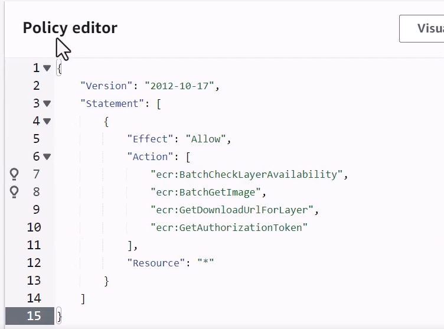
-> Then you copy the URI of created repository and you run:
aws ecr get-login-password --region us-east-1 | docker login --username AWS --password-stdin 337748711987.dkr.ecr.us-east-1.amazonaws.com/tthomsen-test-image


For example:
-> For our scenario in inventory app we have to create 4 repos using `aws ecr create-repository --repository-name {serviec-name} --region us-east-1`

# Containerizing Your Nodejs Microservice

## Containerizing Microservices

Now that you have created the ECR repos for all the services you can follow these steps:

-> clone the projects from git to the `Management Instance` and create Dockerfile for those services...
For example:
```yml
FROM node:alpine AS BUILD_IMAGE

WORKDIR /app
COPY . .
RUN npm install
RUN npm run tsc

FROM node:21-alpine
ARG NODE_ENV=production
ENV NODE_ENV $NODE_ENV

# 1. First create the group
RUN addgroup -g 1001 -S nodejs

# 2. Then create user and assign to group
adduser -S nodejs -u 1001 -G nodejs
#       │ │      │ │     │ └── Group name to join
#       │ │      │ │     └── -G means "add to group"
#       │ │      │ └── User ID number
#       │ │      └── -u sets user ID
#       │ └── Username
#       └── -S means "system user"

WORKDIR /app

COPY --from=BUILD_IMAGE --chown=nodejs:nodejs /app/package.json  /app/package-lock.json ./
COPY --from=BUILD_IMAGE --chown=nodejs:nodejs /app/build ./build

RUN NODE_ENV=$NODE_ENV npm install

USER nodejs

CMD ["npm", "run", "start:prod"]
```
1. Build the image
- docker image build -t inventory-test:latest .
- docker image ls

2. Create the container
- docker container run -d inventory-test
- docker ps
- docker container logs <container_id>


## Containerizing the remaining Microservices

Again follow these steps:
1. Clone the repo from git to our management instance.
2. Navigate to the cloned project
3. Investigate the package.json and ts.config file to build the Dockerfile
4. Create the Dockerfile: vi Dockerfile
5. Build the image
6. Create the container
7. Repeat ♻️

## Pushing the Images to the Container Registry

1. Go to ECR on AWS and copy each registry URI
2. Go again to each cloned microservice in the instance
3. Rebuild the image again but now providing the Registry URI so the image can
 be pushed to the desired registry, run for each cloned repo with the created Dockerfile:
 `docker image build -t <COPIED_REGISTY_URI>:latest .`
4. docker image ls
5. Make sure you have logged in to ECR: `aws ecr get-login-password --region us-east-1 | docker login --username AWS --password-stdin <REGISTRY_URI>`
6. `docker image push <NAME_OF_CREATED_IMAGE>`, the name propably will be the same with the registry URI, you can check it using: docker image ls
7. Go to ECR open the registry and you will see the image in there.
8. Repeat for all services 🔁

# Deploying Your Node.JS MICROSERVICE to EKS

## Deploying a MongoDB Backing Service for the Inventory System

1. Create a manifest directory: mkdir manifest, cd into manifest
2. vi inventory-mongodb-depl.yml
3. Inside inventory-mongodb-depl.yml create a Deployment File, It will look like this:
```yml
apiVersion: apps/v1
kind: Deployment      # This is a Deployment object
metadata:
  name: inventory-mongo-depl  # Name of the deployment
spec:
  replicas: 1        # Number of pod copies to run
  selector:
    matchLabels:     # Selects which pods to manage
      app: inventory-mongo
  template:          # Pod template
    metadata:
      labels:
        app: inventory-mongo
    spec:
      containers:
      - name: inventory-mongo
```

⚠️ What's Happening Here:

Your professor is creating a Deployment, not just a pod

A Deployment manages pods
More reliable than creating pods directly
Handles updates and scaling

You could also create a pod directly like this:

```yml
# pod.yaml
apiVersion: v1
kind: Pod
metadata:
  name: my-mongodb
spec:
  containers:
  - name: mongodb
    image: mongo

```
🔴  But rememberr this approach is not good because:
If it crashes → Stays dead
If node fails → Pod is lost
No auto-recovery
Manual restart needed

🟢 Use deployments because:
If pod crashes → Auto-restarts
If node fails → Recreates pod on another node
Easy scaling (just change replicas)
Handles updates smoothly

🟠 When to use each:
Use Pod Directly:
- Testing/Learning
- One-off jobs
- Debugging

Use Deployment:
- Production apps
- Databases
- Services that need reliability
- Almost everything else

4. In the same file with the created `Deployment` create also the Service to make it accessible:
In Kubernetes, you need a separate Service object to handle port exposure
and networking. The Deployment manages the pods, while the Service manages
network access.

This is how it looks:
```yml
apiVersion: v1
kind: Service
metadata:
  name: inventory-mongo-srv
spec:
  type: ClusterIP  # Internal service type, you can remove this if want
  selector:
    app: inventory-mongo  # Must match Deployment labels!
  ports:
    - name: db
      protocol: TCP
      port: 27017         # Port on the service
      targetPort: 27017   # Port on the pod
```

Different Service Types:
```yml
# Internal Access (within cluster)
type: ClusterIP

# External Access (from outside)
type: NodePort
# or
type: LoadBalancer
```


Example of using the service:

```yml
# In another app's configuration
mongodb_url: mongodb://inventory-mongo-srv:27017
#                              ^
#                              Service name
```
5. Apply the manifest file with the pod and service:
Run: `kubectl apply -f inventory-mongodb-depl.yml`

6. kubectl get all

⚠️ We can see the created mongo service but we still have a problem.
That problem is the persisted storage. Because pods and containers are ephemeral
the data that is actually written to the container, if it gets restarted or recreated
all the data will be lost. This issue can be solved by using  `Storages`.


## Using EBS Volumes for Persistent Storage

- First run this command: `eksctl utils associate-iam-oidc-provider --cluster pscluster --approve`
The purpose of it is:

⚪ Creates an OpenID Connect (OIDC) provider for your EKS cluster
⚪ Enables Kubernetes pods to securely authenticate with AWS services
⚪ Required for using AWS IAM roles with Kubernetes service accounts

Without OIDC:
Your Apps ❌ Can't safely access AWS services
(Like having a building with no security system)

After OIDC Command:
Your Apps ✅ Can safely access AWS services
(Like installing a security system with ID cards)

- Go to AWS and find IAM and find in Roles: AmazonEKS_EBS_CSI_DriverRole

The AmazonEKS_EBS_CSI_DriverRole is specifically for handling storage in EKS. Let me explain in simple terms:

Purpose:

Allows your EKS cluster to create, attach, and manage AWS EBS (Elastic Block Storage) volumes
Think of it like giving your cluster permission to manage external hard drives

Without this role:
EKS Cluster ❌ Can't create/manage storage
(Like a computer that can't manage external hard drives)

With this role:
EKS Cluster ✅ Can manage AWS storage
(Like giving permission to manage external drives)

- Inside this role copy the ARN and go again to terminal and run:
```yml
eksctl create addon \
  --name aws-ebs-csi-driver \
  --cluster pscluster \
  --service-account-role-arn arn:aws:iam::337748711987:role/AmazonEKS_EBS_CSI_DriverRole --force 
```
Simple Explanation:

Remember the role we just discussed (AmazonEKS_EBS_CSI_DriverRole)?
Now we're installing the actual software (driver) that uses that role


1. Created Role (Previous step)
   (Permission to manage storage)
   
2. Install Driver (This step)
   (Software that actually manages storage)
   
3. Now MongoDB can:
   - Save data permanently
   - Survive pod restarts
   - Manage its storage

🟢 So basically now we can use this installed external
driver to save data permanentaly on a storage while our pods
restart. This exteranl driver is called EBS Volume:
An Elastic Block Storage (EBS) Volume hosts virtual data in segments.
It's like a storage disk with the ability to contain various sizes of data.
These virtual storage devices usually replicate within one AWS region to increase their availability.

This is not the only way to handle persistent storage in Kubernetes:

1. AWS EBS (Cloud Storage):
✅ Reliable
✅ Managed by AWS
✅ Auto-scaling
❌ More expensive
❌ AWS-specific

2. Local Storage:
✅ Fast
✅ Free
✅ Simple
❌ Lost if node fails
❌ Pod must run on same node

3. NFS:
✅ Shared across pods
✅ Cloud-independent
✅ Can be cheaper
❌ Need to manage NFS server
❌ More complex setup

Your professor chose EBS because:

1. It's fully managed by AWS
2. More reliable
3. Better for production
4. Integrates well with EKS


- Go again to manifest folder and run `vi storageClass.yml`
Into this file put:

```yml
apiVersion: storage.k8s.io/v1
kind: StorageClass
metadata:
  name: ebs-sc             # Name we'll reference later
provisioner: kubernetes.io/aws-ebs    # Uses AWS EBS
# This tells Kubernetes to wait until MongoDB
# actually needs the storage before creating it
volumeBindingMode: WaitForFirstConsumer
parameters:
  type: gp2               # General Purpose SSD, This specifies we want AWS General Purpose SSDs

```

- Apply this manifest file running: `kubectl apply -f storageClass.yml`
- To confirm if it was created run: `kubectl get storageclass`
- Go to inventory-mongodb-depl.yml and create the persistent volume claim before the Deployment.

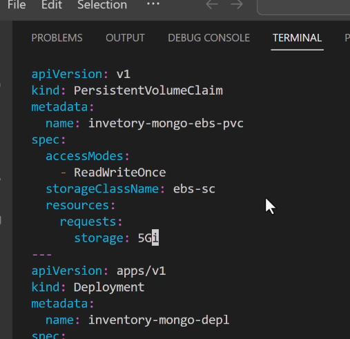

- Go a bit below in this file into the Deployment to use this persistent Volume:
Go to spec -> containers and specify:
```yml
...
  spec:
    containers:
        volumeMount:
           - name: inventory-mongo-storage
             mountPath: /data/db
    volumes:
      - name: inventory-mongo-storage
        persistentVolumeClaim:
            claimName: inventory-mongo-ebs-pvc
```

🟢 Now all you need to do is reapply the manifest file.
`kubectl apply -f inventory-mongo-depl.yml`
`kubectl get all`
`kubectl describe po <name of pod>`
There you can see that you have the Volumens defined with all information..
Wala you have managed to create a persistent storage and use it inside the pod...

🟢 So to conclude these are the steps you follow:
1. Set Up EBS CSI Driver using commands

```yml
# 1a. Create IAM OIDC Provider
eksctl utils associate-iam-oidc-provider --cluster pscluster --approve

# 1b. Create IAM Role (AmazonEKS_EBS_CSI_DriverRole)
# This happened automatically

# 1c. Install EBS CSI Driver
# ACCOUNT_ID:role/AmazonEKS_EBS_CSI_DriverRole find this by copying the ARN of created Role in IAM -> Roles -> AmazonEKS_EBS_CSI_DriverRole: 337748711987:role/AmazonEKS_EBS_CSI_DriverRole
eksctl create addon \
  --name aws-ebs-csi-driver \
  --cluster pscluster \
  --service-account-role-arn arn:aws:iam::ACCOUNT_ID:role/AmazonEKS_EBS_CSI_DriverRole
```

2. Create the StorageClass into the manifest folder you have created.
```yml
apiVersion: storage.k8s.io/v1
kind: StorageClass
metadata:
  name: ebs-sc
provisioner: kubernetes.io/aws-ebs
parameters:
  type: gp2
```

3. Create PersistentVolumeClaim (PVC) which will point to the StorageClass:

```yml
apiVersion: v1
kind: PersistentVolumeClaim
metadata:
  name: mongodb-pvc
spec:
  storageClassName: ebs-sc    # References StorageClass
  resources:
    requests:
      storage: 10Gi
```

4. Use PVC in MongoDB Deployment
```yml
apiVersion: apps/v1
kind: Deployment
metadata:
  name: mongodb
spec:
  template:
    spec:
      containers:
      - name: mongodb
        volumeMounts:
        - mountPath: /data/db
          name: storage
      volumes:
      - name: storage
        persistentVolumeClaim:
          claimName: mongodb-pvc    # References PVC
```

## Deploying RabbitMQ

- Install RabbitMQ Operators
1. Open terminal and run: `kubectl apply -f "https://github.com/rabbitmq/cluster-operator/releases/latest/download/cluster-operator.yml"`
This command is gonna install the rabbitmq operator for us. `Operators` are nothing more than just a piece of software that adds
some additional functionality to Kubernetes. What this allows us to do is to deploy out RabbitMQ without having

🟡 The RabbitMQ Cluster Operator is a Kubernetes operator that:
👉 Automates the deployment and management of RabbitMQ clusters on Kubernetes
👉 Handles RabbitMQ cluster creation, updates, and scaling
👉 Manages cluster configuration and monitoring
👉 Automates failover and recovery operations

2. `kubectl get all -n rabbitmq-system`

3. Create a manifest file into manifest folder to define the RabbitMQ instance: `vi rabbitmq.yml`

```yaml
apiVersion: rabbitmq.com/v1beta1
kind: RabbitmqCluster   # ← This is now recognized thanks to the operator, we are referencing what we insalled using the operator
metadata:
  name: rabbitmq-cluster
spec:
  replicas: 1
  persistence:
    storageClassName: ebs-sc    # Specify your storage class here, this is needed because if pod restarts
    # all the data will be lost so we want to save these data into the EBS Volumes to not lose them...
    storage: "10Gi"              # Specify storage size

```

4. `kubectl apply -f rabbitmq.yml`
5. `kubectl get po`


## Deploy the Inventory Microservice

1. Create a K8s deployment file
2. Start working env vars

⬇️ Steps:

1. Go to the cloned repo in `management instance`
2. Have a look for the `env variables`
3. Go to manifest folder again and create a new Deployment file in it for inventory microservice: `vi inventory-depl.yml`. It will look like this:

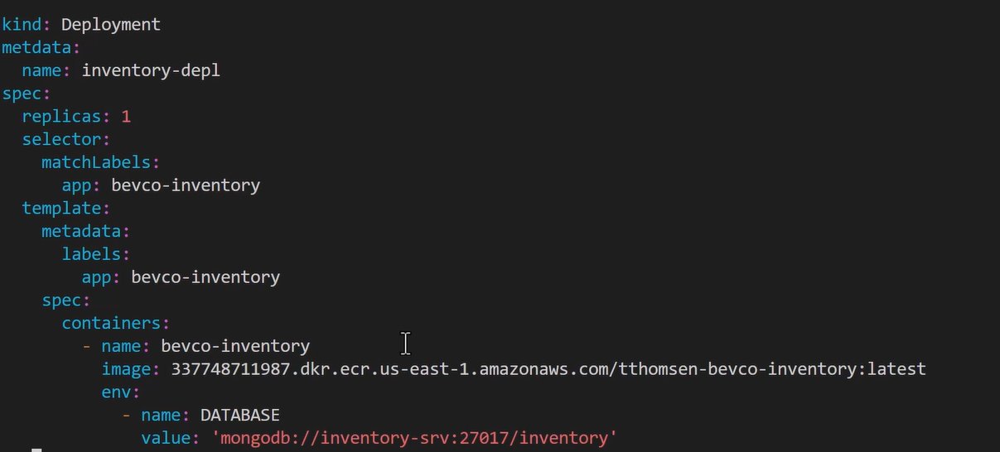

Note: you have to provide in image the urn of the service repo, and in env provide the database connection string: `mongodb://inventory-mongo-srv:27017/inventory`. You find this in the Service file of mongo that you created before.

4. Create the service in the same file of development:

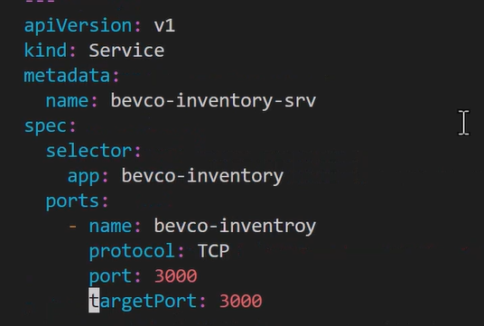

5. `kubectl apply -f inventory-depl.yml`
6. `kubectl get po`
7. To check if the deployed microservice is running well go and see the logs of the service: `kubectl logs <NAME-OF-SERVICE-IN-KUBECLT-GET-PO>`

🟠 Currently we are not able to go and access the microservice.

## Deploying the Inventory Messaging System  Microservice

🟢 We would follow the same steps as with Inventory Microservice
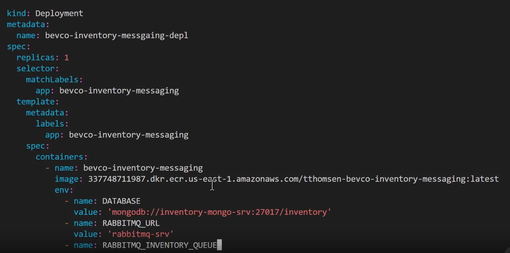

⚠️ You can see that `RABBITMQ_INVENTORY_QUEUE`value is empty of now and thats because we need `Secrets`.
But what are `Secrets`???

Secrets in Kubernetes are used to store sensitive information like passwords, tokens, and keys. For RabbitMQ queues, you might want to keep the queue name secret to prevent unauthorized access.
Instead of directly putting the queue name in the deployment YAML like:

```yml
env:
  - name: RABBITMQ_INVENTORY_QUEUE
    value: "inventory_queue"
```

You'd create a secret:

```yml
apiVersion: v1
kind: Secret
metadata:
  name: rabbitmq-secrets
type: Opaque
data:
  queue-name: <base64-encoded-queue-name>
```

Then reference it in the deployment:

```yml
env:
  - name: RABBITMQ_INVENTORY_QUEUE
    valueFrom:
      secretKeyRef:
        name: rabbitmq-secrets
        key: queue-name
```

## Working with Secrets

- Secrets are confidential data which we wanna keep as private. `usenames, passwords, API keys`. We dont want these data inside the pod definition. These data are being stored in `etcd`. You need to be aware that secrets are `Base64 encoded`, this means that the data can be decoded and they are not encrypted by default. So if you want to encrypt it you can do that by yourself.

1. This is how to create a new Secret:
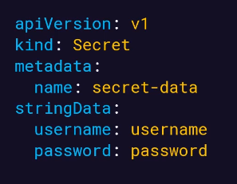

2. How to use it inside our pod:
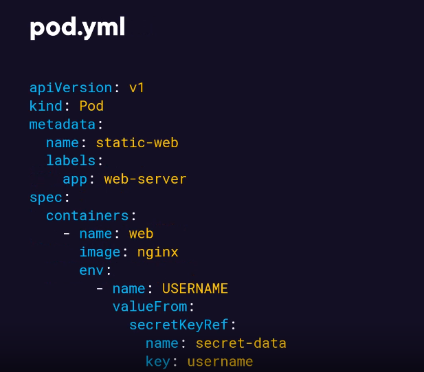

-Now lets go to our demo :)

1. Go to the manifest folder and `vi secrets.yml`
2. Create your Secret for RabbitMQ INVENTORY QUEUE...

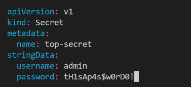

3. kubectl apply -f secrets.yml

4. Grab our secret and since its Base64 encoded we nedd to decode it intp plain text:

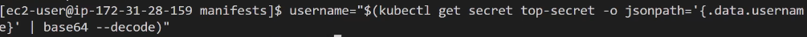

5. `echo $username`

6. Do the same thing for password...

7. Run these commands:
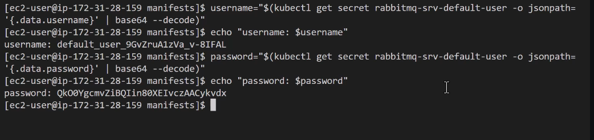

🔴 This might look confusing but what the professor is doing:

- The `rabbitmq-srv-default-user` secret is automatically created by the RabbitMQ Cluster Operator when you create a RabbitMQ cluster

- The operator automatically creates the secret rabbitmq-srv-default-user containing:
-> Default username
-> Default password
-> Other connection details

- You can verify this by running:
```yml
kubectl get secrets | grep rabbitmq-srv-default-user
```

⚠️ So there is no need to create a Secret File for the RabbitMQ default credentials by yourself because:

 The RabbitMQ Cluster Operator automatically creates these secrets when you create a RabbitMQ cluster

However, if you want to create additional secrets (like for queue names or custom configurations), you would need to create those yourself.
The only secrets you need to manually create are ones that aren't automatically generated by the operators or systems you're using.

8. Lets go and update the messaging service so we can access RabbitMQ: `vi inventory-messaging-depl.yml`
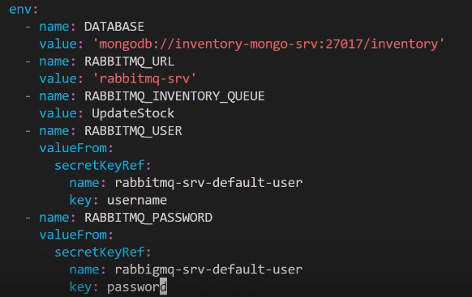

9. Reapply the service: `kubectl apply -f inventory-messaging-depl.yml` 

10. kubectl get po | kubectl <SERVICE_NAME>

🟢 DONEEE 🟢

## Deploy the Restock Microservice

1. Go to manifest dir

2. Deploy out Mongodb database, we can copy the `inventory-mongo-depl.yml` and start editing it: `cp inventory-mongo-depl.yml restock-mongodb-depl.yml` ,  `vi restock-mongodb-depl.yml`

3. In this file rename all inventory to restock and run `kubectl appy -f restock-mongodb-depl.yml`

4. Run `kubectl get pvc` to see all persistent volume claims. You should see 3 of them two for mongo and one for rabbitmq...

5. `kubectl get po` to see the pods.

6. Create the restock deployment file: `vi restock-depl.yml`

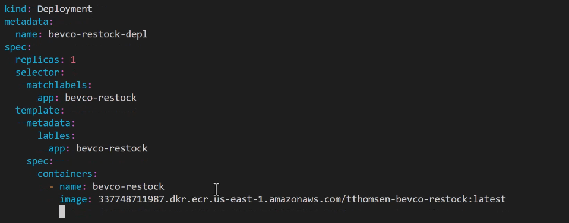

continuing....

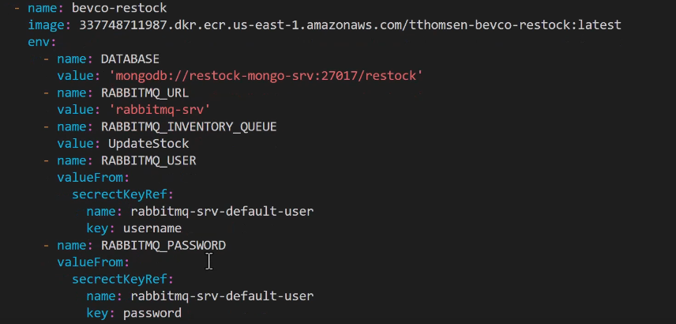

7. Create the Service to make this service reachable by specifying the ports.

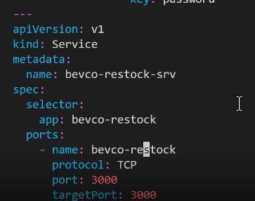

8. `kubectl apply -f restock-depl.yml`
After that if you get no errors see if the pod was created and look at its logs for any error...

🟢 DONEEE 🟢

## Deploying the API Gateway

⚠️ Since the API Gateway will manage the requests to ours services we will have to create also a Load Balancer Service for it to manage the traffic.

1. First go to code and investigate the env and what code it doing...

2. Go into manifest and create a new file: `vi api-gateway-depl.yml`

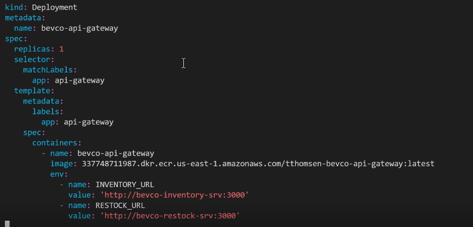

3. Crete the Service for the pod which beside specifying the protocol and targetPort is going to create also the LoadBalancer:

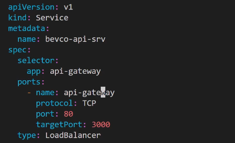

4. `kubectl apply -f api-gateway-depl.yml`

5. Run: `kubectl get svc` and you'll see the LoadBalancer there, copy the long thing there or URL so we can acess it. After that paste it on google and put it there COPIED_URL/api/inventory.

🟠 This URL is needed to put it in frontend for example to make requests to each service:
```javascript

// React/Frontend example
const API_BASE_URL = 'http://your-loadbalancer-url.amazonaws.com';

// Inventory Service requests
fetch(`${API_BASE_URL}/api/inventory/products`)
fetch(`${API_BASE_URL}/api/inventory/stock`)

// Restock Service requests
fetch(`${API_BASE_URL}/api/restock/orders`)

```

Store this URL:

In environment variables
In configuration files
In CI/CD pipelines -> 🟢 For this ack CHAT GPT how to do it
In client applications

🟢 DONEEE 🟢
🟢 MAKE SURE TO TEST THE ENDPOINTS USING POSTMAN 🟢


# Scailing Your Node.JS Microservice in EKS

## Requests and Limits
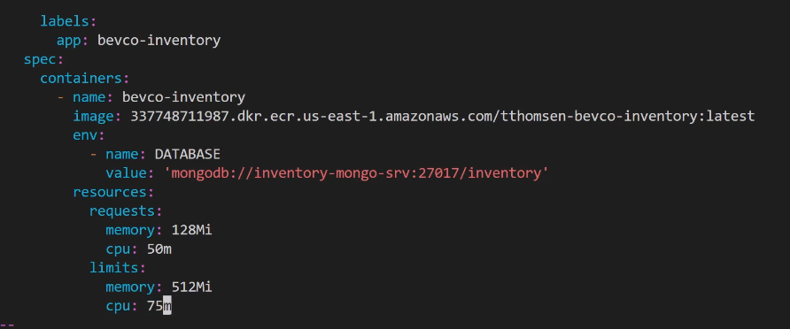

## Scailing in Kubernetes

- Vertical Scailing : Increasing resources to an existing system like cpu and memory.

- Horizontal Scailing : Scale out the number of nodes to meet workload demand.
For this you can use `HorizontalPodAutoscaler` or `HPA`.
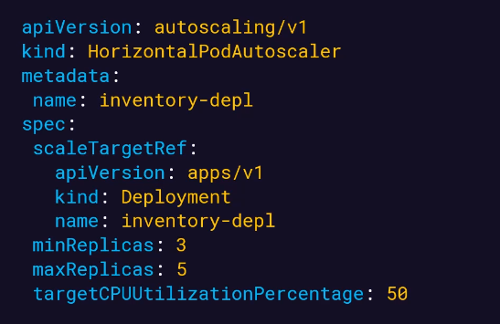

