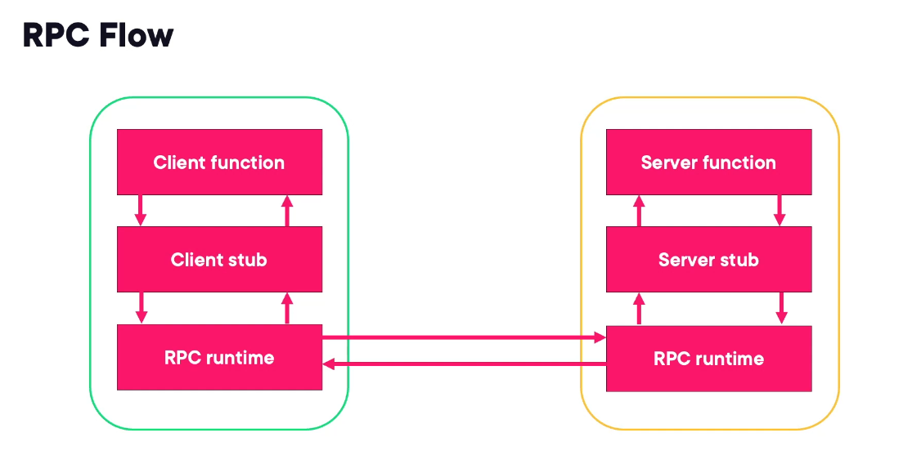

⛔ API GATEWAYS AND EDGE SERVICES ⛔

# API Gateways, what is an API Gateway?

    -  The API Gateway acts as a gatekeeper orchestrating the flow of requests and responses between clients and back-end services

    - They handle `API routing` from the client to the proper API Provider or microservice.

    - They distribute traffic across multiple instances of a microservice aslo called as `Load balancing ` ensuring even load distribution and high availability.

    - They manage user Authentication and Authorization (OAuth, LDAP or custom authentication methods) and access control policies for authorization.

    - Rate limiting/ throttling (we can set a rate limit of 5 requests for each minute)

    - API Gateways allow you to modify the request or the response data as it passes through the gateway so you can do error handling.

    - It can collect and combine responses from multiple microservices in cases when a request depents on multiple back-end microservices

    - Caching

    - It provides a single entry point for multiple microservices knowing that microservices can grow and become complex. It also manages the routing between tehse microservices

    - ...

# Node.js Common Libraries

    1. HTTP
    2. Express (Managing Routing)
    3. Helmet (Security)
    4. Memcache (Caching System)

# Node.js Deployment

1. Development Environment
2. QA / Stage / Test environment
3. Production environment

# Express Gateway

Link: https://www.express-gateway.io/getting-started/

# Express Gateway Security
    - TLS/SSL: It ensures encryptic connections between clients and the API gateway and the associated back-end microservices.
    - Helmet.js: Setting several HTTP headers making it more difficult for attackers to exploit known vulnerabilities.
    It can secure by:
    1. XSS protection (Cross-site scripting)
    2. HTTPS enforcment (reducing the risks of man-in-the-middle attacks)
    3. Clickjacking prevention (ensuring that web pages cannot be embedded within an iframe protecting against user interface manipulation.)
    4. MIME type sniffing protection
    5. Referrer policy control
    6. DNS prefetching control

# Using Express Gateway to Proxy and Manage APIs with OAuth
    - OAuth 2 is an open standard and auth protocol that provides a secure framework for granting third-party apps limited access to user-protected services without exposing user credentials.
     
    - When a client application seeks access to protected resources, the API gateway can act as an intermediary to handle the authorization process, specifically in the context of OAuth, which is a widely used protocol for authorization.

# Express Gateway Pipelines
    - It helps the developers to structure and manage the flow of HTTP requests through a series of defined stages or middleware.
    - A pipeline represents a sequence of processing steps that your request goes through before reaching its final destination.
    - Each step in the pipeline is known as a policy and it performs a specific function such as authentication, authorization, rate limiting, custom business logic...
    - Gateway.config.yaml: serves as the central configuration file that defines the entire setup of the API gateway including the configuration for pipelines.

# Routing and Load Balancing

## Designing Effective Routing Strategies:
1. Path-based routing
2. Header based routing (Routes are based on HTTP header values)
3. Query-based Routing (Routes are based on query parameters in URL)

## Various load balancing algorithms that determine how requests are distributed:
1. Round robin
2. least connections
3. weighted round robin

# Scaling Techniques

- The primary goal of load balancing is to optimize resource utilization, prevent server overload, ensure high availability, and enhance the overall performance and reliability of the system.

- Whith Node, two common load balancers are often used in front of Express Gateway, which include NGINX and HA proxy.

- HORIZONTAL SCAILING
It is critical to consider shared state issues when we deal with Horizontal Scailing, to be mindful of this you should insure that shared resources like databases or caches can handle the increased number of connections and maintain data consistency across instances
 A newer technique thats become common is the use of stateless arch. where each request contains all information required to properl process.

 - VERTICAL SCAILING
 It can be used to handle increased resource demand for individual instances, while HS provides additional capacity.

 - Load balancing algorithms
 1. Random: randomly select a server to handle each request, it is simple and effective in scenarios where all servers have similar capabilities.
 2. Round Robin: distributes client requests evenly across all servers.
 3. Least Connection: Routes new requests to the server with fewest current connections. This algorithm is useful when applications workloads are unevenly distributed across the servers.
 4. IP Hashing: Directs requests from the same IP address to the same server ensuring session persistence.
 5. Least Time: Routes requests to the server with the lowest average response time. This algorithm is useful when the response time is critical.
 6. Least Bandwidth: Routes requests to the server with the lowest bandwidth usage.

 # Improve performance with clustering
 When dealing with cluster model (multi-threading) there are a few metrics that are useful.
 1. Response time: which measures the time taken to respond to requests.
 2. Throughput: which evaluates the number of requests processed per second.
 3. Latency: assesses the time taken for a request to be acknowledged.

 Autocannon is a open source tool that is useful for testing the performance of HTTP-based applications suach as Node.js

 # How NGINX works as Load Balancer
 
- NGINX can be putted in front of a pool of servers where it would work as a load balancer for direct back-end microservices or in front of Express Gateways.

- NGINX distributes incoming requests among the defined servers providing a scalable and fault-tolerant solution.

- To make it work you have to configure nginx.conf config file that contains the specification for how load balancing is to occur by defining both our server pools as well as our load balancing algorithm.

 # Replication vs Partitioning vs Clustering vs Sharding (1 minute read)

 # Authentication and Authorization

 ## Strategies and technicues/methods for authentication and authorization:

 1. Session-based authentication: username and password matched againts a stored database record.
 
 2. Token-based: only a token like JWT is sent for communication
 3. Password-less authentication: users only need an associated email address or phone number for creation of a magic link or one-time password for each login attempt.
 
 4. Protecting routes with role-based access control (RBAC)

 - For authentication protocols we have a few options:
 1. OAuth/OAuth 2.0: used with third-party authorization like social media logins.
 2. OpenID Connect: built on top of OAuth which focuses on authentication.
 3. SAML(Security Assertion Markup Language): enables single sign-on across multiple services. 

 ## Authorization
 1. Access control: we would have a few options such as role-based access control, attribute-based access control, mandatory access controls
 2. Authorization mechanisms

 - For authentication, Express Gateway offers a few benefits such as middleware that can be useful for authentication. Express API Gateway can leverage middleware functions to handle this authentication.
 🖊️Commonly used middlewares for authentication: Password.js , token-based autentication (JSON Web Tokens), single sign-on.

 - ⚠️ For systems implementing single sign-on the gateway can act as a central authentication point by validating user's credentials once and issues tokens for subsequent requests to microservices. This reduces the need for repetitive authentication checks.

 - Once the users or our systems are authenticated then the authorization policies and approaches can be utilized. Similar to Authentication Express Gateway offers many benefits to implementing authorization.

 ## AuthN/Z Techiques
 1. OAuth 2.0
 2. Openid Connect: Express Gateway acts as an OpenID Connect provider enabling features like single sign-on and identity federation.
 3. JWT tokens: for stateless authentication
 4. API key authentications: validation keys from requests
 5. Basic authentication

 ## AuthN/Z Best Practices
 1. Use Express Gateway as a centralized point for authentication to avoid duplicating authentication logic across microservices.
 2. Token validation like signature, expiration and issuer can be used to enhance security if using JWT.
 3. Implement rate limiting and throttling to protect against brute force attacks and other malicious activities.(Express gateway has them built in)
 4. Secure communication: we can use HTTPS to encrypt data in transit and employ secure channels.
 5. Consider integrating multi-factor authentication expecially in scenarios where higher assurance is needed.
 6. API key rotation.
 7. Implement Role-based access control to manage access control efficiently. Express Gateways allows you to define roles. 😄

# Rate Limiting and Quotas

## What is Rate Limiting and Quotas
- Rate limiting and quotas ensure stable and reliable API performance by preventing sudden spikes in traffic that could overwhelm the system.
- They act as a protective barrier against abuse and security attacks by restricting the volume of requests a client can make within a specific timeframe. This prevents malicious attackers from overloading the system with excessive traffic safeguarding against distributed denial of service.
- Rate limiting and quotas contribute in overall scalability and availability of the system by preventing resource exhaustion. 

## Types of attacks rate limiting and quotas handle

1️⃣ Rate limitng
- DDoS attacks: makes it difficult for attackers to overwhelm the server with a high volume of requests as each client is limited to a certain number of requests per second.
- Brute force attacks: an attacker tries to gain unauthorized access by repeatedly attempting different combinations of usernames and passwords. 
- Protecting API resources
- Resource exhaustion attacks: an attacker tries to consume all available resources leading to service unavailability.

2️⃣ Quotas
- Prevent abuse and unauthorized access.
- Single client monopolizing resources.

## Rate Limitng Concepts, Techniques

1. Sliding window algorithm : controls the number of requests a user or IP address can make within a specific timeframe.
2. Token bucket algorithm : we allocate tokens at a fixed rate and requests can only be made if there are vailable tokens.
3. Leaky bucket algorithm : we allow a fixed number of requests per unit of time.
4. Burst vs sustained limits : we distinguish between the maximum number of requests allowed in a short burst and the sustained rate over a longer period.
5. Soft vs hard limits.

## Rate Limiting Globally vs Specific Routes

- In Node we have quite a bit of flexibility in applying rate limiting. For Express web apps we can apply across all routes different rate-limiting algorithms. Lets say different rate limit algorithms/techniques for each route.
We can also configure it using Express Gateway by configuring it in our gateway.config.yml.
- But first make sure and determine which approach works best with your requirements.
- When applied to specific routes you have fine-grained controls and are able to adapt rate limits based on the nature of the data or functionality exposed by the route also gain optimized resource utilization. 
- Global rate limiting simplifies the configuration providing uniform protection and a bit easier maintainance. But there is a trade off, we do lose a bit of granual control if it needed.

# Caching in Edge Services

## Caching Strategies

1. Page Caching: we can cache the entire HTML page to serve them quickly without regenerating the content for each request.
2. Object Caching: we can cache specific objects or data structures such as database query results or API responses.
3. CDN Caching (Content Delivery Networks): suach as images, stylesheets, and scripts.
4. Fragments Caching : partial page updates.
5. In-Memory Caching
6. Distributed Caching

## Caching Expiration

Cache Expiration is cruicial to ensure that cache data remains up to date. Different caching systems employ various expiration mechanisms.

1. Time-based Expiration
2. Event-based Expiration
3. Lazy Loading

## Optimization

Optimizing caching involves maximizing the efficiency and performance benefits of caching strategies.
1. Cache Headers
2. Cache Busting
3. Compressed Caching
4. Selective Caching
5. Regular Monitoring
6. CDN Optimization

# -----------------------------------------------------------------------------------------------------------------------------------------------------------------#
# -----------------------------------------------------------------------------------------------------------------------------------------------------------------#
# -----------------------------------------------------------------------------------------------------------------------------------------------------------------#

# ⛔ Node.js Microservices: Communication Patterns ⛔

## Lection 1 - Intro to Communication Patterns

### Sync vs Async Communication

- Synchronous Communication waits for response before moving on.

- Async Communication is like leaving a voice mail, one server sends a message and then moves on.

🗒️Key takeaways: Synchronous communication is useful for immediate, real-time interactions where quick responses are necessary.
Asynchronous communication is ideal for processes that can be decoupled and don't require immediate feedback.

### Overview of communication patterns

1. Event-Driven Communication (with REST API)
2. Webhooks - they are simple and powerfull for real-time data synchronization across services.
3. Massaging-based Communication - RabbitMQ and the Publish-Subscribe pattern play a crucial role
4. Remote Procedure Call - gRPC 
5. Real-time Communication using WebSockets

## Lection 2 - RESTful Services and Event-driven Communication in Microservices

### RESTful Services and Event-driven Architecture

- REST is built on top of request/response cycle where a client makes the request and the server provides the response. The server might itself make further calls to other services or APOs to create a full response.
- Rest is stateless which means the server does not have to keep track of the client. Each service can process the request in isolation.
- Given that the same request can generate the same response we can cache the response for static data.

📓 You can use eventEmmiters in nodejs in RESTapi-s to call other services. This pattern of using event emitters is a fundamental shift from a traditional response-only approach to an active event generation model. Through emitting events, services communicate and trigger subsequent actions in an asynchronous and loosely coupled manner.

REST is: 
1. Build on top of Client/Server
2. Stateless
3. Cacheable
4. Resource Driven

### Building Scalable RESTful Services

- RESTful services, by their nature, are very scalable. Their stateless protocol and ability to handle requests indepedently make them ideal for building systems that can grow and adapt with ease.

- Stateful vs Stateless Architecture

Stateful: the server retains information or state about each client across requests. This can lead to complexity and scalability challanges, as the server needs to manage and synchronize the state across multiple sessions.

Stateless: each request from the client contains all the information the server needs to process it.
This leads to a much simplier and scalable model.

- But why is the statelessness so beneficial for microservices?
▶️ It allows each service to operate independently without relying on shared state or context.
This independence is key for scailing, as services can be distributed across multiple servers or even geographic locations.

- Strategies to Help with Scalability as our traffic increases.
1. Caching
2. State offloading (to store the state about the request in a data storage so It can be distributed to all servers/services)
3. Session management

### Optimising RESTful API Performance

1. Pagination ➡️ it is key to managing and presenting large datasets. You might be trying to fetch thousands of records in a single API call, it is going to be pain in the ass. Pagination solves this by dividing the data into smaller, more manageable pages (like 10 items at a time). Pagination is a necessity for scalable , user-friendly API design.

2. Compression ➡️ data compression, particularly techniques like gzip play a pivotal role in minimizing the size of the data being transferred over the network. This can reduce the amound of bandwidth used,  by lowering the size of data transferred over the network.

3. Caching ➡️ for sure you can create your own function to handle the caching for a single service but when dealing with microservices it would be better to have a shared caching logic for all the services instead of each instance maintining its own cache . In this scenario you can use deistributed caching systems like Redis or Mcache. These systems allow multiple instances to share a common cache, ensuring consistency and reducing redudant data storage. While working with caching you should also consider: ⚠️ Cache invalidation, Read-through/write-through, session management, Cache warm-up, cosistent hasing, monitoring and analytics, fallback/failures strategies . These are very importants and useful technicues.

### RESTful Services and Data Consistency 

- ACID vs BASE

### Error Handling in RESTful Microservices

- Types of errors
    1. Client Side Error: in this scenario the caller did something wrong. It is iniciated by 400 status code and it accours when the request sent by the client is incomplete or incorrect.

    2. Server Side Error: where the server did something wrong. Represented by STATUS CODE 500.

    3. Network Issues

- Implementing error responses

- Error handling patterns (3 of them)
     1. Timeout handling ➡️ limits the time spent waiting for a response, preventing system hang ups due to unresponsive services.
     

     2. Retries with exponential backoff ➡️ automatically reattempts failed operations with increasing delays.
     

     3. Circuit breaker pattern ➡️ prevents repeated calls to a failing service, in does it in purpose to allow the system time to recover and maintain system stability.

- Error logging and monitoring

## Lection 3 - Webhooks (the spy 😆) in Node.js Microservices: Real-time Event Handling

### Introduction to Webhooks

🛑 The differences between a traditional API call (RESTapi) and Webhooks:

- In REST the connection is kept open until the response is fully formed. On the other side Webhooks allow an immediate response to acknowledge that a request has been made. After the work will be done by the reciever, a spereate call will be handled to inform the caller and it does not have the request-response cycle. This allows a smooth experience for the users.

- Webhooks are Event-driven (Push Mechanism) ➡️  Webhooks are triggered automatically by an event. When a specific event occurs (e.g., a new order is placed, a payment is processed), the service where the event happened sends an HTTP request to a predefined URL (the webhook endpoint) on another service.
REST API are Request-driven (Pull Mechanism) ➡️ REST APIs require the client to initiate communication. The client sends an HTTP request to the server to ask for data or perform an action (e.g., get user details, update a record).

- Webhooks are unidirectional which means they have a one-way communication from the sending service to the receiving serive. On the other side REST API are bidirectional, the client can send a request to the server, aand the server sends back responses.

- Webhooks are used for real-time notifications. For example, a payment gateway might use a webhook to notify your system when a payment has been successfully processed.
REST API are used to access and manipulate resources. For example, you might use a REST API to get information about a user, update a record, or delete an item from a database.

### Webhooks in Microservices Architecture
 
- In an Microservices environment webhooks play a cruicial role, they can act as messengers that instantly relay events between services. Remember we are talking about events only. For example when a customer places an order, a webhook can immediately inform the inventory service to update stock levels. Remember the order placement might be done using REST API but when that request is made in some kind of server the event using webhook is triggered to inform some other service.

- Real-time data flow ➡️ webhooks provide a direct line of communication, when an event accurs in one service, a webhook ensures that the information is immediately pushed to other relevant services without the need for periodic polling. This makes it to have real-time data flow.

- Event-driven communication ➡️ webhooks automatically trigger a response to events as they happen. This is a key concept of microservices because actions ar etrigegred by events, rather than being scheduled or manually initiated. For example a payment gateway might use a webhook to notify your accounting service as soon as the transaction is processed.

- Scalability

- Resilient

- Reduce load ➡️ by getting rid of unecessary polling. So by using webhooks we dont have to use polling by the other service so they could get what they want in case of an event but just notify the other service when something happens.

### Securing Webhooks

- Validate payloads ➡️ We always want to validate the payload we receive to ensure it contains the expected data and conforms to the expected format. This helps prevent injection attacks. For this you can use libraries like Zod or ajv.validate. In this scenario it is good to create a middleware to handle the validation logic and call it webhook-validator.js

- Serving our endpoints only over HTTPS.

- Authenticate requests, for example signature verification

### Webhook Event Processing

⚠️ Best Practices for Event Processing:
1. Security
2. Error Handling
3. Reliability

### Code Example

- Example of connecting a webhook with a strippe application to handle payments.

## Lection 4 - Message Brokers in Event-Driven Architecture

### Understanding Message Brokers

- What is a message broker? 🤓

🍩 This is a scenario in microservice architecture without a message broker.
Each service needs to communicate directly with multiple other services. This works well but it creates a complex web of direct connections. If any service fails or becomes overloaded it can directly impact all the services that depend on it.
This is also called `tight coupling` and it can make the system difficult to manage and scale.

🍩 Lets see how this changes when we introduce a message broker. WHith a message broker in place, the services no longer communicate directly with each other. Instead, they send messages to the broker which then routes these messages to the appropriate services.
This approach allows services to operate independently improving modularity , scalability, reliability and maintainability making it easier to build and manage complex microservices architectures.

- Types Of Message Brokers:

1. AMQP (eg RabbitMQ): Advanced Message Queing Protocol. They support queues, exchanges, bindings, durability and acknowledgements.
2. Log-based (eg Kafka): Instead of using queues kafka uses a distributed log store messages. Producers write messages to the log, and consumers read from it. They support topics , partitions, offset management, replication.

⚠️ Log-based brokers are suiable for applications that require high throughput, real-time data processing and the ability to replay messages.

### Principles of Event-driven Architecture

- Asynchronous communication ➡️ events are produced and consumed independently, allowing services to operate without waiting for each other.

- Event sourcing ➡️ it involves storing the state of an application as a sequence of events. Instent of persisting the current state each change is stored as an event.

- CQRS (Command Query Responsibility Segregation) ➡️ it's a pattern that separates read-and-write operations to optimize performance. Commands are responsibe for changing the state, while queries are used to fetch data.

### Setting Up RabbitMQ using docker in docker-compose.yml

### Publish/Subscribe Model

## Lection 5 - RPC and use gRPC in Microservices

### Introduction to RPC

- gRPC is a RPC framework which is strongy-typed.

- It allows a service to invoke a method in another service as if it were a local function.

- RPC is more performant and efficient than REST API or webhooks, this depends on the favor of RPC you're using. But if you decide to use gRPC which uses a binary serialization format, which is much more compact and faster to encode and decode compared to text-based JSON you get to see the benefits.

- It also uses HTTP, which provides multiplexing, header compression and better flow control.

- Comparing to REST, the contracts in RPC are more strongly typed, this reduces runtime errors and improves developer productivity by catching errors at compile time.

- REST can also achieve strong typing and compile-time checks when combined with tools like OpenAPI (formerly Swagger) and code generation tools. However, by default, REST is not as strongly typed as some modern RPC systems like gRPC.

- It supports Bidirectional streaming.

- gRPC is `synchronous` which means its ideal for real time and low latency interactions and it uses HTTP2. ⚠️ The difference between `massage-brokers and gRPC` is that gRPC says that the work should be done right now using strongly typed contracts , strict APIs and streaming capabilities but message brokers say that the work is gonna be done at some point in the future.

- Use Cases for RPC:

1. Financial Sytsems that process transactions, they may require real time co ordination between services, handling user accounts and transaction recors and fraud detection. You want to know the answer of these things straight away.

2. IoT system to collect and process sensor data in real time that need fast and efficient communication between edge devices and central processing units.

3. Online multiplayer games: they require real time synchronization between game servers and client applications.

4. Telecommunication systems.

5. Healthcare systems: for example patient records.

### RPC Mechanisms and Protocols

🔘Types of RPC mechanisms: gRPC, XML-RPC, JSON-RPC

- RPC flow

Components 📦

- Client function: This is the function in the client's application that initiates the RPC call. It represents the client's logic and sends the request to the server.
- Client stub: The client stub is a proxy or intermediary that acts on behalf of the client function. It handles the serialization of the request data, packages it into an RPC message, and sends it over the network to the server.
- RPC runtime: The RPC runtime is the core component responsible for managing the RPC communication. It handles tasks such as network connections, message transmission, and error handling.
- Server stub: The server stub is similar to the client stub but operates on the server side. It receives the RPC message from the network, deserializes the request data, and passes it to the appropriate server function.
- Server function: This is the function on the server that processes the incoming request and performs the necessary actions. It may involve database queries, calculations, or other operations.

Flow 📃

- Client function call: The client function is invoked, initiating the RPC call.
- Client stub involvement: The client stub is responsible for packaging the request data into an RPC message and sending it over the network to the server.
- RPC runtime communication: The RPC runtime handles the network communication, ensuring that the message is transmitted reliably and securely.
- Server stub reception: The server stub receives the RPC message, deserializes the request data, and passes it to the appropriate server function.
- Server function processing: The server function processes the request, performs the necessary actions, and generates a response.
- Server stub response: The server stub packages the response data into an RPC message and sends it back to the client.
- RPC runtime communication: The RPC runtime handles the network communication, ensuring that the response message is transmitted reliably and securely.
- Client stub reception: The client stub receives the response message, deserializes the response data, and returns it to the client function.
- Client function use: The client function can then use the returned response to continue its execution.

In summary, the RPC flow involves the client making a request, the request being transmitted to the server, the server processing the request and generating a response, and the response being transmitted back to the client. The stubs and RPC runtime handle the underlying communication and serialization/deserialization tasks.

# ⛔ Node.js Microservices: Resilience and Fault Tolerance ⛔

## Introduction to Resilience and Fault Tolerance

- `Resilience` is a systems ability to recover from failures while `Fault Tolerance`
is a systems ability to continue operationg when one or more components fail.
For example: a `resilient` system may quickly switch to a backup service if the primary service fails.
⚠️ For this check how to create backup services in Nodejs....!!
While a `fault tolerant` system might have redundant component in place so that if one component fails, the otehr can continue to function properly.

- Resilience involves the overall behaviour of a system. Fault tolerance on the other hand is more about the systems architecture and how it is designed to handle component failures without interrupting the service so basically it focuses on individual pieces in a system.

- Why do Systems Fail?
1. External causes
2. Internal causes

- External Causes of System Failures -> these are mostly caused by erd parties where we have little to no control over. But by implementing geographically ddata canters and cloud absed solutions like AWS and Google can help mitigate the impact of localized natural disasters.

- Internal Causes of System Filures -> Bugs or misconfigurations, insuficient resources allocation, inadequate testing, human error.

- Ways to prevent a System from Failing and avoiding Single point of failure:
1. Implementing disaster recovery plans
2. Utilizing load balancing, backup service, employing distributed architectures

"Single point of failure" (SPOF) in Node.js, as in any system, refers to a component that, if it fails, will cause the entire system to fail. In the context of Node.js applications, this concept is particularly important due to the single-threaded nature of Node.js.

Here are some key points about single points of failure in Node.js:

1. Process Crashes:
   Since Node.js typically runs as a single process, if that process crashes due to an unhandled exception, it becomes a single point of failure for the entire application.

2. Database Connections:
   If your Node.js app relies on a single database instance, and that database goes down, it can bring down your entire application.

3. External Service Dependencies:
   If your app heavily depends on a single external service (like an API), and that service becomes unavailable, it could potentially crash your application or make it non-functional.

4. Hardware Failures:
   If your Node.js application runs on a single server, hardware failure of that server becomes a single point of failure.

5. Load Balancer:
   In a distributed system, if you're using a single load balancer to distribute traffic, and it fails, your entire system could become inaccessible.

To mitigate single points of failure in Node.js applications, you can consider the following strategies:

1. Use Process Managers:
   Tools like PM2 can automatically restart your Node.js process if it crashes.

2. Implement Clustering:
   Node.js's built-in cluster module allows you to create child processes, spreading the load across multiple CPU cores.

3. Database Replication:
   Use database replication and failover mechanisms to ensure database availability.

4. Implement Circuit Breakers:
   For external service dependencies, use circuit breaker patterns to gracefully handle service unavailability.

5. Use Containers and Orchestration:
   Technologies like Docker and Kubernetes can help in creating redundant, scalable, and fault-tolerant deployments.

6. Implement Proper Error Handling:
   Use try-catch blocks and handle promises properly to prevent unhandled exceptions from crashing your application.

7. Load Balancing:
   Use multiple load balancers to distribute traffic and avoid a single point of failure.

8. Microservices Architecture:
   Breaking down a monolithic application into microservices can help isolate failures and prevent them from taking down the entire system.

By addressing these potential single points of failure, you can create more resilient and reliable Node.js applications. The goal is to design your system so that no single component's failure can bring down the entire application.

## Retries, Timeouts and Circuit Brakers

