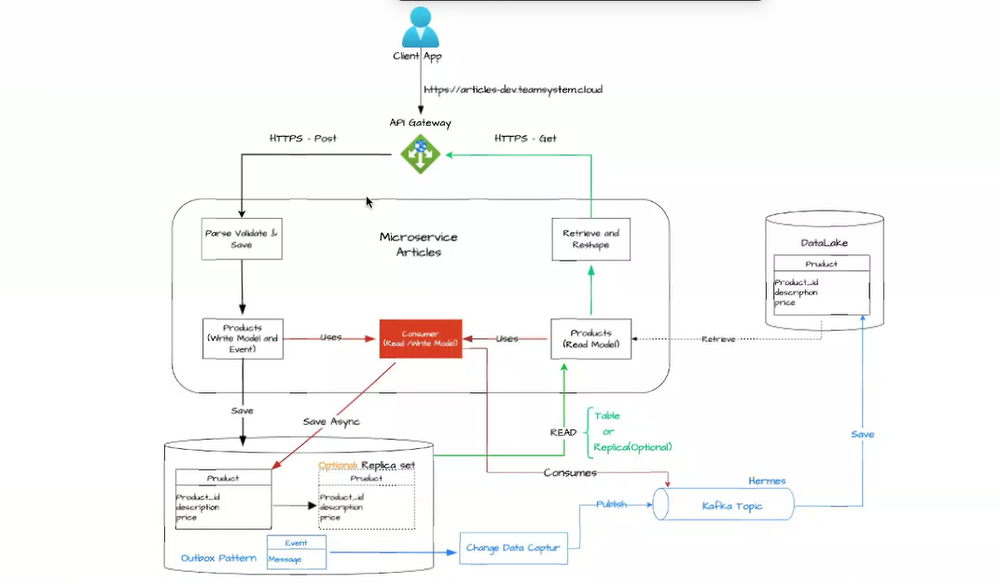
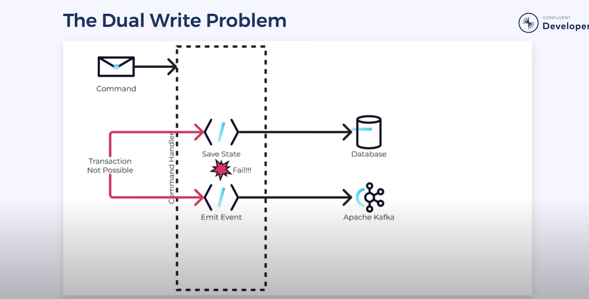
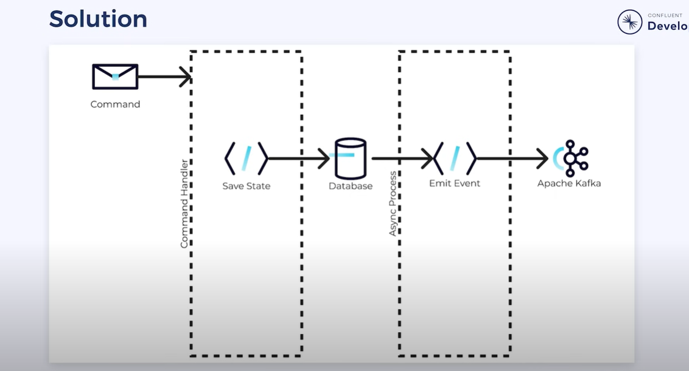
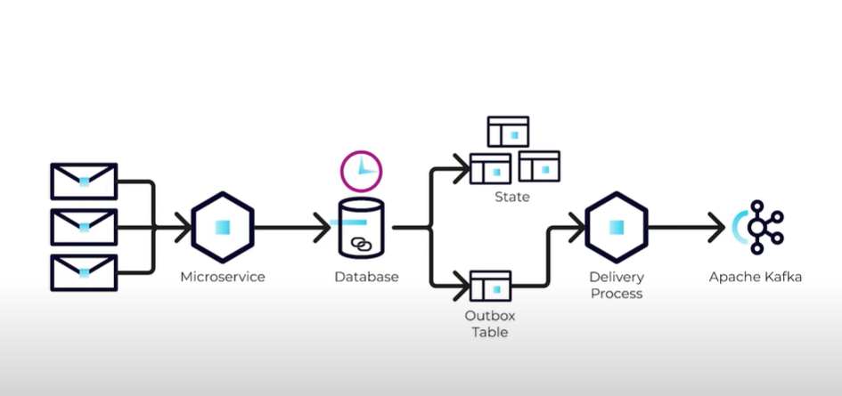

Blog URL: https://medium.com/swlh/change-data-capture-cdc-with-embedded-debezium-and-springboot-6f10cd33d8ec

🟢 Lets start from this picture:

🟠 Key things to discuss:
1. Transactional Outbox Pattern (CDC Pattern)
2. Dual Writte Problem
2. Repository Pattern on data layer
3. Circuit breaker pattern microservices
4. Repository pattern

# Lets start with the `Dual Writte Problem`:

In Microservices we might want to save data in db but also issue and event to `Kafka-Hermes` for example to notify other Service that something happened. But this can cause `Transactional Issues Easily`. Lets say that our Service fails right after the db was updated, the event won't be sent to Kafka and that would cause incosistency... This is the issue e are trying to solve `Dual Writte Problem`

SOLUTION:
- We need to separate the two writes and make one dependent on the other.

First we update the database, and a separate process can look for changes and emit the events.
⚠️ The only risk is if the process fails after emmiting the event. One solution for this is using `Transactional Outbox Pattern`

# Transactional Outbox Pattern 

Based to the described problem, rather than trying to update the database and Kafka at the same time, we push the transactional logic into the database, it can be a table like `Outbox Table`.In this table we will save all the events we want to send to Kafka. But this means we would need to create another process that `asynchronously monitors this table` using `Kafka Connector` for example. Whenever it sees a new event or entry into this table it can deliver it to Kafka.

🟢 If the state fails to update then the event wont be wrriten to the outbox table and this would solve the `Dual Writte Problem`. The only bottleneck can be the Delivery process because it can result in a failure, but now we have encapsulated this mechanism and it can be easier to resolve it using retry mechanisms or something like that but It wont cause data inconsistency between our tables. 

# Approaches:

## NestJS and TypeORM

## Kotlin

- Gradle
Gradle is the most popular build system for the JVM and is the default system for Android and Kotlin Multi-Platform projects. It has a rich community plugin ecosystem.

Gradle can automate a wide range of software build scenarios using either its built-in functionality, third-party plugins, or custom build logic.

Gradle provides a high-level, declarative, and expressive build language that makes it easy to read and write build logic.

Gradle is fast, scalable, and can build projects of any size and complexity.

Gradle produces dependable results while benefiting from optimizations such as incremental builds, build caching, and parallel execution.

🟢 `Gradle` its a build automation tool which manages project's dependencies, builing, testing, and deploying your application.
