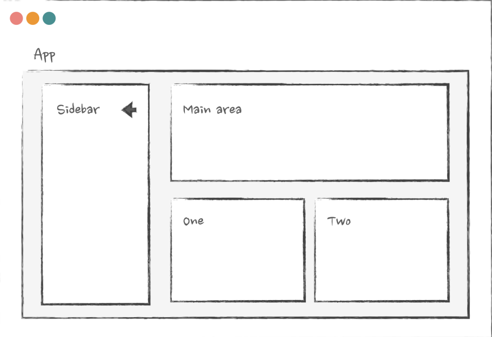

#### LEARNING PATH And Links

Server Components in React:
https://www.mux.com/blog/react-19-server-components-and-actions?ref=dailydev
https://www.mux.com/blog/what-are-react-server-components

Reactjs 19 updates:
https://www.mux.com/blog/facebook-just-updated-it-s-relationship-status-with-web-components

JSX in React – Explained with Examples
https://www.freecodecamp.org/news/jsx-in-react-introduction/

How to Style Your React Apps with Less Code Using Tailwind CSS, Styled Components, and Twin Macro
https://www.freecodecamp.org/news/how-to-style-your-react-apps-with-less-code-using-tailwind-css-and-styled-components/

The Fetch API Cheatsheet: Nine of the Most Common API Requests
https://www.freecodecamp.org/news/fetch-api-cheatsheet/

How To Use Axios With React: The Definitive Guide (2021)
https://www.freecodecamp.org/news/how-to-use-axios-with-react/

Learn :Importantt
https://www.freecodecamp.org/learn/front-end-development-libraries/#react

Youtube tutorial step by step
https://www.youtube.com/watch?v=ODKIxaSMgpU&list=PLIJrr73KDmRyrDnDFy-hHvQ24rRjz6e_J

# CHAPTER 4 --> Sharing stateful logic: children as render props.

It would look like this:

```JavaScript
<Parent children={() => <Child />} />
```

And in Parent , you'd call it like any other render prop:

```JavaScript
const Parent = ({ children }) => {
 // it's just a function that returns an element, just call it here
 return children();
};

```

The pretty nested syntax will work with this as well:

```JavaScript
<Parent>{() => <Child />}</Parent>

```

- Why can it be useful? Imagine, for example, you're implementing a
  "resize detector" component. A component that tracks the resize event
  on the browser window:

```JavaScript
const ResizeDetector = () => {
 const [width, setWidth] = useState();

 useEffect(() => {
 const listener = () => {
 const width = window.innerWidth;
 setWidth(width)
 }
 window.addEventListener("resize", listener);
 // the rest of the code
 }, [])
 return ...
}
```

And you want to make it generic so that different components
throughout the app can track the window width without implementing
that code everywhere. So ResizeDetector needs to share that state
with other components somehow. Technically, we could do this through
props, just by adding the onWidthChange prop to the detector:

```JavaScript

const ResizeDetector = ({ onWidthChange }) => {
 const [width, setWidth] = useState();

 useEffect(() => {
 const listener = () => {
 const width = window.innerWidth;
 setWidth(width);
 // trigger onWidthChange prop here
 onWidthChange(width);
 }

 window.addEventListener("resize", listener);
 // the rest of the code
 }, [])

 return ...
}

```

⚠️ But this would mean that any component that wants to use it would have
to maintain its own state for it:

```JavaScript
const Layout = () => {
 const [windowWidth, setWindowWidth] = useState(0);

 return (
 <>
 <ResizeDetector onWidthChange={setWindowWidth} />
 {windowWidth > 600 ? (
 <WideLayout />
 ) : (
 <NarrowLayout />
 )}
 </>
 );
};

```

🥸 A bit messy.
What we can do instead is just make ResizeDetector accept
children as a function and pass that width to children directly:

```JavaScript

const ResizeDetector = ({ children }) => {
 const [width, setWidth] = useState();
 // same code as before
 // pass width to children
 return children(width);
};


```

Then, any component that needs that width can just use it without
introducing unnecessary state for it:

```JavaScript
const Layout = () => {
 return (
 <ResizeDetector>
 {(windowWidth) => {
 // no more state! Get it directly from the resizer
 return windowWidth > 600 ? (
 <WideLayout />
 ) : (
 <NarrowLayout />
 );
 }}
 </ResizeDetector>
 );
};

```

👍🥇 Full Code:

```JavaScript
import { ReactElement, useEffect, useState } from 'react';
import './styles.scss';

type ResizeDetectorProps = {
  children: (width: number) => ReactElement;
};

const WideLayout = () => <div style={{ background: 'salmon', width: 600, padding: 20 }}>Wide layout</div>;
const NarrowLayout = () => <div style={{ background: 'salmon', width: 300, padding: 20 }}>Narrow layout</div>;

const ResizeDetector = ({ children }: ResizeDetectorProps) => {
  const [width, setWidth] = useState(0);

  console.log(children())

  useEffect(() => {
    const listener = () => {
      const width = window.innerWidth;
      setWidth(width);
    };

    window.addEventListener('resize', listener);
    // the rest of the code
  }, []);

  // pass width to children
  return children(width);
};

export default function App() {
  return (
    <>
      <h4>Render function for children</h4>
      <ResizeDetector>
        {(windowWidth) => {
          // no more state! Get it directly from the resizer
          return windowWidth > 600 ? <WideLayout /> : <NarrowLayout />;
        }}
      </ResizeDetector>
    </>
  );
}


```

⚠️⛑️ In real life, of course, we'd have a re-renders problem here: we're
triggering state updates on every width change. So we'd have to either
calculate the layout inside the detector or debounce it. But the principle
of sharing state will remain the same.

BUTTTTTTTT!!! In modern code, we probably wouldn't use this at all because…

## Hooks replaced render props 🤓

Anyone who's done any coding in React in the last two years is probably
thinking something like this right now: "Hey, what you're saying doesn't
make sense. Why do you do something as complicated as this when we
have hooks for sharing stateful logic?"

And you are right.

```JavaScript
const useResizeDetector = () => {
 const [width, setWidth] = useState();
 useEffect(() => {
 const listener = () => {

 const width = ... // get window width here
 setWidth(width);
 }
 window.addEventListener("resize", listener);
 // the rest of the code
 }, [])
 return width;
}

// And call it like this everywhere

const Layout = () => {
 const windowWidth = useResizeDetector();
 return windowWidth > 600 ? (
 <WideLayout />
 ) : (
 <NarrowLayout />
 );
};

```

But why did we learn render props you might say??

Reasons:

- If you are working on a project that is a few years old, this pattern
  will be all over the codebase. It was really popular before the
  introduction of hooks, especially for encapsulating form validation
  logic. A few popular libraries still use it to this day
- It can still be useful for specific scenarios, such as when the logic
  and state that you want to share depend on a DOM element

A very common example of the last use case would be tracking scroll in
an area:

```JavaScript
const ScrollDetector = ({ children }) => {
 const [scroll, setScroll] = useState();

 return (
 <div
 onScroll={(e) => setScroll(e.currentTarget.scrollTop)}
 >
 {children(scroll)}

 </div>
 );
};

//This is how you call it

const Layout = () => {

 return (
 <ScrollDetector>
 {(scroll) => {
 return <>{scroll > 30 ? <SomeBlock /> : null}</>;
 }}
 </ScrollDetector>
 );
};
```

# Chapter 5. Memoization with useMemo, useCallback and React.memo

```JavaScript
const Component = () => {

 const submit = () => {};

 useEffect(() => {
 // call the function here
 submit();
 // it's declared outside of the useEffect
 // so should be in the dependencies
 }, [submit]);

 return ...
}

```

In this example, the submit function is declared outside of the
useEffect hook. So if I want to use it inside the hook, it should be
declared as a dependency. But since submit is declared locally inside
Component , it will be re-created every time Component re-renders.
Remember we discussed in Chapter 2. Elements, children as props, and
re-renders - a re-render is just React calling the component's functions.
Every local variable during that will be re-created, exactly the same as
any function in JavaScript.

Lets have a look at useCallback() hook.

If I wrap that submit in useCallback :

```JavaScript
const submit = useCallback(() => {
 // no dependencies, reference won't change between re-renders
}, []);
```

then `the value in the submit variable will be the same reference
between re-renders` , the comparison will return true , and the
useEffect hook that depends on it won't be triggered every time:

```JavaScript
const Component = () => {

 const submit = useCallback(() => {
 // submit something here
 }, [])

 useEffect(() => {
 submit();
 // submit is memoized, so useEffect won't be triggered on every re-render
 }, [submit]);

 return ...
}

```

ALL CODE:

```JavaScript
import { useCallback, useEffect, useMemo, useState } from 'react';

import { Button } from './components/button';

export default function App() {
  const [state, setState] = useState(1);

  const submitNormal = () => {
    console.info('submit some data here - normal');
  };

  const submitCallback = useCallback(() => {
    console.info('submit some data here - useCallback');
  }, []);

  const submitMemo = useMemo(
    () => () => {
      console.info('submit some data here - useMemo');
    },
    [],
  );

  useEffect(() => {
    console.info('This will be triggered every re-render');
  }, [submitNormal]);

  useEffect(() => {
    console.info('This will be triggered only on mounting');
  }, [submitCallback, submitMemo]);

  return (
    <>
      Examples of a function non-memoized and memoized via useCallback or useMemo
      <br />
      <br />
      <Button onClick={() => setState(state + 1)}>Click to trigger re-render</Button>
      <br />
      <br />
      <Button onClick={submitNormal}>Click to trigger normal submit</Button>
      <Button onClick={submitCallback}>Click to trigger submit from useCallback</Button>
      <Button onClick={submitMemo}>Click to trigger submit from useMemo</Button>
    </>
  );
}


```

⚠️🔴There are only two major use cases where we actually need to memoize
props on a component. The first one is when this prop is used as a
dependency in another hook in the downstream component.

1-

```JavaScript

const Parent = () => {
// this needs to be memoized!
// Child uses it inside useEffect
const fetch = () => {};

return <Child onMount={fetch} />;
};

const Child = ({ onMount }) => {

useEffect(() => {
onMount();

}, [onMount]);

};

```

2- And the second one is when a component is wrapped in React.memo.

```JavaScript
import React, { useCallback, useEffect, useState } from 'react';

import { Button } from './components/button';

const Child = ({ onChange }: { onChange: () => void }) => {
  useEffect(() => {
    console.info('Child re-renders');
  });
  return <div>Some Child</div>;
};

const ChildMemo = React.memo(Child);
export default function App() {
  const [state, setState] = useState(1);

  const onChangeMemo = useCallback(() => {
    console.info('On change callback');
  }, []);

  return (
    <>
      Examples of a function non-memoized and memoized via useCallback or useMemo
      <br />
      <br />
      <Button onClick={() => setState(state + 1)}>Click to trigger re-render {state}</Button>
      <br />
      <br />
      <h3>Child component is not memoized here</h3>
      <p>So it will re-render when the button is clicked, even those it's onChange prop is memoized</p>
      <Child onChange={onChangeMemo} />
      <h3>This component is memoized</h3>
      <p>So it won't re-render when the button clicked</p>
      <ChildMemo onChange={onChangeMemo} />
    </>
  );
}


```

⚠️ Be careful!! ⚠️
Broken memoization cases:

1. The first and simplest case of broken memoization is props that are
   passed from props. Especially when the spreading of props in
   components in between is involved. Imagine you have a chain of
   components like this:

```JavaScript
import React, { useCallback, useEffect, useState } from 'react';

import { Button } from './components/button';

type ChildProps = { onChange: () => void };
const Child = ({ onChange }: ChildProps) => {
  useEffect(() => {
    console.info('Child re-renders');
  });
  return <div>Some Child</div>;
};

const ChildMemo = React.memo(Child);
const Component = <T extends ChildProps>(props: T) => {
  return <ChildMemo {...props} />;
};

const ComponentInBetween = <T extends ChildProps>(props: T) => {
  return <Component {...props} />;
};

const InitialComponent = <T extends ChildProps>(props: T) => {
  const [state, setState] = useState(1);

  // this one will have state and will trigger re-render of Component
  return (
    <>
      <Button onClick={() => setState(state + 1)}>Click to trigger re-render {state}</Button>
      <ComponentInBetween {...props} data={{ id: '1' }} />
    </>
  );
};
export default function App() {
  const onChangeMemo = useCallback(() => {
    console.info('On change callback');
  }, []);

  return (
    <>
      <InitialComponent onChange={onChangeMemo} />
    </>
  );
}

```

So unless you're prepared and able to enforce the rule that every single
prop everywhere should be memoized, using the React.memo
function on components has to follow certain rules.

Rule 1: never spread props that are coming from other components.

Instead of this:

```JavaScript
const Component = (props) => {
 return <ChildMemo {...props} />;
};
```

Do this:

```JavaScript
const Component = (props) => {
 return <ChildMemo some={prop.some} other={props.other} />;
};

```

Rule 2: avoid passing non-primitive props that are coming from other
components.

Rule 3: avoid passing non-primitive values that are coming from
custom hooks.

By passing that submit function to our ChildMemo , we just broke its
memoization - from now on, it will re-render as if it's not wrapped in
React.memo because the submit fundtion is not wrapped into useCallback.

```JavaScript
import React, { useEffect, useState } from 'react';

import { Button } from './components/button';

type ChildProps = { onChange: () => void };
const Child = ({ onChange }: ChildProps) => {
  useEffect(() => {
    console.info('Child re-renders');
  });
  return <div>Some Child</div>;
};

const ChildMemo = React.memo(Child);

const useForm = () => {
  const submit = () => {
    console.info('do something on submit');
  };

  return {
    submit,
  };
};

export default function App() {
  const [state, setState] = useState(1);
  const { submit } = useForm();

  return (
    <>
      <Button onClick={() => setState(state + 1)}>Click to trigger re-render {state}</Button>
      <ChildMemo onChange={submit} />
    </>
  );
}

```

## React.memo and children

Let's take a look at this code:

```JavaScript

const ChildMemo = React.memo(Child);

const Component = () => {

 return (
 <ChildMemo>
 <div>Some text here</div>
 </ChildMemo>
 );

};
```

Seems innocent enough: a memoized component with no props, renders
some div inside, right? Well, memoization is broken here again, and the
React.memo wrapper is completely useless.

In order to fix this and to make it useful we have to write:

```JavaScript
const Component = () => {

 const content = useMemo(
 () => <div>Some text here</div>,
 [],
 );

 return <ChildMemo>{content}</ChildMemo>;
};

```

The same happens when we pass function as childern:

```JavaScript
const Component = () => {
 return (
 <ChildMemo>{() => <div>Some text here</div>}</ChildMemo>
 );
};
```

Do this ⬇️

```JavaScript

const Component = () => {
 const content = useMemo(
 () => () => <div>Some text here</div>,
 [],
 );
 return <ChildMemo>{content}</ChildMemo>;
};

// Or just use useCallback()

const Component = () => {

 const content = useCallback(
 () => <div>Some text here</div>,

 [],
 );
 return <ChildMemo>{content}</ChildMemo>;

};


```

## useMemo and expensive calculations

⛔🗒️ So an addition to the "measure first" rule, when it comes to
memoization, should be: "don't forget to measure how long it takes to rerender component elements as well." And if you wrap every JavaScript
calculation in useMemo and gain 10ms from it, but re-rendering of
actual components still takes almost 200ms, then what's the point? All it
does is complicate the code without any visible gain.

# Chapter 6. Deep dive into diffing and reconciliation

In this chapter, we'll investigate a few very curious bugs, dive very deep into how things work under the hood, and in the process of doing so, we will learn:

1. How React's Diffing and Reconciliation algorithm works.
2. What happens when a state update is triggered and React needs to
   re-render components.
3. Why we shouldn't create components inside other components.
4. How to solve the bug of two different components sharing the
   same state.
5. How React renders arrays and how we can influence that.
6. What is the purpose of the "key" attribute.
7. How to write the most performant lists possible.
8. Why we would use the "key" attribute outside of dynamic lists

# Chapter 7. Higher-order components in modern world

1. A higher-order component is just a function that accepts a
   component as an argument and returns a new component. That
   new component renders the component from the argument.

2. We can inject props or additional logic into the components that
   are wrapped in a higher-order component.

```JavaScript
// accept a Component as an argument
const withSomeLogic = (Component) => {
 // inject some logic here
 // return a component that renders the component from the
argument
 // inject some prop to it
 return (props) => {
 // or inject some logic here
 // can use React hooks here, it's just a component
 return <Component {...props} some="data" />;
 };
};

```

3. We can pass additional data to the higher-order component,
   either through the function's argument or through props.

# Chapter 8. React Context and performance

✋ Key takeaways

I'm not advocating for using Context everywhere, of course:
its caveats are pretty serious. So for larger, more complex apps, it's
probably better to go with an external state management solution right
away. Any solution that supports memoized selectors. But it could work
for smaller apps, where you have just a few places that could benefit
from the Context mental model.

The problem 💣:

Imagine you were implementing a page with a two-column layout: a
sidebar on the left and the "main" part on the right. The left sidebar
needs to be collapsible: it should have a button, a click on which will
collapse the sidebar into the "narrow" view or expand it back to the
"wide" view. As a result, the main part can also become bigger or
smaller. And somewhere at the bottom of that main part, you have a
block where you want to show something in three columns when the
sidebar is collapsed or in two columns when it's expanded. Maybe an
image gallery or some advertisement blocks.



This would be the solution without using useContext:

At first glance this would work but behind the wheels there are some performance bottlenecks with this code 🤌.

- What will happen here from the re-renders perspective? Every time the button is clicked, and
  navigation is expanded/collapsed, the state in the Page component will
  change. And as we know from Chapter 1. Intro to re-renders, state
  update will cause this component and every component inside, including
  their children, to re-render. Both Sidebar and MainPart have a lot
  of components, some of which are quite slow. So re-rendering of the
  entire page will be slow, making navigation expanding/collapsing slow
  and laggy as a result.

```JavaScript
import React, { ReactNode, useState } from 'react';

import { AnotherVerySlowComponent, VerySlowComponent } from './components/very-slow-component';
import './styles.scss';

const AdjustableColumnsBlock = ({ isNavExpanded }: { isNavExpanded: boolean }) => {
  return isNavExpanded ? <div>two block items here</div> : <div>three block items here</div>;
};

const MainPart = ({ isNavExpanded }: { isNavExpanded: boolean }) => {
  return (
    <>
      <VerySlowComponent />
      <AnotherVerySlowComponent />
      <AdjustableColumnsBlock isNavExpanded={isNavExpanded} />
    </>
  );
};

type ExpandProps = { isNavExpanded: boolean; toggleNav: () => void };
const ExpandButton = ({ isNavExpanded, toggleNav }: ExpandProps) => (
  <button onClick={toggleNav}>{isNavExpanded ? 'collapse <' : 'expand >'}</button>
);

const Sidebar = ({ isNavExpanded, toggleNav }: ExpandProps) => {
  return (
    <div className="left" style={{ flexBasis: isNavExpanded ? '50%' : '20%' }}>
      {/* this one will control the expand/collapse */}
      <ExpandButton isNavExpanded={isNavExpanded} toggleNav={toggleNav} />

      <ul>
        <li>
          <a href="#">some links</a>
        </li>
      </ul>
    </div>
  );
};

const Layout = ({ children }: { children: ReactNode }) => <div className="three-layout">{children}</div>;

const Page = () => {
  const [isNavExpanded, setIsNavExpanded] = useState(false);

  return (
    <Layout>
      <Sidebar isNavExpanded={isNavExpanded} toggleNav={() => setIsNavExpanded(!isNavExpanded)} />
      <MainPart isNavExpanded={isNavExpanded} />
    </Layout>
  );
};

export default function App() {
  return (
    <>
      <h3>Very slow "Page" component - click on expand/collapse to toggle nav</h3>
      <p>everything re-renders on every toggle</p>
      <Page />
    </>
  );
}


//Very slow component
const wait = (ms: number) => {
  const start = Date.now();
  let now = start;

  while (now - start < ms) now = Date.now();
};

export const VerySlowComponent = () => {
  wait(400);
  return null;
};

export const AnotherVerySlowComponent = () => {
  wait(400);
  return null;
};


// styles.scss
.three-layout {
  display: flex;
  gap: 1rem;

  .left {
    flex: 0 0 20%;
    background: lightblue;
    border: 1px solid rgba(blue, 0.3);
    min-height: 30rem;
  }

  .middle {
    flex: 0 0 50%;
    min-height: 30rem;
  }

  .right {
    flex: 0 0 30%;
    background: lightsalmon;
    border-left: 1px solid salmon;
    min-height: 30rem;
  }
}


//global.scss
* {
  font-family: sans-serif;
  box-sizing: border-box;
}

body {
  margin: 0;
  padding: 1rem;
  font-family: "Open Sans", "Helvetica Neue", Helvetica, Arial, sans-serif;
  line-height: 1.5;
  font-size: 1;
}

h1, h2, h3, h4, h5, h6 {
  margin: 1rem 0;
}

/* Headings */
h1 {
  font-size: 2rem;
  line-height: 2.5rem;
  margin: 0 0 2rem 0;
  padding: 0 0 1rem 0;
  border-bottom: 1px solid black;
}

h2 {
  font-size: 1.8rem;
  line-height: 2.3rem;
  margin: 3rem 0 1rem 0;
}

h3 {
  font-size: 1.6rem;
  line-height: 2.2rem;
  margin: 2rem 0 1rem 0;
}

h3 {
  font-size: 1.4rem;
  line-height: 2rem;
  margin: 1rem 0 1rem 0;
}

.button {
  padding: 0.5rem;
  background: lightgrey;
  border:1px solid grey;
  font-size: 1rem;
  display: inline-flex;
  gap: 0.5rem;
  align-items: center;
  border-radius: 5px;
  cursor: pointer;

  &:hover {
    background: rgba(grey, 0.5)
  }

  &.secondary {
    background: rgba(lightgrey, 0.3);
    border: 1px solid lightgrey;

    &:hover {
      background: rgba(lightgrey, 0.1)
    }
  }

  &.dark {
    background: darkgray;
    border:1px solid gray;

    &:hover {
      background: rgba(grey, 0.9)
    }
  }
}

.modal-dialog {
  position: fixed;
  top: 30px;
  left: 50%;
  margin-left: -15rem;
  width: 30rem;
  background: white;
  border:1px solid rgba(grey,0.5);
  border-radius: 10px;
  box-shadow: 0 0 10px 0 rgba(0,0,0,0.1);

  .content {
    padding: 2rem 1rem;
  }

  .footer {
    padding: 1rem;
    background: rgba(lightgrey, 0.2);
    border-top:1px solid gray;
    border-bottom-left-radius: 10px;
    border-bottom-right-radius: 10px;
  }
}

input[type="text"] {
  padding: 0.5rem 1rem;
  margin: 0.5rem 0;
  border-radius: 5px;
  border: 1px solid rgba(grey,0.5);
  width: 100%;
}


// index

import React from 'react';

import ReactDOM from 'react-dom/client';
import App from './App';

import './global.scss';

const rootElement = document.getElementById('root')!;
const root = ReactDOM.createRoot(rootElement);

root.render(<App />);

```

In situations like this, Context (or any context-like state management
library) is very powerful. What they allow us to do is escape that tree of
components and, instead of passing data through props, we can pass it
directly from the component at the very top to the component at the
bottom.

Using useContext:

```JavaScript

import React, { ReactNode, useContext, useState } from 'react';

// Importing slow components and styles
import { AnotherVerySlowComponent, VerySlowComponent } from './components/very-slow-component';
import './styles.scss';

// Creating a context to manage the navigation state
const Context = React.createContext({
  isNavExpanded: false, // Initial state: navigation is not expanded
  toggle: () => {}, // Placeholder function for toggling navigation state
});

// NavigationController component manages the state of the navigation
const NavigationController = ({ children }: { children: ReactNode }) => {
  const [isNavExpanded, setIsNavExpanded] = useState(false); // State variable to track navigation expansion

  // Function to toggle the navigation state
  const toggle = () => setIsNavExpanded(!isNavExpanded);
  const value = { isNavExpanded, toggle }; // Values provided by the context

  // Providing the context value to its children components
  return <Context.Provider value={value}>{children}</Context.Provider>;
};

// Custom hook to access the navigation context values
const useNavigation = () => useContext(Context);

// AdjustableColumnsBlock component renders different content based on navigation state
const AdjustableColumnsBlock = () => {
  const { isNavExpanded } = useNavigation();
  return isNavExpanded ? <div>two block items here</div> : <div>three block items here</div>;
};

// MainPart component renders the main content of the page
const MainPart = () => {
  return (
    <>
      <VerySlowComponent /> {/* A slow component */}
      <AnotherVerySlowComponent /> {/* Another slow component */}
      <AdjustableColumnsBlock /> {/* Component with adjustable content based on navigation state */}
    </>
  );
};

// ExpandButton component renders a button to expand/collapse the navigation
const ExpandButton = () => {
  const { isNavExpanded, toggle } = useNavigation();

  return <button onClick={toggle}>{isNavExpanded ? 'collapse <' : 'expand >'}</button>;
};

// SidebarLayout component manages the layout of the sidebar based on navigation state
const SidebarLayout = ({ children }: { children: ReactNode }) => {
  const { isNavExpanded } = useNavigation();
  return (
    <div className="left" style={{ flexBasis: isNavExpanded ? '50%' : '20%' }}>
      {children}
    </div>
  );
};

// Sidebar component represents the sidebar content with expand/collapse button and links
const Sidebar = () => {
  return (
    <SidebarLayout>
      {/* ExpandButton component to control the expand/collapse state */}
      <ExpandButton />

      {/* List of links */}
      <ul>
        <li>
          <a href="#">some links</a>
        </li>
      </ul>
    </SidebarLayout>
  );
};

// Layout component manages the overall page layout
const Layout = ({ children }: { children: ReactNode }) => <div className="three-layout">{children}</div>;

// Page component represents the entire page structure with navigation controller, sidebar, and main content
const Page = () => {
  return (
    <NavigationController>
      <Layout>
        <Sidebar /> {/* Sidebar component */}
        <MainPart /> {/* Main content component */}
      </Layout>
    </NavigationController>
  );
};

// App component renders the entire application
export default function App() {
  return (
    <>
      {/* Heading and descriptions */}
      <h3>Very slow "Page" component - click on expand/collapse to toggle nav</h3>
      <p>Only components that use Context are now re-render</p>
      <p>Expand/collapse of the navigation doesn't trigger re-render of the slow components anymore, because of Context</p>

      {/* Page component representing the entire application */}
      <Page />
    </>
  );
}


```

😲 It's not all sunshine and roses when dealing with Context, of course.
Otherwise, it wouldn't have such a bad reputation. There are three major
things that you need to know like the back of your hand when
introducing Context into the app:

1. Context consumers will re-render when the value on the Provider changes.
2. All of them will re-render, even if they don't use the part of the value that actually changed.
3. Those re-renders can't be prevented with memoization (easily).

In the case of our small app, it's not a problem: the provider sits at the
very top, so nothing above it can re-render. However, this won't always
be the case. And in large, complicated apps, it's more likely than not that
someone will introduce something one day that triggers the re-render of
that provider.
For example, in our Page component, I might decide one day to move
that provider inside the Layout component to simplify the Page :

```JavaScript
const Layout = ({ children }) => {
 return (
 <NavigationController>
 <div className="layout">{children}</div>
 </NavigationController>
 );
};

```

Everything still works perfectly as before, just with slightly cleaner
composition. But what will happen if I introduce some state into that
Layout ? Maybe I want to track scrolling on the page there:

```JavaScript

const Layout = ({ children }) => {
 const [scroll, setScroll] = useState();
 useEffect(() => {

 window.addEventListener('scroll', () => {
 setScroll(window.scrollY);
 });
 }, []);

 return (
 <NavigationController>
 <div className="layout">{children}</div>
 </NavigationController>
 );
};

```

Normally, this wouldn't be a problem: this is the "children as props"
pattern, the state is limited to the Layout only, and no one else on the
Page is affected.
But in this case, the NavigationController component is also
rendered inside. So the state change on scroll will cause it to re-render,
the value in the provider will change, and all components that use that
Context will re-render.
And if that Context is used in a heavy component or in a component with
a lot of children, then - oops, half of the app re-renders on every scroll,
and everything becomes super slow.

Fortunately, all of this is easily preventable. We just need to use
useMemo and useCallback to memoize the value passed to the
provider: 😍

```JavaScript

const NavigationController = ({ children }) => {

 const [isNavExpanded, setIsNavExpanded] = useState();

 const toggle = useCallback(() => {
 setIsNavExpanded(!isNavExpanded);
 }, [isNavExpanded]);

 const value = useMemo(() => {
 return { isNavExpanded, toggle };
 }, [isNavExpanded, toggle]);

 return (
 <Context.Provider value={value}>
 {children}
 </Context.Provider>
 );
};


```

- Preventing unnecessary Context rerenders: split providers

It works like this. Instead of just one Context that holds everything, we
can create two: one will hold the value that changes, and another one will
hold those that don't.

```JavaScript
import React, { ReactNode, useCallback, useContext, useEffect, useMemo, useState } from 'react';

import { AnotherVerySlowComponent, VerySlowComponent } from './components/very-slow-component';
import './styles.scss';
// store the state here
const ContextData = React.createContext({ isNavExpanded: false });
// store the open/close functions here
const ContextApi = React.createContext({ open: () => {}, close: () => {} });

const NavigationController = ({ children }: { children: ReactNode }) => {
  const [isNavExpanded, setIsNavExpanded] = useState(false);

  const open = useCallback(() => setIsNavExpanded(true), []);

  // no dependencies, close won't change
  const close = useCallback(() => setIsNavExpanded(false), []);

  // that one has a dependency on state
  const data = useMemo(() => ({ isNavExpanded }), [isNavExpanded]);

  // that one never changes - no dependencies
  const api = useMemo(() => ({ open, close }), [close, open]);

  return (
    <ContextData.Provider value={data}>
      <ContextApi.Provider value={api}>{children}</ContextApi.Provider>
    </ContextData.Provider>
  );
};

const useNavigationData = () => useContext(ContextData);
const useNavigationApi = () => useContext(ContextApi);

const AdjustableColumnsBlock = () => {
  const { isNavExpanded } = useNavigationData();
  return isNavExpanded ? <div>two block items here</div> : <div>three block items here</div>;
};

const SomeComponent = () => {
  const { open } = useNavigationApi();

  useEffect(() => {
    console.info("SomeComponent won't re-render on navigation expand/collapse, even though it uses Context");
  });

  return (
    <div>
      <button onClick={open}>Expand nav</button>
    </div>
  );
};

const MainPart = () => {
  return (
    <>
      <SomeComponent />
      <VerySlowComponent />
      <AnotherVerySlowComponent />
      <AdjustableColumnsBlock />
    </>
  );
};

const ExpandButton = () => {
  const { isNavExpanded } = useNavigationData();
  const { open, close } = useNavigationApi();

  useEffect(() => {
    console.info("Button that uses Context data re-renders. But SomeComponent won't");
  });

  return <button onClick={() => (isNavExpanded ? close() : open())}>{isNavExpanded ? 'collapse <' : 'expand >'}</button>;
};

const SidebarLayout = ({ children }: { children: ReactNode }) => {
  const { isNavExpanded } = useNavigationData();
  return (
    <div className="left" style={{ flexBasis: isNavExpanded ? '50%' : '20%' }}>
      {children}
    </div>
  );
};

const Sidebar = () => {
  return (
    <SidebarLayout>
      {/* this one will control the expand/collapse */}
      <ExpandButton />

      <ul>
        <li>
          <a href="#">some links</a>
        </li>
      </ul>
    </SidebarLayout>
  );
};

const Layout = ({ children }: { children: ReactNode }) => {
  const [scroll, setScroll] = useState(0);

  useEffect(() => {
    window.addEventListener('scroll', () => {
      setScroll(window.scrollY);
    });
  }, []);

  return (
    <NavigationController>
      <div className="three-layout">{children}</div>
    </NavigationController>
  );
};

const Page = () => {
  return (
    <Layout>
      <Sidebar />
      <MainPart />
    </Layout>
  );
};

export default function App() {
  return (
    <>
      <h3>Very slow "Page" component - click on expand/collapse to toggle nav</h3>
      <p>Those components that use only API won't re-render on nav expand/collapse anymore</p>
      <Page />
    </>
  );
}


```

And don't forget:

1. With Context (or any context-like state management library), we
   can pass data directly from one component to another deep in the
   render tree without the need to wire it through props.

2. Passing data in this way can improve the performance of our apps,
   as we'll avoid the re-rendering of all components in between.

3. Context, however, can be dangerous: all components that use it
   will re-render if the value in the Context provider changes. This
   re-render can't be stopped with standard memoization techniques.

4. To minimize Context re-renders, we should always memoize the
   value we pass to the provider.

5. We can split the Context provider into multiple providers to
   further minimize re-renders. Switching from useState to
   useReducer can help with this.

6. Even though we don't have proper selectors for Context, we can
   imitate their functionality with higher order components and
   React.memo.

# Chapter 10. Closures in React

```JavaScript
import React, { useState } from 'react';

type HeavyComponentProps = {
  onClick: () => void;
  title: string;
};

const HeavyComponent = ({ onClick, title }: HeavyComponentProps) => {
  return (
    <>
      <h3>{title}</h3>
      <p>Some other stuff here</p>
      <button className="button" onClick={onClick}>
        Done!
      </button>
    </>
  );
};

const HeavyComponentMemo = React.memo(HeavyComponent, (before, after) => {
  return before.title === after.title;
});

export default function App() {
  const [value, setValue] = useState<string>();

  const onClick = () => {
    // submit stuff to the backend
    console.log("1e", value);
  };

   console.log("2e", value);

  return (
    <div className="App">
      <h1>Closures example</h1>

      <>
        <input type="text" value={value} onChange={(e) => setValue(e.target.value)} />
        <HeavyComponentMemo title="Welcome closures" onClick={onClick} />
      </>
    </div>
  );
}

```

What's going on? ⚠️
This is known as the "stale closure" problem. And in order to fix it, we
first need to dig a bit into probably the most feared topic in JavaScript:

closures and how they work.

## JavaScript, scope, and closures

Let's start with functions and variables. What happens when we declare
a function in JavaScript, either via normal declaration or via arrow
function?

```JavaScript

function something() {
 //
}
const something = () => {};

```

By doing that, we created a local scope: an area in our code where
variables declared inside won't be visible from the outside.

```JavaScript

const something = () => {
 const value = 'text';
};
console.log(value); // not going to work, "value" is local to "something" function

```

This happens every time we create a function. A function created inside
another function will have its own local scope, invisible to the function outside.

```JavaScript

const something = () => {
 const inside = () => {
 const value = 'text';
 };
 console.log(value); // not going to work, "value" is local to "inside" function
};

```

In the opposite direction, however, it's an open road. The inner-most
function will "see" all the variables declared outside.

```JavaScript

const something = () => {
 const value = 'text';
 const inside = () => {
 // perfectly fine, value is available here
 console.log(value);
 };
};

```

This is achieved by creating what is known as "closure". The function
inside "closes" over all the data from the outside. It's essentially a
snapshot of all the "outside" data frozen in time stored separately in
memory.

If instead of creating that value inside the something function, I
pass it as an argument and return the inside function:

```JavaScript
const something = (value) => {
 const inside = () => {
 // perfectly fine, value is available here
 console.log(value);
 };
 return inside;
};

// We will get this behavior:

const first = something('first');
const second = something('second');

first(); // logs "first"
second(); // logs "second"


//  We call our something function with the value "first" and assign the
// result to a variable. The result is a reference to a function declared
// inside. A closure is formed. From now on, as long as the first variable
// that holds that reference exists, the value "first" that we passed to it is
// frozen, and the inside function will have access to it.
// The same story with the second call: we pass a different value, a closure
// is formed, and the function returned will forever have access to that
// variable.

```

In React, we're creating closures all the time without even realizing it.
Every single callback function declared inside a component is a closure:

```JavaScript
const Component = () => {
 const onClick = () => {
 // closure!
 };
 return <button onClick={onClick} />;
};

//Everything in useEffect or useCallback hook is a closure
```

## The stale closure problem

It's because closures live for as long as a reference to the function that
caused them exists. And the reference to a function is just a value that
can be assigned to anything. Let's twist our brains a bit. Here's our
function from above, that returns a perfectly innocent closure:

```JavaScript
const something = (value) => {
 const inside = () => {
 console.log(value);
 };
 return inside;
};

```

But the inside function is re-created there with every something
call. What will happen if I decide to fight it and cache it? Something like
this:

```JavaScript
const cache = {};
const something = (value) => {
 if (!cache.current) {
 cache.current = () => {
 console.log(value);
 };
 }
 return cache.current;
};

```

On the surface, the code seems harmless. We just created an external
variable named cache and assigned our inside function to the
cache.current property. Now, instead of this function being recreated every time, we just return the already saved value.

However, if we try to call it a few times, we'll see a weird thing:

```JavaScript
const first = something('first');
const second = something('second');
const third = something('third');
first(); // logs "first"
second(); // logs "first"
third(); // logs "first"
```

woowwwwwwwwwwwwwwwwwwwwwwwwwwwwwwwww!!!!! 💣

Let me explain it is quite easy 😄

No matter how many times we call the something function with
different arguments, the logged value is always the first one!

We just created what is known as the "stale closure". Every closure is
frozen at the point when it's created. When we first called the
something function, we created a closure that has "first" in the
value variable. And then, we saved it in an object that sits outside of
the something function.

When we call the something function the next time, instead of
creating a new function with a new closure, we return the one that we
created before. The one that was frozen with the "first" variable forever.

In order to fix this behavior, we'd want to re-create the function and its
closure every time the value changes. Something like this:

```JavaScript
const cache = {};
let prevValue;
const something = (value) => {
 // check whether the value has changed
 if (!cache.current || value !== prevValue) {
 cache.current = () => {
 console.log(value);
 };
 }
 // refresh it
 prevValue = value;
 return cache.current;
};

```

Solutionn....

```JavaScript
import React, { useCallback, useEffect, useRef, useState } from 'react';

type HeavyComponentProps = {
  onClick: () => void;
  title: string;
};

const HeavyComponent = ({ onClick, title }: HeavyComponentProps) => {
  return (
    <>
      <h3>{title}</h3>
      <p>Some other stuff here</p>
      <button className="button" onClick={onClick}>
        Done!
      </button>
    </>
  );
};

const HeavyComponentMemo = React.memo(HeavyComponent);

export default function App() {
  const [value, setValue] = useState<string>();
  const ref = useRef<() => void>();

  useEffect(() => {
    ref.current = () => {
      console.log(value);
    };
  });

  const onClick = useCallback(() => {
    ref.current?.();
  }, []);

  return (
    <div className="App">
      <h1>Closures example</h1>

      <>
        <input type="text" value={value} onChange={(e) => setValue(e.target.value)} />
        <HeavyComponentMemo title="Welcome closures" onClick={onClick} />
      </>
    </div>
  );
}

```

Now, we have the best of both worlds: the heavy component is properly
memoized and doesn't re-render with every state change. And the
onClick callback on it has access to the latest data in the component
without ruining memoization. We can safely send everything we need to
the backend now!

!!! Key takeaways:

1. Closures are formed every time a function is created inside
   another function.

2. Since React components are just functions, every function created
   inside forms a closure, including such hooks as useCallback
   and useRef .
3. When a function that forms a closure is called, all the data around
   it is "frozen", like a snapshot.
4. To update that data, we need to re-create the "closed" function.
5. This is what dependencies of hooks like useCallback allow us
   to do.
6. If we miss a dependency, or don't refresh the closed function
   assigned to ref.current , the closure becomes "stale".
7. We can escape the "stale closure" trap in React by taking
   advantage of the fact that Ref is a mutable object. We can mutate
   ref.current outside of the stale closure, and then access it
   inside. Will be the latest data.

# Chapter 11. Implementing advanced debouncing and throttling with Refs

We will learn:

1. What debouncing and throttling are, and what the difference
   between them is (a very quick knowledge refresh).
2. Why we can't just use debounce directly on our event handlers.
3. How to use useMemo or useCallback for that, and what the
   downsides of those are.
4. How to use Refs for debouncing, and what the difference between
   Refs and using useMemo and useCallback is.
5. How to use the closure trap escape trick for implementing
   debouncing.

```JavaScript
// Using debounce and throtle from lodash..

import './styles.scss';
import { ChangeEventHandler } from 'react';

import debounce from 'lodash/debounce';
import throttle from 'lodash/throttle';

const InputWithJustOnchange = () => {
  const onChange: ChangeEventHandler<HTMLInputElement> = (e) => {
    console.log('Changed value:', e.target.value);
  };

  return <input type="text" onChange={onChange} />;
};

const InputWithDebouncedOnchange = () => {
  const onChange: ChangeEventHandler<HTMLInputElement> = (e) => {
    console.log('Changed value:', e.target.value);
  };

  const debouncedOnChange = debounce(onChange, 1000);

  return <input type="text" onChange={debouncedOnChange} />;
};

const InputWithThrottledOnchange = () => {
  const onChange: ChangeEventHandler<HTMLInputElement> = (e) => {
    console.log('Changed value:', e.target.value);
  };

  const throttledOnChange = throttle(onChange, 1000);

  return <input type="text" onChange={throttledOnChange} />;
};

export default function App() {
  return (
    <div className="App">
      <h1>Debounce and throttle examples</h1>
      <h3>Open console and type something in inputs really fast</h3>
      <div className="container">
        <div className="column">
          <h3>Just onChange callback</h3>
          <InputWithJustOnchange />
        </div>
        <div className="column">
          <h3>Debounced onChange</h3>
          <InputWithDebouncedOnchange />
        </div>
        <div className="column">
          <h3>Throttled onChange</h3>
          <InputWithThrottledOnchange />
        </div>
      </div>
    </div>
  );
}

```

# React 19 updates

- Automatic Memoization
  Traditionally, we used hooks like useMemo and useCallback to fo the memoization. These hooks will be a thing of the past now.

- use() hook
  The use() hook lets you read and asynchronously load a resource such as a promise or a context. It can also be used in loops and conditionals unlike other hooks.

  It can be used to fetch data in some cases replacing useEffect(). But remember its not made to fully replace useEffect() hook.
  use(context) will replace the useContext() hook.

Example 1:

```JavaScript
import { use, Suspense } from 'react';

const fetchData = async () => {
  const res = await fetch('https://api.chucknorris.io/jokes/random');
  return res.json();
};

const JokeItem = () => {
  const joke = use(fetchData());
  return (
    <div className='bg-blue-50 shadow-md p-4 my-6 rounded-lg'>
      <h2 className='text-xl font-bold'>{joke.value}</h2>
    </div>
  );
};

const Joke = () => {
  return (
    <Suspense
      fallback={
        <h2 className='text-2xl text-center font-bold mt-5'>Loading...</h2>
      }
    >
      <title>Chuck Norris Jokes</title>
      <meta name='description' content='Chuck Norris jokes' />
      <meta name='keywords' content='chuck norris, jokes' />

      <JokeItem />
    </Suspense>
  );
};
export { Joke as UseExample1 };
```

Example 2:

```JavaScript
import { use, Suspense } from 'react';

const fetchPosts = async () => {
  const res = await fetch('https://jsonplaceholder.typicode.com/posts');
  return res.json();
};

const PostItems = () => {
  const posts = use(fetchPosts());

  return (
    <ul>
      {posts.map((post) => (
        <div key={post.id} className='bg-blue-50 shadow-md p-4 my-6 rounded-lg'>
          <h2 className='text-xl font-bold'>{post.title}</h2>
          <p>{post.body}</p>
        </div>
      ))}
    </ul>
  );
};

const Posts = () => {
  return (
    <Suspense
      fallback={
        <h1 className='text-2xl text-center font-bold mt-5'>Loading...</h1>
      }
    >
      <PostItems />
    </Suspense>
  );
};

export { Posts as UseExample2 };
```

- use client & use server Directives
  Components can be rendered on the server, which makes for better SEO (“search engine optimization”, the process of improving your website to increase its visibility in Google, Microsoft Bing, and other search engines whenever people search for: Products you sell. Services you provide. ), faster page load times and easy data fetching.

- Actions
<form action={formAction}>

Example 1:

```JavaScript
import { useState } from 'react';

// PostItem component
const PostItem = ({ post }) => {
  return (
    <div className='bg-blue-50 shadow-md p-4 my-6 rounded-lg'>
      <h2 className='text-xl font-bold'>{post.title}</h2>
      <p>{post.body}</p>
    </div>
  );
};

// PostForm component
const PostForm = ({ addPost }) => {
  const formAction = async (formData) => {
    // We have direct access to the form data
    const newPost = {
      title: formData.get('title'),
      body: formData.get('body'),
    };

    addPost(newPost);
  };

  return (
    <form
      action={formAction}
      className='bg-white shadow-md rounded px-8 pt-6 pb-8 mb-4'
    >
      <div className='mb-4'>
        <label
          className='block text-gray-700 text-sm font-bold mb-2'
          htmlFor='title'
        >
          Title
        </label>
        <input
          className='shadow appearance-none border rounded w-full py-2 px-3 text-gray-700 leading-tight focus:outline-none focus:shadow-outline'
          id='title'
          type='text'
          placeholder='Enter title'
          name='title'
        />
      </div>
      <div className='mb-6'>
        <label
          className='block text-gray-700 text-sm font-bold mb-2'
          htmlFor='body'
        >
          Body
        </label>
        <textarea
          className='shadow appearance-none border rounded w-full py-2 px-3 text-gray-700 leading-tight focus:outline-none focus:shadow-outline'
          id='body'
          rows='5'
          placeholder='Enter body'
          name='body'
        ></textarea>
      </div>
      <div className='flex items-center justify-between'>
        <button
          className='bg-blue-500 hover:bg-blue-700 text-white font-bold py-2 px-4 rounded focus:outline-none focus:shadow-outline'
          type='submit'
        >
          Submit
        </button>
      </div>
    </form>
  );
};

// Posts component
const Posts = () => {
  const [posts, setPosts] = useState([]);

  const addPost = (newPost) => {
    setPosts((posts) => [...posts, newPost]);
  };

  return (
    <>
      <PostForm addPost={addPost} />
      {posts.map((post, index) => (
        <PostItem key={index} post={post} />
      ))}
    </>
  );
};
export { Posts as ActionExample1 };
```

Example 2:

```JavaScript
import { useState } from 'react';

// AddToCartForm component
const AddToCartForm = ({ id, title, addToCart }) => {
  const formAction = async (formData) => {
    try {
      await addToCart(formData, title);
    } catch (error) {
      console.log(error);
    }
  };

  return (
    <form
      action={formAction}
      className='bg-white shadow-md rounded px-8 pt-6 pb-8 mb-4'
    >
      <h2 className='text-xl font-bold mb-4'>{title}</h2>
      <input type='hidden' name='itemID' value={id} className='hidden' />
      <button
        type='submit'
        className='bg-blue-500 hover:bg-blue-700 text-white font-bold py-2 px-4 rounded focus:outline-none focus:shadow-outline'
      >
        Add to Cart
      </button>
    </form>
  );
};

// CartDisplay component
const CartDisplay = ({ cart }) => {
  if (cart.length === 0) {
    return null;
  }
  return (
    <>
      <h2 className='text-xl font-bold my-4'>Your Cart:</h2>
      <ul>
        {cart.map((item, index) => (
          <li key={index}>{item.title}</li>
        ))}
      </ul>
      <hr className='my-4' />
    </>
  );
};

// ShoppingCart component
const ShoppingCart = () => {
  const [cart, setCart] = useState([]);

  const addToCart = async (formData, title) => {
    const id = String(formData.get('itemID'));
    // simulate an AJAX call
    await new Promise((resolve) => setTimeout(resolve, 1000));
    setCart((cart) => [...cart, { id, title }]);

    return { id };
  };

  return (
    <>
      <CartDisplay cart={cart} />
      <AddToCartForm
        id='1'
        title='JavaScript: The Definitive Guide'
        addToCart={addToCart}
      />
      <AddToCartForm
        id='2'
        title='JavaScript: The Good Parts'
        addToCart={addToCart}
      />
    </>
  );
};

export { ShoppingCart as ActionExample2 };
```

- useFormStatus()
  useFormStatus is a Hook that gives you status information of the last form submission.

  ```JavaScript
  const { pending, data, method, action } = useFormStatus();
  ```

  Example:

```JavaScript

import { useFormStatus } from "react-dom";
import action from './actions';

function Submit() {
  const status = useFormStatus();
  return <button disabled={status.pending}>Submit</button>
}

export default function App() {
  return (
    <form action={action}>
      <Submit />
    </form>
  );
}

```

Caveats ⚠️
The useFormStatus Hook must be called from a component that is rendered inside a <form>.
useFormStatus will only return status information for a parent <form>. It will not return status information for any <form> rendered in that same component or children components.

- useFormState()

  Call useFormState at the top level of your component to create component state that is updated when a form action is invoked. You pass useFormState an existing form action function as well as an initial state, and it returns a new action that you use in your form, along with the latest form state. The latest form state is also passed to the function that you provided.

  Example 1:

```JavaScript
import { useFormState } from "react-dom";

async function increment(previousState, formData) {
  return previousState + 1;
}

function StatefulForm({}) {
  const [state, formAction] = useFormState(increment, 0);
  return (
    <form>
      {state}
      <button formAction={formAction}>Increment</button>
    </form>
  )
}
```

Example 2:

```JavaScript
import { useState } from "react";
import { useFormState } from "react-dom";
import { addToCart } from "./actions.js";

function AddToCartForm({itemID, itemTitle}) {
  const [formState, formAction] = useFormState(addToCart, {});
  return (
    <form action={formAction}>
      <h2>{itemTitle}</h2>
      <input type="hidden" name="itemID" value={itemID} />
      <button type="submit">Add to Cart</button>
      {formState?.success &&
        <div className="toast">
          Added to cart! Your cart now has {formState.cartSize} items.
        </div>
      }
      {formState?.success === false &&
        <div className="error">
          Failed to add to cart: {formState.message}
        </div>
      }
    </form>
  );
}

export default function App() {
  return (
    <>
      <AddToCartForm itemID="1" itemTitle="JavaScript: The Definitive Guide" />
      <AddToCartForm itemID="2" itemTitle="JavaScript: The Good Parts" />
    </>
  )
}

-------------------

"use server";

export async function addToCart(prevState, queryData) {
  const itemID = queryData.get('itemID');
  if (itemID === "1") {
    return {
      success: true,
      cartSize: 12,
    };
  } else {
    return {
      success: false,
      message: "The item is sold out.",
    };
  }
}


```

Caveats ⚠️
When used with a framework that supports React Server Components, useFormState lets you make forms interactive before JavaScript has executed on the client. When used without Server Components, it is equivalent to component local state.
The function passed to useFormState receives an extra argument, the previous or initial state, as its first argument. This makes its signature different than if it were used directly as a form action without using useFormState.

- useOptimistic() Hook
  Apply temporary updates to the UI while waiting for things like the server to respond

- Document Metadata

Other changes:

- ref is passed as a regular prop (No more forwardRef)
- Asset loading (integrates with Suspense) also laods content before it is displayed for smoother experience.
- Web components
- No more React.lazy
- <Context.Provider> replaced with <Context>

```

```
