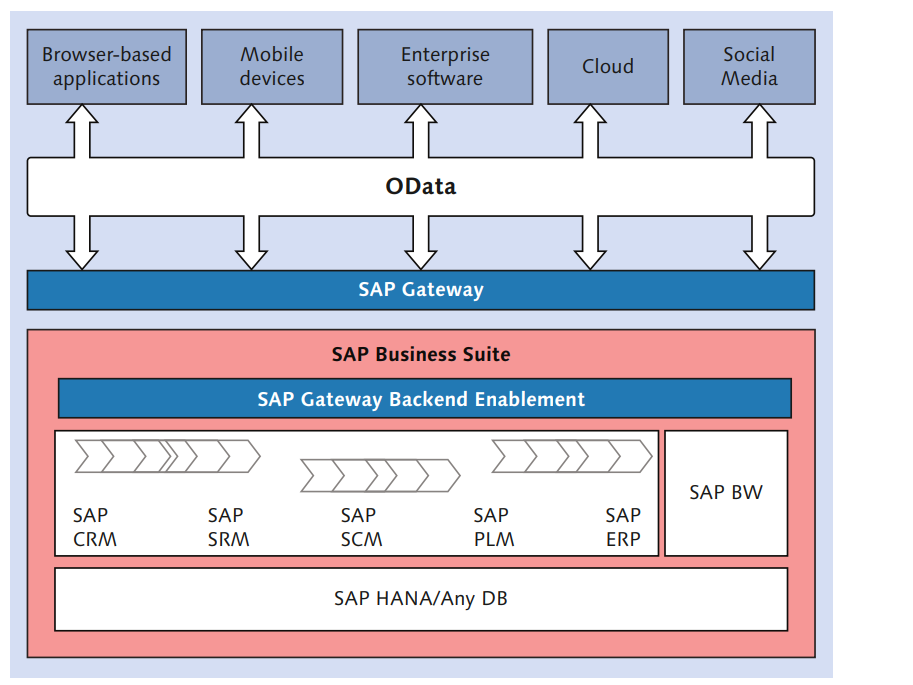
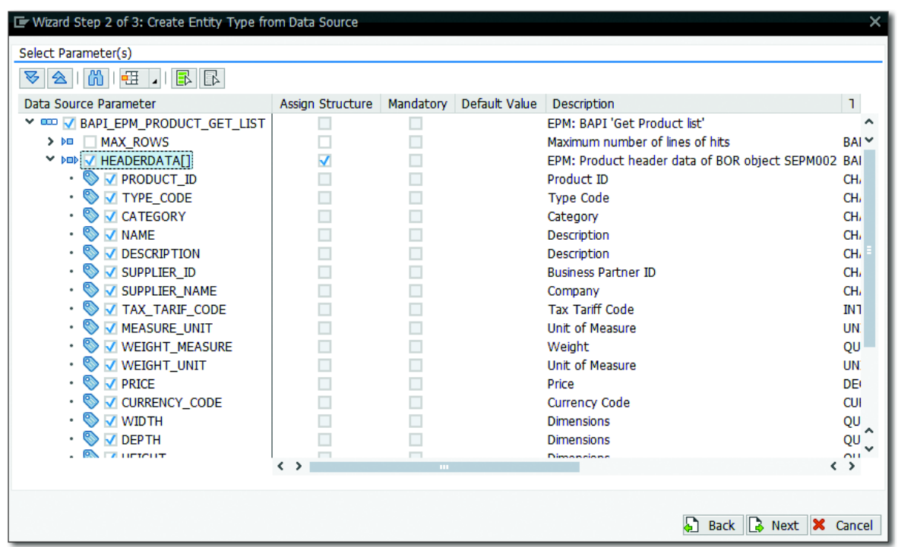
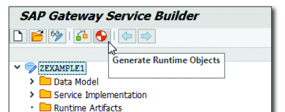
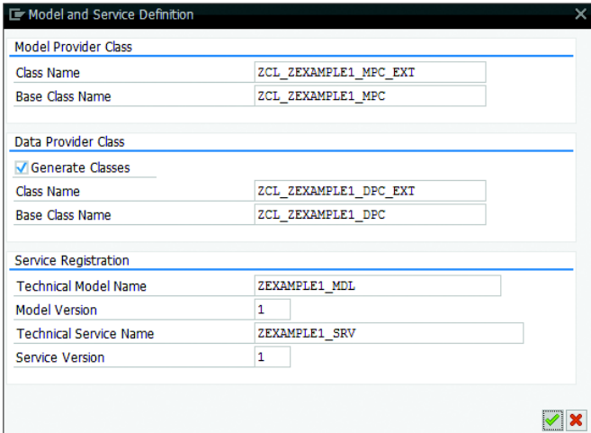

Statement 1: Customers aren’t the only ones betting on SAP Gateway. Major parts of SAP S/4HANA are based on top of the SAP Gateway framework, providing OData services for SAP S/4HANA’s SAPUI5-based services.

Explanation: 
Let me break this statement down:

SAP Gateway's Role:
It's a framework that exposes SAP business data to the outside world
Acts as a middleware/communication layer
Converts complex SAP data structures into web-friendly formats


OData Services:
These are standardized REST-based web services
Allow data to be accessed and modified through HTTP requests
Make SAP data easily consumable by modern web applications


Connection to S/4HANA:
S/4HANA uses Gateway framework as its foundation
Gateway helps S/4HANA expose its business functions as services
These services are then used by the SAPUI5 frontend (Fiori apps)




## ODATA, How to make requests from oDATA

Links:
https://www.odata.org/getting-started/basic-tutorial/
https://www.odata.org/getting-started/advanced-tutorial/


The OData protocol follows five design principles: 
🔴 Data store variety
Select mechanisms that support diverse data stores. In particular, 
don’t assume a relational data model.
🔴 Backwards compatibility
Clients and services that speak different versions of the OData protocol should interoperate, supporting everything allowed in lower versions.
🔴 REST principles
Adhere to these unless there is a good and specific reason not to.
🔴 Graceful degradation
It should be easy to build a very basic but compliant OData service, 
with additional work necessary only to support additional capabilities.
🔴 Simplicity
Address the common cases and provide extensibility where necessary.


### Why is OData needed??

- You dont always have to use OData, there are also alternative options:
1. REST applications
2. 👍 RFC(Remote Function Calls) -> A Remote Function Call (RFC)
is the call or remote execution of a Remote Function Module
in an external system. In the SAP system, these functions are
provided by the RFC interface system. The RFC interface system
enables function calls between two SAP systems.
3. SOAP Web Services - For legacy systems
4. BAPI(Business APIs)- Standard business functions

🔴 Buttt, why is OData preferred when we have these alternatives????
1. Need to integrate with modern UI frameworks(SAP Fiori)
2. Require consistent data access across different SAP services.

Lets explain why these concepts are important in details:

1. Integration with Modern UI Frameworks (SAP Fiori):
SAP Fiori is a modern user interface design that provides a consistent experience across
devices and platforms. OData plays a crucial role here because Fiori applications are built
using SAPUI5/OpenUI5 frameworks, which are designed to work seamlessly with OData services.
SAPUI5/OpenUI5 frameworks were specifically designed with OData integration in mind because
`both share similar architectural principles` and data handling patterns.
When you build a Fiori app, it needs to communicate efficiently with your SAP backend systems.
OData provides this bridge by offering:

 - Real-time data binding - When users interact with UI elements, OData handles the automatic synchronization between the frontend
 and the backend data.
 - Built-in support for common UI patterns- Like master-detail views, list-to-list navigation, and smart tables
 - Optimised Data Loading - OData's $select and $expand options help Fiori apps load exactly what they need, improving performance


⚠️ Example of using OData on Fiori apps:
```JavaScript
// Simple, standard approach
var oDataModel = new sap.ui.model.odata.v2.ODataModel("/sap/opu/odata/SERVICE");

oDataModel.read("/SalesOrderSet", {
    urlParameters: {
        "$filter": "Status eq 'Open'",
        "$top": 20,
        "$skip": 0
    }
});
```

⚠️ Using other services like BAPI:
```JavaScript
// Complex custom code needed
function getSalesOrders(filter) {
    // Call BAPI
    const result = callBAPI('BAPI_SALESORDER_GETLIST');
    // Manually implement filtering
    const filtered = result.filter(order => /* complex filtering logic */);
    // Manually implement pagination
    const page = filtered.slice(startIndex, endIndex);
    // Manually transform data format
    const transformed = page.map(order => /* complex transformation */);
    return transformed;
}
```

2. Consistent Data Access Across SAP Services:
Think of this like having a universal language for data communication across different SAP
systems. Without OData, each SAP service might have its own unique way of sharing data, 
similar to people speaking different languages. OData provides standardization in several 
ways:

  - Uniform data Model - Whether you're accessing HR data, sales order, or inventory
    information, the way you request and recive data remains consistent
  - Standard operations -  The same CRUD (Create, Read, Update, Delete) operations work identically across different services
  - Common query options - Features like filtering ($filter), sorting ($orderby), and pagination ($skip/$top)
    work the same way regardless of which SAP service you're accessing

🟢 For example, if you're building an application that needs to combine data from SAP S/4HANA and SAP SuccessFactors,
 OData ensures you can use the same code patterns and data access methods for both systems, significantly reducing#
development complexity and maintenance effort.

🟢 TO FINALIZEEE:::
Think of SAPUI5 and OData as two puzzle pieces designed to fit together - SAPUI5 provides the visual components and
interaction patterns, while OData provides a standardized way to communicate with the backend. Together, they create
a seamless development experience that significantly reduces the amount of code needed to build enterprise applications.

🟠 Examples of calling OData endpoints:
`http://.../sap/opu/odata/IWBEP/GWSAMPLE_BASIC/BusinessPartnerSet ('0100000000')?$expand=ToSalesOrders,ToSalesOrders/ToLineItems` 

The base URL points to a specific business partner:

`.../BusinessPartnerSet('0100000000')`

This identifies one particular business partner by their ID '0100000000'.

`?$expand=ToSalesOrders,ToSalesOrders/ToLineItems`

This expansion is doing two levels of data retrieval in a single request:

1. First level - ToSalesOrders: It retrieves all sales orders associated with the Business
partner. This is like saying "show me all the orders this customer has placed".
2. Second Level - ToSalesOrders/ToLineItems: For each of those sales orders, it also
retrieves all the line items. The forward slash (/) indicates we're going deeper into the
relationship chain. It's like saying "and for each of those orders, show me all the individual items they purchased."

🔴 This is a typical flow:

- A Fiori app makes an OData request through Gateway
- Gateway translates this request into ABAP calls
- The ABAP layer processes the business logic
- ABAP code interacts with HANA to retrieve or update data
- The response follows the same path back to the frontend

1. Database Layer (SAP HANA):
This is where all your business data is stored - sales orders, customer information, inventory, etc.
SAP HANA's in-memory capabilities make data retrieval incredibly fast.
2. Application Layer (SAP NetWeaver with ABAP):
This layer contains all your business logic, processing, and rules.
When you create a sales order, for example, this layer handles validations, calculations, and updates.
The ABAP code here determines how business processes work.
3. Gateway Layer:
SAP Gateway acts as an interpreter between your modern frontend applications and the SAP backend system.
It doesn't connect directly to HANA - instead, it works with the ABAP layer to expose business functionality as OData services.


## Understanding BOR and RFC:

BOR (Business Object Repository) and RFC (Remote Function Call) are two fundamental concepts in SAP:
- BOR is like a library catalog for SAP business objects. Think of it as an organized collection where SAP stores definitions of business objects
(like Products, Sales Orders, etc.) along with all their properties and behaviors. Just as a library catalog helps you find books, BOR helps
developers find and use business objects in their applications.
- RFC is like a telephone line between different SAP systems or between SAP and other applications.
When one system needs to call a function in another system, it uses RFC to make that call.
For example, if your Fiori app needs to get product information from the SAP backend, it would use RFC to make that request.



Have a look at this image, the BAPI_ERP_PRODUCT_GET_LIST was imported from BOR using RFC. And now you can use it in your Fiori app to get product related data.

⚠️ Remember!!!! BOR(Business Object Repository) is not just basic rules.
It is a complete technical dictionary of your SAP system. BOR stores:
1. The objects structure (what fields and properties it has)
2. The objects behaviours (what actions can be performed on it)
3. The objects relationships (how it connects to other objects)
4. The business rules that govern it
5. The methods and functions that can  interact with it

```json
// BOR already contains the complete product object definition
// Your OData service might map to it like this:
EntityType "Product" 
    -> Maps to BOR object "MATERIAL"
    -> Uses BAPI_EPM_PRODUCT_GET_LIST for data retrieval
    -> Inherits business rules and validations from BOR
```

⚠️ Remember that `one business object in BOR can have or be accessed through 
multiple BAPIs`, as this is a key concept in SAP development.

Each BAPI for a certain BOR represents a specific way to interact with that object
like: viewing it, purchasing it, checking its inventory etc.

For example, for a Product object, you might have BAPIs like:
- BAPI_EPM_PRODUCT_GET_LIST (gets a list of products)
- BAPI_MATERIAL_GET_DETAIL (gets detailed information about a specific product)
- BAPI_MATERIAL_SAVEDATA (saves changes to a product)
- BAPI_MATERIAL_AVAILABILITY (checks product availability)

🟢 Now by using BAPI it allows you to access data stored in HANA, 
lets see how It works.

When you use a BAPI to request data:
    1. Your application makes a call to the BAPI (like BAPI_EPM_PRODUCT_GET_LIST)
    2. The BAPI processes this request through the SAP application server
    3. The application server translates this into appropriate database queries
    4. These queries are executed against the HANA database
    5. HANA returns the requested data
    6. The data flows back through the application server
    7. The BAPI formats the data according to its defined structure
    8. Finally, your application receives the formatted data.

```JavaScript
DATA: lt_products TYPE TABLE OF bapi_epm_product_header.
CALL FUNCTION 'BAPI_EPM_PRODUCT_GET_LIST'
  EXPORTING
    max_rows    = 100
  TABLES
    headerdata  = lt_products.

```


## Next steps after importing a BAPI from BOR using RFC:

1. Generate a runtime object




Based on the second image:
These runtime objects are essential pieces that SAP Gateway needs to actually 
run your OData service.

- Model Provider Class (MPC):
ZCL_ZEXAMPLE1_MPC_EXT (extends from ZCL_ZEXAMPLE1_MPC)
This class defines the structure of your data model - what entities exist, their properties, and how they relate to each other
It's like creating a blueprint that says "this is what our data looks like and how it's organized"
When you imported the BAPI, this class was generated to match the structure of the data that BAPI can provide

Example in code:
```java
" Base Class (Generated by SAP)"
CLASS zcl_example_mpc DEFINITION.
  PUBLIC SECTION.
    " Standard product definition"
    METHOD define_product.
      add_property('ID').
      add_property('NAME').
      add_property('PRICE').
    ENDMETHOD.
ENDCLASS.

" Extension Class (Your customizations)"
CLASS zcl_example_mpc_ext DEFINITION INHERITING FROM zcl_example_mpc.
  PUBLIC SECTION.
    " Add custom properties"
    METHOD define_product_extensions.
      super->define_product( ).  " Get standard properties first
      add_property('CUSTOM_CATEGORY').
      add_property('REGIONAL_PRICE').
    ENDMETHOD.
ENDCLASS.
```

- Data Provider Class (DPC):

ZCL_ZEXAMPLE1_DPC_EXT (extends from ZCL_ZEXAMPLE1_DPC)
This class handles the actual data operations - how to get data, create new entries, update existing ones, etc.
This is where your BAPI calls will actually happen
Think of it as the worker that knows how to interact with your SAP system to get or modify the data

Example, transformed in code:

```Java
CLASS zcl_example_dpc_ext DEFINITION 
  INHERITING FROM zcl_example_dpc.

  PUBLIC SECTION.
    METHODS /iwbep/if_mgw_appl_srv_runtime~get_entityset
      REDEFINITION.

  PRIVATE SECTION.
    " Custom method to call your BAPI
    METHODS get_products_from_bapi
      RETURNING
        VALUE(rt_products) TYPE your_product_table_type.

ENDCLASS.

CLASS zcl_example_dpc_ext IMPLEMENTATION.
  METHOD /iwbep/if_mgw_appl_srv_runtime~get_entityset.
    " This is where you implement how to actually get your product data
    " For example, calling your BAPI
    DATA(lt_products) = get_products_from_bapi( ).
    
    " Convert BAPI results to OData format
    copy_data_to_ref(
      EXPORTING
        is_data = lt_products
      CHANGING
        cr_data = er_entityset
    ).
  ENDMETHOD.
  
  METHOD get_products_from_bapi.
    " Your BAPI call implementation goes here
    CALL FUNCTION 'BAPI_EPM_PRODUCT_GET_LIST'
      IMPORTING
        headerdata = rt_products.
  ENDMETHOD.
ENDCLASS.

```

- Service Registration
 Technical Model Name (ZEXAMPLE1_MDL): This registers your data model in the SAP Gateway
Technical Service Name (ZEXAMPLE1_SRV): This is what external applications will use to call your service
Version numbers help track changes to your service over time