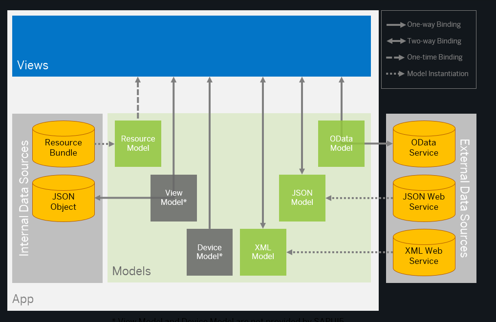

## Data Binding
Lets start with this diagram: 

- This is a visualization of the Model-View-Paattern (MVC) in SAPUI5,
specifically showing how data flows between different components.

1. Views
These are what users actually see on the screen
Example: A form with input fields, a table showing products, or buttons

2. Data Sources (Left and Right Grey Sections):

- Internal Data Sources (Left):

Resource Bundle: Contains texts like translations
Example: Button labels in different languages, error messages

JSON Object: Local data in JSON format
Example: A simple list of products stored directly in your app

- External Data Sources (Right):

OData Service: Backend service for complex data
Example: Getting product catalog from SAP backend

JSON Web Service: REST API calls
Example: Getting currency exchange rates from an external API

XML Web Service: XML-based services
Example: Getting weather data from a legacy system

3. Models (Green Boxes): These act as bridges between your Views and Data Sources

Resource Model: Handles translations and texts
OData Model: Connects to SAP backend services
JSON Model: Handles JSON data
XML Model: Processes XML data

Lets show an example, imagine you want to build a Product List application:

1. Your backend data comes from an OData service
2. The OData Model processes this data
3. Your View shows this as a table
4. The texts (like column headers) comes from Resource Bundle
5. Maybe some user preferences are stored in a local JSON Object

So the data layerlike from backend our resources or user preferences are accessed by using modules.

There are multiple ways how data is binded, data binding defines how models and views communicate with each other:
1. Two-way binding (↔️): Data can flow both ways
Example: When a user edits a product name, it updates both in the UI and the model

2. One-way binding (→): Data flows in one direction only
Example: Displaying read-only product information

3. One-time binding (- →): Data is read once and not updated
Example: Loading initial configuration settings

🟢 As a beginner, focus on understanding that:
- Views are what users see
- Models handle your data
- The arrows show how your data moves between these components

🟠 Lets have a deeper look at different types of  `Models` and explain them:

- The `resource model` is used in communication with the resource bundle that contains translatable texts in multiple languages.

Have a look at this example: https://ui5.sap.com//sdk#/entity/sap.m.tutorial.walkthrough/sample/sap.m.tutorial.walkthrough.08
We are using the `sap/ui/model/resource/ResourceModel` to use the i18n file on our view.

- `View Models` can be, for example, JSON models that communicate with a corresponding JSON object. JSON data can also be edited in the app, but they are not stored - as soon as you refresh the browser or restart the app, the changes are reset.

- `JSON Model`: The Device Model is a special JSON Model that SAPUI5 uses to store information about the current device (phone, tablet, desktop). It's not connecting to external devices - it's detecting what kind of device is running your app!

- Most of the models are client-side models. This means that all data is initially loaded to the model when the app is started. All actions performed on the data are only executed on the client, and are only sent back to the data source when this is triggered by the app

- The `OData models (V2 and V4)` are server-side models, which means that data is provided by a back-end system on demand. Filtering, sorting, and paging actions are performed on the server. This means, for example, that you don't have to load a complete table on the UI to be able to sort the entries.

🟠 What is the OData V4?
OData V4 is a standardized way to request exactly what you need from the backend, it is a way to communicate with your backend `(like SAP S/4HANA or any other SAP system)`. Without the OData V4 each backend team might send data in different formats and there is not a standard way to filter, sort or paginate data. Thats why `OData V4` is used to get data using the `OData models`.

If you wanna know more about data binding have a look at this tutorial: https://ui5.sap.com//sdk#/topic/e5310932a71f42daa41f3a6143efca9c.

Lets have a look at an example how two way binding works:
`https://ui5.sap.com//sdk#/entity/sap.m.tutorial.walkthrough/sample/sap.m.tutorial.walkthrough.07/code`

Have a look at this element:
<Input
		value="{/recipient/name}"
		description="Hello {/recipient/name}"
		valueLiveUpdate="true"
		width="60%"
/>

You can see it doesnt have an `onChange` function. The update happends for the reason of `two-way data binding`.
The Input has a default built-in change handler. When you type, SAPUI5 automatically:
1. Captures the input value
2. Updates the model

## Components
An application can use components from different locations from where the application is running. Thus, components can be developed by different development teams and be used in different projects. Components also support the encapsulation of closely related parts of an application into a particular component. This makes the structure of an application and its code easier to understand and to maintain.

